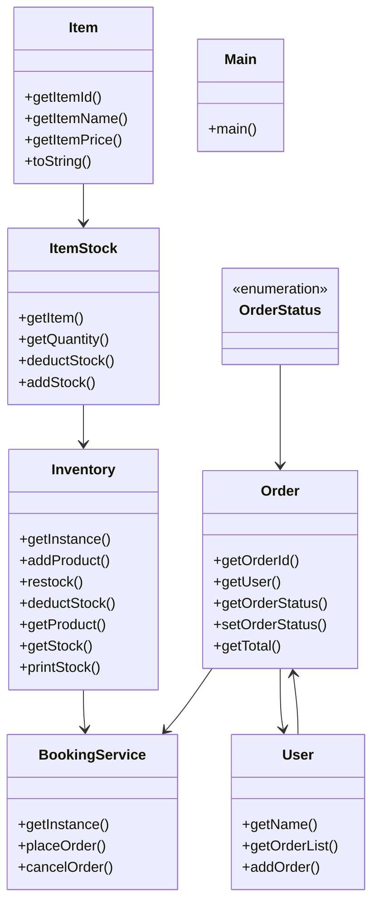

# Low-Level Design: Order & Inventory Management

**Difficulty:** Hard 🔥  
**Interview duration:** 60–75 min  
**Code status:** ✅ Reference Java included (§3)  
**Companion code:** `LLD/InventoryManagement`  

---

## How to present in an interview

Present in this order — interviewers expect **flow first**, then **model**, then **code**:

1. **Core flow** — main use cases as numbered steps (happy path + key branches).
2. **Entities & relationships** — nouns and verbs from the flow; who owns whom.
3. **Reference implementation** — classes that map 1:1 to the model (only after flow is agreed).

Do not open with a class diagram or code dumps before the flow is clear.

---

## 1. Core flow

### 1.1 Place order

1. Catalog loaded into **inventory** (item → quantity).
2. User places **order** with line items.
3. System reserves/decrements stock; **order status** updated.
4. Insufficient stock → reject before confirmation.

---

## 2. Entities & relationships

_Deduced from the flows above — each entity should appear in at least one step._

| Entity | Responsibility | Key fields / collaborators |
|--------|----------------|----------------------------|
| **User** | Buyer | orders |
| **Item** | SKU | id, name, price |
| **ItemStock / Inventory** | Availability | item → quantity |
| **Order** | Purchase | lines, status |
| **BookingService** | Checkout | place order, update inventory |

### Relationships

- Inventory **1—*** ItemStock; Order references Item + quantity
- BookingService coordinates atomic stock decrement

### Class diagram



---

## 3. Reference implementation (Java)

Reference implementation from **`LLD/InventoryManagement/`** (all sources in this file).

Classes in **logical order**: enums → interfaces → domain → strategies → services → `Main`.

**Run:**
```bash
cd LLD/InventoryManagement
javac src/*.java
java -cp src Main
```

### `OrderStatus.java`

```java
public enum OrderStatus {
    BOOKED,
    CANCELED,
}
```

### `Inventory.java`

```java
import java.util.Map;
import java.util.concurrent.ConcurrentHashMap;

public class Inventory {
    private static Inventory instance;
    private final Map<String, ItemStock> inventory = new ConcurrentHashMap<>(); // itemId -> ItemStock

    private Inventory() {}

    public static synchronized Inventory getInstance() {
        if (instance == null) instance = new Inventory();
        return instance;
    }

    public void addProduct(Item item, int qty) {
        ItemStock existing = inventory.get(item.getItemId());
        if (existing != null) {
            existing.addStock(qty);
        } else {
            inventory.put(item.getItemId(), new ItemStock(item, qty));
        }
    }

    public void restock(String itemId, int qty) {
        ItemStock itemStock = inventory.get(itemId);
        if (itemStock == null) throw new RuntimeException("Item not found: " + itemId);
        itemStock.addStock(qty);
    }

    public boolean deductStock(String itemId, int qty) {
        ItemStock itemStock = inventory.get(itemId);
        if (itemStock == null) throw new RuntimeException("Item not found: " + itemId);
        if (!itemStock.deductStock(qty))
            throw new RuntimeException("Insufficient stock: " + itemStock.getItem().getItemName());
        return true;
    }

    public Item getProduct(String itemId) {
        ItemStock itemStock = inventory.get(itemId);
        return itemStock != null ? itemStock.getItem() : null;
    }

    public int getStock(String itemId) {
        ItemStock itemStock = inventory.get(itemId);
        return itemStock != null ? itemStock.getQuantity() : 0;
    }

    public void printStock() {
        System.out.println("\n-- Inventory --");
        inventory.values().forEach(itemStock ->
                System.out.println(
                        itemStock.getItem().getItemName() + ": " +
                                itemStock.getQuantity() + " units @ $" +
                                itemStock.getItem().getItemPrice()
                ));
    }
}
```

### `Order.java`

```java
import java.util.Map;
import java.util.UUID;

public class Order {
    private final String orderId;
    private final User user;
    private OrderStatus orderStatus;
    private final Map<Item, Integer> itemMap;

    public Order(User user, Map<Item, Integer> itemMap) {
        this.orderId = UUID.randomUUID().toString();
        this.user = user;
        this.itemMap = itemMap;
        this.orderStatus = OrderStatus.BOOKED;
    }

    public String getOrderId()             { return orderId; }
    public User getUser()                  { return user; }
    public OrderStatus getOrderStatus()    { return orderStatus; }
    public Map<Item, Integer> getItemMap() { return itemMap; }

    public void setOrderStatus(OrderStatus status) { this.orderStatus = status; }

    public double getTotal() {
        return itemMap.entrySet().stream()
                .mapToDouble(e -> e.getKey().getItemPrice() * e.getValue())
                .sum();
    }
}
```

### `ItemStock.java`

```java
public class ItemStock {
    private final Item item;
    private int quantity;

    public ItemStock(Item item, int quantity) {
        this.item = item;
        this.quantity = quantity;
    }

    public Item getItem()     { return item; }
    public int getQuantity()  { return quantity; }

    public synchronized boolean deductStock(int qty) {
        if (quantity < qty) return false;
        quantity -= qty;
        return true;
    }

    public synchronized void addStock(int qty) { quantity += qty; }
}
```

### `User.java`

```java
import java.util.ArrayList;
import java.util.List;

public class User {
    private final String name;
    private final List<Order> orderList;

    public User(String name) {
        this.name = name;
        this.orderList = new ArrayList<>();
    }

    public String getName()           { return name; }
    public List<Order> getOrderList() { return orderList; }
    public void addOrder(Order order) { orderList.add(order); }
}
```

### `Item.java`

```java
import java.util.UUID;

public class Item {
    final String itemId;
    final String itemName;
    final double itemPrice;

    public Item(String itemName, double itemPrice) {
        this.itemId = UUID.randomUUID().toString();
        this.itemName = itemName;
        this.itemPrice = itemPrice;
    }

    public String getItemId()    { return itemId; }
    public String getItemName()  { return itemName; }
    public double getItemPrice() { return itemPrice; }

    @Override
    public String toString() {
        return itemName + " ($" + itemPrice + ")";
    }
}
```

### `BookingService.java`

```java
import java.util.HashMap;
import java.util.Map;

public class BookingService {
    private static BookingService instance;
    private final Map<String, Order> orderMap = new HashMap<>();
    private final Inventory inventory;

    private BookingService(Inventory inventory) {
        this.inventory = inventory;
    }

    public static BookingService getInstance(Inventory inventory) {
        if (instance == null) instance = new BookingService(inventory);
        return instance;
    }

    public Order placeOrder(User user, Map<String, Integer> itemQtyMap) {
        Map<Item, Integer> resolvedItems = new HashMap<>();

        for (Map.Entry<String, Integer> entry : itemQtyMap.entrySet()) {
            Item item = inventory.getProduct(entry.getKey());
            if (item == null) throw new RuntimeException("Item not found: " + entry.getKey());
            inventory.deductStock(entry.getKey(), entry.getValue()); // throws if insufficient stock
            resolvedItems.put(item, entry.getValue());
        }

        Order order = new Order(user, resolvedItems);
        orderMap.put(order.getOrderId(), order);
        user.addOrder(order);
        System.out.println("Order placed! ID: " + order.getOrderId() + " | Total: $" + order.getTotal());
        return order;
    }

    public void cancelOrder(String orderId) {
        Order order = orderMap.get(orderId);
        if (order == null || order.getOrderStatus() == OrderStatus.CANCELED) return;
        order.getItemMap().forEach((item, qty) -> inventory.restock(item.getItemId(), qty));
        order.setOrderStatus(OrderStatus.CANCELED);
        System.out.println("Order " + orderId + " cancelled. Stock restored.");
    }
}
```

### `Main.java`

```java
import java.util.Map;

public class Main {
    public static void main(String[] args) {
        Inventory inventory = Inventory.getInstance();
        BookingService bookingService = BookingService.getInstance(inventory);

        Item jeans  = new Item("Jeans", 200);
        Item tshirt = new Item("Tshirt", 150);

        inventory.addProduct(jeans,  100);
        inventory.addProduct(tshirt, 50);

        inventory.printStock();

        User user = new User("Aman");
        Order order = bookingService.placeOrder(user, Map.of(
                jeans.getItemId(),  2,
                tshirt.getItemId(), 1
        ));

        inventory.printStock();

        bookingService.cancelOrder(order.getOrderId());
        inventory.printStock();
    }
}
```

