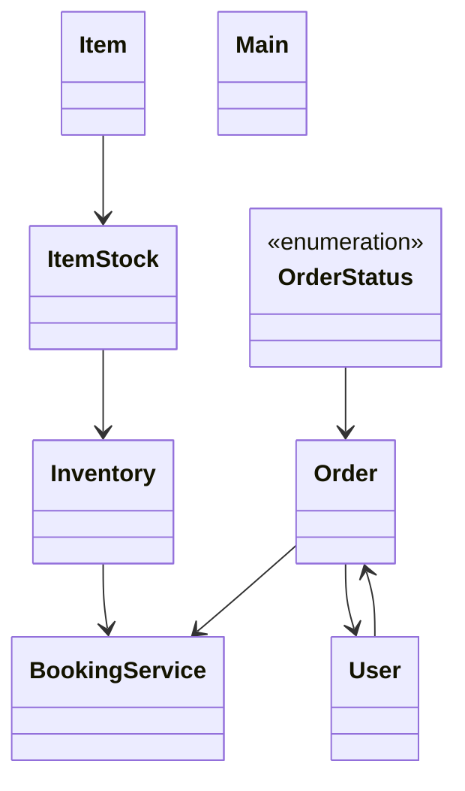

# Low-Level Design: Order & Inventory Management

**Difficulty:** Hard 🔥  
**Interview duration:** 60–75 min  
**Code status:** ✅ Reference Java included (§3)  
**Companion code:** `LLD/InventoryManagement`  

---

## How to present in an interview

Present in this order — interviewers expect **flow first**, then **model**, then **code**:

1. **Core flow** — main use cases as numbered steps (happy path + key branches).
2. **Entities & relationships** — nouns and verbs from the flow; who owns whom.
3. **Reference implementation** — classes that map 1:1 to the model (only after flow is agreed).

Do not open with a class diagram or code dumps before the flow is clear.

---

## 1. Core flow

### 1.1 Place order

1. Catalog loaded into **inventory** (item → quantity).
2. User places **order** with line items.
3. System reserves/decrements stock; **order status** updated.
4. Insufficient stock → reject before confirmation.

---

## 2. Entities & relationships

_Deduced from the flows above — each entity should appear in at least one step._

| Entity | Responsibility | Key fields / collaborators |
|--------|----------------|----------------------------|
| **User** | Buyer | orders |
| **Item** | SKU | id, name, price |
| **ItemStock / Inventory** | Availability | item → quantity |
| **Order** | Purchase | lines, status |
| **BookingService** | Checkout | place order, update inventory |

### Relationships

- Inventory **1—*** ItemStock; Order references Item + quantity
- BookingService coordinates atomic stock decrement

### Class diagram



---

## 3. Reference implementation (Java)

Companion project: **`LLD/InventoryManagement/`**. Copies below for browsing on GitHub (logical order, not A–Z).

**Run locally:**
```bash
cd LLD/InventoryManagement
javac src/*.java
java -cp src Main
```

| # | Source |
|---|--------|
| 1 | [`OrderStatus.java`](code/09_order_inventory_management_lld/OrderStatus.java) |
| 2 | [`Inventory.java`](code/09_order_inventory_management_lld/Inventory.java) |
| 3 | [`Order.java`](code/09_order_inventory_management_lld/Order.java) |
| 4 | [`ItemStock.java`](code/09_order_inventory_management_lld/ItemStock.java) |
| 5 | [`User.java`](code/09_order_inventory_management_lld/User.java) |
| 6 | [`Item.java`](code/09_order_inventory_management_lld/Item.java) |
| 7 | [`BookingService.java`](code/09_order_inventory_management_lld/BookingService.java) |
| 8 | [`Main.java`](code/09_order_inventory_management_lld/Main.java) |

