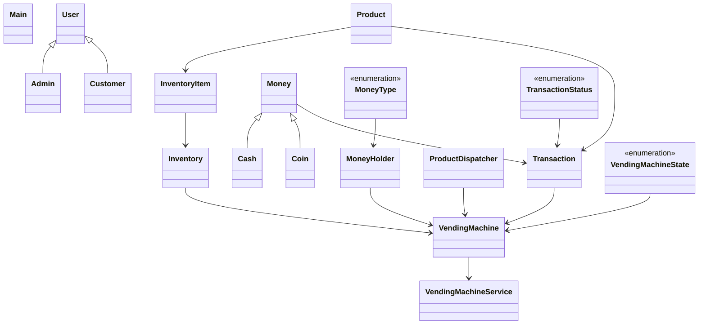

# Low-Level Design: Vending Machine

**Difficulty:** Medium ⚡  
**Interview duration:** 45–60 min  
**Code status:** ✅ Reference Java included (§3)  
**Companion code:** `LLD/Vending Machine`  

---

## How to present in an interview

Present in this order — interviewers expect **flow first**, then **model**, then **code**:

1. **Core flow** — main use cases as numbered steps (happy path + key branches).
2. **Entities & relationships** — nouns and verbs from the flow; who owns whom.
3. **Reference implementation** — classes that map 1:1 to the model (only after flow is agreed).

Do not open with a class diagram or code dumps before the flow is clear.

---

## 1. Core flow

### 1.1 Purchase

1. Customer selects **product** from **inventory**.
2. Customer inserts **cash/coins** into **money holder**.
3. Machine validates price + change availability.
4. Product **dispatched**; change returned; else refund.

### 1.2 Admin

1. Admin restocks inventory and loads cash float.

---

## 2. Entities & relationships

_Deduced from the flows above — each entity should appear in at least one step._

| Entity | Responsibility | Key fields / collaborators |
|--------|----------------|----------------------------|
| **VendingMachine** | Context + state | inventory, moneyHolder, state |
| **Inventory / InventoryItem** | Stock | product, quantity |
| **Product** | SKU | code, price |
| **Money / Coin / Cash** | Payment | denomination |
| **ProductDispatcher** | Physical output | dispense product |
| **VendingMachineService** | API | select, pay, cancel |

### Relationships

- VendingMachine **1—1** Inventory and MoneyHolder
- State pattern for idle / hasMoney / dispensing / refund

### Class diagram



---

## 3. Reference implementation (Java)

Companion project: **`LLD/Vending Machine/`**. Copies below for browsing on GitHub (logical order, not A–Z).

**Run locally:**
```bash
cd LLD/Vending Machine
javac src/*.java
java -cp src Main
```

| # | Source |
|---|--------|
| 1 | [`MoneyType.java`](code/11_vending_machine_lld/MoneyType.java) |
| 2 | [`TransactionStatus.java`](code/11_vending_machine_lld/TransactionStatus.java) |
| 3 | [`VendingMachineState.java`](code/11_vending_machine_lld/VendingMachineState.java) |
| 4 | [`VendingMachine.java`](code/11_vending_machine_lld/VendingMachine.java) |
| 5 | [`Transaction.java`](code/11_vending_machine_lld/Transaction.java) |
| 6 | [`Admin.java`](code/11_vending_machine_lld/Admin.java) |
| 7 | [`Cash.java`](code/11_vending_machine_lld/Cash.java) |
| 8 | [`Coin.java`](code/11_vending_machine_lld/Coin.java) |
| 9 | [`Customer.java`](code/11_vending_machine_lld/Customer.java) |
| 10 | [`Inventory.java`](code/11_vending_machine_lld/Inventory.java) |
| 11 | [`InventoryItem.java`](code/11_vending_machine_lld/InventoryItem.java) |
| 12 | [`MoneyHolder.java`](code/11_vending_machine_lld/MoneyHolder.java) |
| 13 | [`Money.java`](code/11_vending_machine_lld/Money.java) |
| 14 | [`Product.java`](code/11_vending_machine_lld/Product.java) |
| 15 | [`ProductDispatcher.java`](code/11_vending_machine_lld/ProductDispatcher.java) |
| 16 | [`User.java`](code/11_vending_machine_lld/User.java) |
| 17 | [`VendingMachineService.java`](code/11_vending_machine_lld/VendingMachineService.java) |
| 18 | [`Main.java`](code/11_vending_machine_lld/Main.java) |

