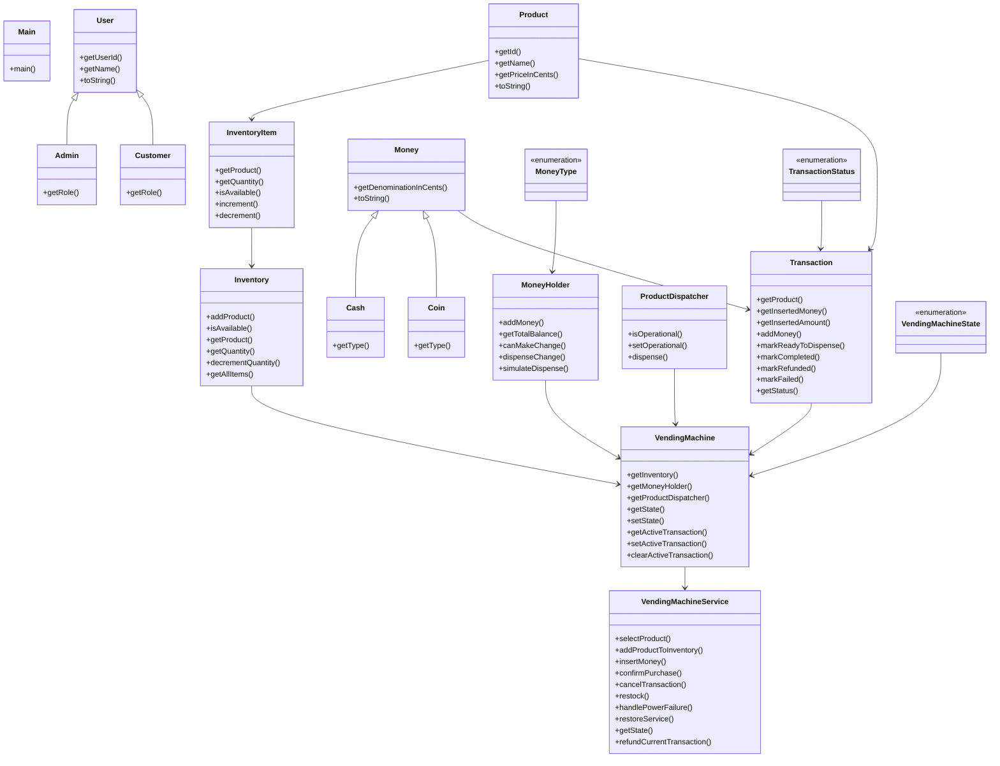

# Low-Level Design: Vending Machine

**Difficulty:** Medium ⚡  
**Interview duration:** 45–60 min  
**Code status:** ✅ Reference Java included (§3)  
**Companion code:** `LLD/Vending Machine`  

---

## How to present in an interview

Present in this order — interviewers expect **flow first**, then **model**, then **code**:

1. **Core flow** — main use cases as numbered steps (happy path + key branches).
2. **Entities & relationships** — nouns and verbs from the flow; who owns whom.
3. **Reference implementation** — classes that map 1:1 to the model (only after flow is agreed).

Do not open with a class diagram or code dumps before the flow is clear.

---

## 1. Core flow

### 1.1 Purchase

1. Customer selects **product** from **inventory**.
2. Customer inserts **cash/coins** into **money holder**.
3. Machine validates price + change availability.
4. Product **dispatched**; change returned; else refund.

### 1.2 Admin

1. Admin restocks inventory and loads cash float.

---

## 2. Entities & relationships

_Deduced from the flows above — each entity should appear in at least one step._

| Entity | Responsibility | Key fields / collaborators |
|--------|----------------|----------------------------|
| **VendingMachine** | Context + state | inventory, moneyHolder, state |
| **Inventory / InventoryItem** | Stock | product, quantity |
| **Product** | SKU | code, price |
| **Money / Coin / Cash** | Payment | denomination |
| **ProductDispatcher** | Physical output | dispense product |
| **VendingMachineService** | API | select, pay, cancel |

### Relationships

- VendingMachine **1—1** Inventory and MoneyHolder
- State pattern for idle / hasMoney / dispensing / refund

### Class diagram



---

## 3. Reference implementation (Java)

Reference implementation from **`LLD/Vending Machine/`** (all sources in this file).

Classes in **logical order**: enums → interfaces → domain → strategies → services → `Main`.

**Run:**
```bash
cd LLD/Vending Machine
javac src/*.java
java -cp src Main
```

### `MoneyType.java`

```java
public enum MoneyType {
    COIN,
    NOTE
}
```

### `TransactionStatus.java`

```java
public enum TransactionStatus {
    INITIATED,
    WAITING_FOR_PAYMENT,
    READY_TO_DISPENSE,
    COMPLETED,
    REFUNDED,
    FAILED
}
```

### `VendingMachineState.java`

```java
public enum VendingMachineState {
    IDLE,
    PRODUCT_SELECTED,
    COLLECTING_PAYMENT,
    PROCESSING,
    DISPATCHING,
    OUT_OF_SERVICE
}
```

### `VendingMachine.java`

```java
public class VendingMachine {
    private final Inventory inventory;
    private final MoneyHolder moneyHolder;
    private final ProductDispatcher productDispatcher;
    private VendingMachineState state = VendingMachineState.IDLE;
    private Transaction activeTransaction;

    public VendingMachine(Inventory inventory, MoneyHolder moneyHolder, ProductDispatcher productDispatcher) {
        if (inventory == null || moneyHolder == null || productDispatcher == null) {
            throw new IllegalArgumentException("Vending machine dependencies cannot be null");
        }
        this.inventory = inventory;
        this.moneyHolder = moneyHolder;
        this.productDispatcher = productDispatcher;
    }

    public Inventory getInventory() {
        return inventory;
    }

    public MoneyHolder getMoneyHolder() {
        return moneyHolder;
    }

    public ProductDispatcher getProductDispatcher() {
        return productDispatcher;
    }

    public VendingMachineState getState() {
        return state;
    }

    public void setState(VendingMachineState state) {
        this.state = state;
    }

    public Transaction getActiveTransaction() {
        return activeTransaction;
    }

    public void setActiveTransaction(Transaction transaction) {
        this.activeTransaction = transaction;
    }

    public void clearActiveTransaction() {
        this.activeTransaction = null;
    }
}
```

### `Transaction.java`

```java
import java.util.ArrayList;
import java.util.Collections;
import java.util.List;

public class Transaction {
    private final Product product;
    private final List<Money> insertedMoney = new ArrayList<>();
    private TransactionStatus status = TransactionStatus.INITIATED;

    public Transaction(Product product) {
        this.product = product;
    }

    public Product getProduct() {
        return product;
    }

    public List<Money> getInsertedMoney() {
        return Collections.unmodifiableList(insertedMoney);
    }

    public int getInsertedAmount() {
        int total = 0;
        for (Money money : insertedMoney) {
            total += money.getDenominationInCents();
        }
        return total;
    }

    public void addMoney(Money money) {
        insertedMoney.add(money);
        status = TransactionStatus.WAITING_FOR_PAYMENT;
    }

    public void markReadyToDispense() {
        status = TransactionStatus.READY_TO_DISPENSE;
    }

    public void markCompleted() {
        status = TransactionStatus.COMPLETED;
    }

    public void markRefunded() {
        status = TransactionStatus.REFUNDED;
    }

    public void markFailed() {
        status = TransactionStatus.FAILED;
    }

    public TransactionStatus getStatus() {
        return status;
    }
}
```

### `Admin.java`

```java
public class Admin extends User {

    public Admin(String userId, String name) {
        super(userId, name);
    }

    @Override
    public String getRole() {
        return "Admin";
    }
}
```

### `Cash.java`

```java
public class Cash extends Money {

    public Cash(int denominationInCents) {
        super(denominationInCents);
    }

    @Override
    public MoneyType getType() {
        return MoneyType.NOTE;
    }
}
```

### `Coin.java`

```java
public class Coin extends Money {

    public Coin(int denominationInCents) {
        super(denominationInCents);
    }

    @Override
    public MoneyType getType() {
        return MoneyType.COIN;
    }
}
```

### `Customer.java`

```java
public class Customer extends User {

    public Customer(String userId, String name) {
        super(userId, name);
    }

    @Override
    public String getRole() {
        return "Customer";
    }
}
```

### `Inventory.java`

```java
import java.util.ArrayList;
import java.util.Collection;
import java.util.LinkedHashMap;
import java.util.Map;

public class Inventory {
    private final Map<String, InventoryItem> items = new LinkedHashMap<>();

    public void addProduct(Product product, int quantity) {
        if (quantity <= 0) {
            throw new IllegalArgumentException("Quantity must be greater than 0");
        }
        InventoryItem item = items.get(product.getId());
        if (item == null) {
            items.put(product.getId(), new InventoryItem(product, quantity));
        } else {
            item.increment(quantity);
        }
    }

    public boolean isAvailable(String productId) {
        InventoryItem item = items.get(productId);
        return item != null && item.isAvailable();
    }

    public Product getProduct(String productId) {
        InventoryItem item = items.get(productId);
        return item == null ? null : item.getProduct();
    }

    public int getQuantity(String productId) {
        InventoryItem item = items.get(productId);
        return item == null ? 0 : item.getQuantity();
    }

    public void decrementQuantity(String productId) {
        InventoryItem item = items.get(productId);
        if (item == null) {
            throw new IllegalArgumentException("Product not found in inventory: " + productId);
        }
        item.decrement();
    }

    public Collection<InventoryItem> getAllItems() {
        return new ArrayList<>(items.values());
    }
}
```

### `InventoryItem.java`

```java
public class InventoryItem {
    private final Product product;
    private int quantity;

    public InventoryItem(Product product, int quantity) {
        this.product = product;
        this.quantity = quantity;
    }

    public Product getProduct() {
        return product;
    }

    public int getQuantity() {
        return quantity;
    }

    public boolean isAvailable() {
        return quantity > 0;
    }

    public void increment(int count) {
        if (count < 0) {
            throw new IllegalArgumentException("Quantity to increment cannot be negative");
        }
        quantity += count;
    }

    public void decrement() {
        if (quantity <= 0) {
            throw new IllegalStateException("Product is out of stock");
        }
        quantity--;
    }
}
```

### `MoneyHolder.java`

```java
import java.util.ArrayList;
import java.util.Collections;
import java.util.List;
import java.util.Map;
import java.util.TreeMap;

public class MoneyHolder {
    private final TreeMap<Integer, Integer> denominationCount = new TreeMap<>(Collections.reverseOrder());
    // track whether a denomination is a coin or cash note
    private final TreeMap<Integer, MoneyType> denominationType = new TreeMap<>();

    public void addMoney(Money money) {
        if (money.getType() == null) {
            throw new IllegalArgumentException("Money type cannot be null");
        }
        int denom = money.getDenominationInCents();
        denominationCount.put(denom, denominationCount.getOrDefault(denom, 0) + 1);
        denominationType.put(denom, money.getType());
    }

    public void addMoney(List<Money> moneyList) {
        for (Money money : moneyList) {
            addMoney(money);
        }
    }

    public int getTotalBalance() {
        int total = 0;
        for (Map.Entry<Integer, Integer> entry : denominationCount.entrySet()) {
            total += entry.getKey() * entry.getValue();
        }
        return total;
    }

    public boolean canMakeChange(int amountInCents) {
        return simulateDispense(amountInCents) != null;
    }

    public List<Money> dispenseChange(int amountInCents) {
        List<Money> change = simulateDispense(amountInCents);
        if (change == null) {
            throw new IllegalStateException("Cannot dispense exact change for amount: " + amountInCents);
        }
        for (Money money : change) {
            int denomination = money.getDenominationInCents();
            int count = denominationCount.getOrDefault(denomination, 0);
            if (count <= 0) {
                throw new IllegalStateException("Internal money holder inconsistency for denomination: " + denomination);
            }
            if (count == 1) {
                denominationCount.remove(denomination);
                denominationType.remove(denomination);
            } else {
                denominationCount.put(denomination, count - 1);
            }
        }
        return change;
    }

    private List<Money> simulateDispense(int amountInCents) {
        if (amountInCents < 0) {
            return null;
        }
        if (amountInCents == 0) {
            return new ArrayList<>();
        }
        int remaining = amountInCents;
        List<Money> change = new ArrayList<>();
        for (Map.Entry<Integer, Integer> entry : denominationCount.entrySet()) {
            int denomination = entry.getKey();
            int available = entry.getValue();
            MoneyType type = denominationType.getOrDefault(denomination, MoneyType.COIN);
            while (remaining >= denomination && available > 0) {
                change.add(type == MoneyType.COIN ? new Coin(denomination) : new Cash(denomination));
                remaining -= denomination;
                available--;
            }
        }
        return remaining == 0 ? change : null;
    }
}
```

### `Money.java`

```java
public abstract class Money {
    private final int denominationInCents;

    public Money(int denominationInCents) {
        if (denominationInCents <= 0) {
            throw new IllegalArgumentException("Denomination must be positive");
        }
        this.denominationInCents = denominationInCents;
    }

    public int getDenominationInCents() {
        return denominationInCents;
    }

    public abstract MoneyType getType();

    @Override
    public String toString() {
        return getType() + " ₹" + denominationInCents;
    }
}
```

### `Product.java`

```java
public class Product {
    private final String id;
    private final String name;
    private final int priceInCents;

    public Product(String id, String name, int priceInCents) {
        this.id = id;
        this.name = name;
        this.priceInCents = priceInCents;
    }

    public String getId() {
        return id;
    }

    public String getName() {
        return name;
    }

    public int getPriceInCents() {
        return priceInCents;
    }

    @Override
    public String toString() {
        return name + " (" + id + ", ₹" + priceInCents + ")";
    }
}
```

### `ProductDispatcher.java`

```java
public class ProductDispatcher {
    private boolean operational = true;

    public boolean isOperational() {
        return operational;
    }

    public void setOperational(boolean operational) {
        this.operational = operational;
    }

    public boolean dispense(Product product) {
        return operational && product != null;
    }
}
```

### `User.java`

```java
public abstract class User {
    private final String name;
    private final String userId;

    public User(String userId, String name) {
        this.userId = userId;
        this.name = name;
    }

    public String getUserId() {
        return userId;
    }

    public String getName() {
        return name;
    }

    public abstract String getRole();

    @Override
    public String toString() {
        return getRole() + "[" + userId + "]: " + name;
    }
}
```

### `VendingMachineService.java`

```java
import java.util.List;

public class VendingMachineService {
    private final VendingMachine vendingMachine;

    public VendingMachineService(VendingMachine vendingMachine) {
        if (vendingMachine == null) {
            throw new IllegalArgumentException("VendingMachine cannot be null");
        }
        this.vendingMachine = vendingMachine;
    }

    public String selectProduct(String productId) {
        ensureMachineAvailable();
        Product product = vendingMachine.getInventory().getProduct(productId);
        if (product == null) {
            throw new IllegalArgumentException("Product not found: " + productId);
        }
        if (!vendingMachine.getInventory().isAvailable(productId)) {
            throw new IllegalStateException("Product is out of stock: " + productId);
        }
        vendingMachine.setActiveTransaction(new Transaction(product));
        vendingMachine.setState(VendingMachineState.PRODUCT_SELECTED);
        return "Selected: " + product;
    }

    public String addProductToInventory(Product product, int quantity) {
        vendingMachine.getInventory().addProduct(product, quantity);
        return "Added " + quantity + " unit(s) of " + product.getName();
    }

    public String insertMoney(Money money) {
        ensureTransactionExists();
        Transaction txn = vendingMachine.getActiveTransaction();
        txn.addMoney(money);
        vendingMachine.setState(VendingMachineState.COLLECTING_PAYMENT);
        int inserted = txn.getInsertedAmount();
        int price = txn.getProduct().getPriceInCents();
        return "Inserted ₹" + inserted + ", pending ₹" + Math.max(price - inserted, 0);
    }

    public String confirmPurchase() {
        ensureTransactionExists();
        Transaction txn = vendingMachine.getActiveTransaction();
        Product product = txn.getProduct();
        int insertedAmount = txn.getInsertedAmount();
        int productPrice = product.getPriceInCents();

        if (insertedAmount < productPrice) {
            throw new IllegalStateException("Insufficient payment. Remaining due: " + (productPrice - insertedAmount));
        }

        int changeNeeded = insertedAmount - productPrice;
        if (!vendingMachine.getMoneyHolder().canMakeChange(changeNeeded)) {
            List<Money> refund = refundCurrentTransaction();
            txn.markRefunded();
            clearTransaction();
            return "Change unavailable. Refunded ₹" + totalAmount(refund);
        }

        vendingMachine.setState(VendingMachineState.PROCESSING);

        if (!vendingMachine.getProductDispatcher().dispense(product)) {
            throw new IllegalStateException("Product dispenser failed");
        }

        vendingMachine.getMoneyHolder().addMoney(txn.getInsertedMoney());
        List<Money> change = vendingMachine.getMoneyHolder().dispenseChange(changeNeeded);

        vendingMachine.getInventory().decrementQuantity(product.getId());
        txn.markCompleted();
        vendingMachine.setState(VendingMachineState.IDLE);
        vendingMachine.clearActiveTransaction();
        return "Dispensed " + product.getName() + ", change returned ₹" + totalAmount(change);
    }

    public String cancelTransaction() {
        ensureTransactionExists();
        List<Money> refund = refundCurrentTransaction();
        vendingMachine.getActiveTransaction().markRefunded();
        clearTransaction();
        return "Transaction cancelled. Refunded ₹" + totalAmount(refund);
    }

    public String restock(String productId, int quantity) {
        if (quantity <= 0) {
            throw new IllegalArgumentException("Quantity must be greater than 0");
        }
        Product existing = vendingMachine.getInventory().getProduct(productId);
        if (existing == null) {
            throw new IllegalArgumentException("Cannot restock unknown product: " + productId);
        }
        vendingMachine.getInventory().addProduct(existing, quantity);
        return "Restocked " + existing.getName() + " with quantity " + quantity;
    }

    public String restock(Product product, int quantity) {
        vendingMachine.getInventory().addProduct(product, quantity);
        return "Restocked " + product.getName() + " with quantity " + quantity;
    }

    public String handlePowerFailure() {
        if (vendingMachine.getActiveTransaction() == null) {
            vendingMachine.setState(VendingMachineState.OUT_OF_SERVICE);
            return "Power failure: no active transaction. Machine out of service.";
        }
        List<Money> refund = refundCurrentTransaction();
        vendingMachine.getActiveTransaction().markRefunded();
        clearTransaction();
        vendingMachine.setState(VendingMachineState.OUT_OF_SERVICE);
        return "Power failure. Refunded ₹" + totalAmount(refund) + ". Machine out of service.";
    }

    public void restoreService() {
        if (vendingMachine.getState() == VendingMachineState.OUT_OF_SERVICE) {
            vendingMachine.setState(VendingMachineState.IDLE);
        }
    }

    public VendingMachineState getState() {
        return vendingMachine.getState();
    }

    private List<Money> refundCurrentTransaction() {
        return vendingMachine.getActiveTransaction().getInsertedMoney();
    }

    private void ensureMachineAvailable() {
        if (vendingMachine.getState() == VendingMachineState.OUT_OF_SERVICE) {
            throw new IllegalStateException("Machine is out of service");
        }
        if (!vendingMachine.getProductDispatcher().isOperational()) {
            throw new IllegalStateException("Product dispatcher is not operational");
        }
    }

    private void ensureTransactionExists() {
        ensureMachineAvailable();
        if (vendingMachine.getActiveTransaction() == null) {
            throw new IllegalStateException("No active transaction. Please select a product first.");
        }
    }

    private void clearTransaction() {
        vendingMachine.clearActiveTransaction();
        vendingMachine.setState(VendingMachineState.IDLE);
    }

    private int totalAmount(List<Money> moneyList) {
        int total = 0;
        for (Money money : moneyList) {
            total += money.getDenominationInCents();
        }
        return total;
    }
}
```

### `Main.java`

```java
public class Main {
    public static void main(String[] args) {
        Customer customer = new Customer("C001", "Aman");
        Admin admin = new Admin("A001", "Store Admin");

        Inventory inventory = new Inventory();
        MoneyHolder moneyHolder = new MoneyHolder();
        ProductDispatcher productDispatcher = new ProductDispatcher();
        VendingMachine machine = new VendingMachine(inventory, moneyHolder, productDispatcher);
        VendingMachineService vendingMachine = new VendingMachineService(machine);

        System.out.println(customer);
        System.out.println(admin);

        Product chips = new Product("P1", "Chips", 30);
        Product soda = new Product("P2", "Soda", 50);

        System.out.println(vendingMachine.addProductToInventory(chips, 5));
        System.out.println(vendingMachine.addProductToInventory(soda, 2));

        // seed the machine's cash reserve with coins and notes
        moneyHolder.addMoney(new Coin(10));
        moneyHolder.addMoney(new Coin(10));
        moneyHolder.addMoney(new Coin(10));
        moneyHolder.addMoney(new Coin(10));
        moneyHolder.addMoney(new Coin(10));
        moneyHolder.addMoney(new Coin(20));
        moneyHolder.addMoney(new Cash(50));

        // customer buys Chips (₹30) with a ₹50 note — expects ₹20 change
        System.out.println("\n--- Customer buys Chips ---");
        System.out.println(vendingMachine.selectProduct("P1"));
        System.out.println(vendingMachine.insertMoney(new Cash(50)));
        System.out.println(vendingMachine.confirmPurchase());

        // admin restocks Chips
        System.out.println("\n--- Admin restocks Chips ---");
        System.out.println(vendingMachine.restock("P1", 3));

        // customer buys Soda (₹50) with a ₹100 note — expects ₹50 change
        System.out.println("\n--- Customer buys Soda ---");
        System.out.println(vendingMachine.selectProduct("P2"));
        System.out.println(vendingMachine.insertMoney(new Cash(100)));
        System.out.println(vendingMachine.confirmPurchase());

        // simulate power failure
        System.out.println("\n--- Power Failure ---");
        System.out.println(vendingMachine.handlePowerFailure());
    }
}
```

