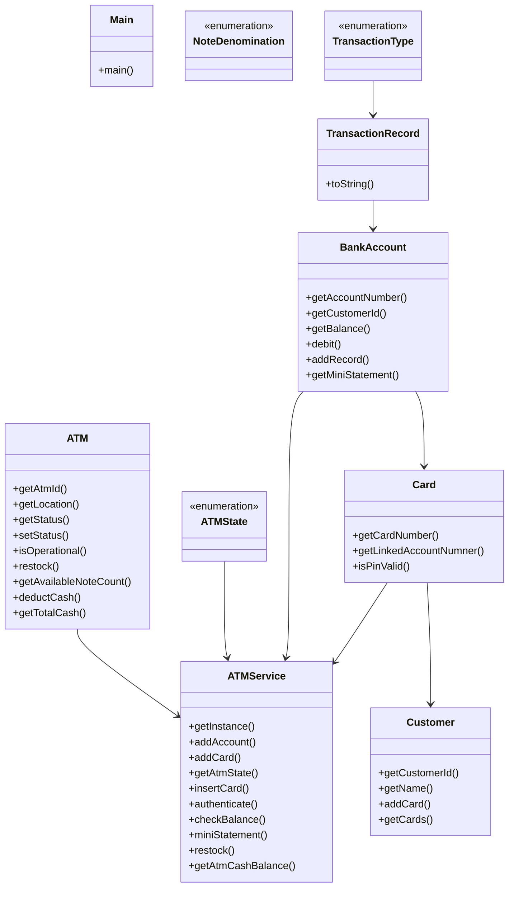

# Low-Level Design: ATM Machine

**Difficulty:** Hard 🔥  
**Interview duration:** 60–75 min  
**Code status:** ✅ Reference Java included (§3)  
**Companion code:** `LLD/ATM`  

---

## How to present in an interview

Present in this order — interviewers expect **flow first**, then **model**, then **code**:

1. **Core flow** — main use cases as numbered steps (happy path + key branches).
2. **Entities & relationships** — nouns and verbs from the flow; who owns whom.
3. **Reference implementation** — classes that map 1:1 to the model (only after flow is agreed).

Do not open with a class diagram or code dumps before the flow is clear.

---

## 1. Core flow

### 1.1 Withdraw / inquire

1. Customer inserts **card**; enters PIN → **authenticate**.
2. Select operation: balance / withdraw / mini statement.
3. Withdraw: validate account + ATM **cash inventory**; **dispense** notes.
4. Session ends; card ejected; transaction logged.

### 1.2 Admin

1. Restock note denominations in ATM cassette map.

---

## 2. Entities & relationships

_Deduced from the flows above — each entity should appear in at least one step._

| Entity | Responsibility | Key fields / collaborators |
|--------|----------------|----------------------------|
| **ATM** | Hardware + cash | note inventory, status |
| **ATMService** | Session facade | card session, operations |
| **Customer** | Owner | cards |
| **Card** | Auth token | PIN, linked BankAccount |
| **BankAccount** | Ledger | balance, transactions |
| **NoteDenomination** | Cash units | ₹100, ₹500, … |
| **TransactionRecord** | Audit | type, amount, timestamp |

### Relationships

- Customer **1—*** Card **1—1** BankAccount
- ATMService drives ATMState (insert card → auth → operate → eject)

### Class diagram



---

## 3. Reference implementation (Java)

Reference implementation from **`LLD/ATM/`** (all sources in this file).

Classes in **logical order**: enums → interfaces → domain → strategies → services → `Main`.

**Run:**
```bash
cd LLD/ATM
javac src/*.java
java -cp src Main
```

### `ATMState.java`

```java
public enum ATMState {
    IDLE,
    CARD_INSERTED,
    AUTHENTICATED
}
```

### `NoteDenomination.java`

```java
public enum NoteDenomination {
    TWO_THOUSAND(2000),
    FIVE_HUNDRED(500),
    TWO_HUNDRED(200),
    ONE_HUNDRED(100);

    private final int value;

    NoteDenomination(int value) {
        this.value = value;
    }

    public int getValue() {
        return value;
    }
}
```

### `TransactionType.java`

```java
public enum TransactionType {
    WITHDRAWAL,
    BALANCE_ENQUIRY,
    MINI_STATEMENT
}
```

### `BankAccount.java`

```java
import java.util.ArrayList;
import java.util.Collections;
import java.util.List;

public class BankAccount {
    private final String accountNumber;
    private final String customerId;
    private double balance;
    private final List<TransactionRecord> history = new ArrayList<>();

    public BankAccount(String accountNumber, String customerId, double openingBalance) {
        this.accountNumber = accountNumber;
        this.customerId = customerId;
        this.balance = openingBalance;
    }

    public String getAccountNumber() {
        return accountNumber;
    }

    public String getCustomerId() {
        return customerId;
    }

    public double getBalance() {
        return balance;
    }

    public void debit(double amount, String message) {
        if (amount <= 0) {
            throw new IllegalArgumentException("Amount must be greater than 0");
        }
        if (balance < amount) {
            throw new IllegalStateException("Insufficient account balance");
        }
        balance -= amount;
        history.add(new TransactionRecord(TransactionType.WITHDRAWAL, amount, message));
    }


    public void addRecord(TransactionType type, String message) {
        history.add(new TransactionRecord(type, 0, message));
    }

    public List<TransactionRecord> getMiniStatement(int count) {
        if (count <= 0) {
            throw new IllegalArgumentException("Count must be greater than 0");
        }
        int fromIndex = Math.max(0, history.size() - count);
        return Collections.unmodifiableList(history.subList(fromIndex, history.size()));
    }
}
```

### `Card.java`

```java
public class Card {
    private final String cardNumber;
    private final String pin;
    private final BankAccount linkedAccountNumner;

    public Card(String cardNumber, String pin, BankAccount linkedAccountNumner) {
        this.cardNumber = cardNumber;
        this.pin = pin;
        this.linkedAccountNumner = linkedAccountNumner;
    }

    public String getCardNumber() {
        return cardNumber;
    }

    public BankAccount getLinkedAccountNumner() {
        return linkedAccountNumner;
    }

    public boolean isPinValid(String enteredPin) {
        return pin.equals(enteredPin);
    }
}
```

### `Customer.java`

```java
import java.util.ArrayList;
import java.util.Collections;
import java.util.List;

public class Customer {
    private final String customerId;
    private final String name;
    private final List<Card> cards = new ArrayList<>();

    public Customer(String customerId, String name) {
        this.customerId = customerId;
        this.name = name;
    }

    public String getCustomerId() {
        return customerId;
    }

    public String getName() {
        return name;
    }

    public void addCard(Card card) {
        cards.add(card);
    }

    public List<Card> getCards() {
        return Collections.unmodifiableList(cards);
    }
}
```

### `TransactionRecord.java`

```java
import java.time.LocalDateTime;

public class TransactionRecord {
    private final TransactionType type;
    private final double amount;
    private final String message;
    private final LocalDateTime timestamp;

    public TransactionRecord(TransactionType type, double amount, String message) {
        this.type = type;
        this.amount = amount;
        this.message = message;
        this.timestamp = LocalDateTime.now();
    }

    @Override
    public String toString() {
        return timestamp + " | " + type + " | amount=" + amount + " | " + message;
    }
}
```

### `ATM.java`

```java
import java.util.Collections;
import java.util.EnumMap;
import java.util.Map;

public class ATM {
    public enum OperationalStatus {
        UP,
        DOWN,
        MAINTENANCE
    }

    private final String atmId;
    private final String location;
    private final EnumMap<NoteDenomination, Integer> cashInventory = new EnumMap<>(NoteDenomination.class);
    private OperationalStatus status;

    public ATM(String atmId, String location) {
        if (atmId == null || atmId.isBlank()) {
            throw new IllegalArgumentException("ATM id cannot be empty");
        }
        if (location == null || location.isBlank()) {
            throw new IllegalArgumentException("ATM location cannot be empty");
        }
        this.atmId = atmId;
        this.location = location;
        this.status = OperationalStatus.UP;

        for (NoteDenomination denomination : NoteDenomination.values()) {
            cashInventory.put(denomination, 0);
        }
    }

    public String getAtmId() {
        return atmId;
    }

    public String getLocation() {
        return location;
    }

    public OperationalStatus getStatus() {
        return status;
    }

    public void setStatus(OperationalStatus status) {
        this.status = status;
    }

    public boolean isOperational() {
        return status == OperationalStatus.UP;
    }

    public void restock(NoteDenomination denomination, int count) {
        if (count <= 0) {
            throw new IllegalArgumentException("Restock count must be greater than 0");
        }
        cashInventory.put(denomination, cashInventory.get(denomination) + count);
    }

    public int getAvailableNoteCount(NoteDenomination denomination) {
        return cashInventory.get(denomination);
    }

    public void deductCash(Map<NoteDenomination, Integer> dispensePlan) {
        for (Map.Entry<NoteDenomination, Integer> entry : dispensePlan.entrySet()) {
            NoteDenomination denomination = entry.getKey();
            int nextCount = cashInventory.get(denomination) - entry.getValue();
            if (nextCount < 0) {
                throw new IllegalStateException("Invalid dispense plan for ATM cash inventory");
            }
            cashInventory.put(denomination, nextCount);
        }
    }

    public int getTotalCash() {
        int total = 0;
        for (Map.Entry<NoteDenomination, Integer> entry : cashInventory.entrySet()) {
            total += entry.getKey().getValue() * entry.getValue();
        }
        return total;
    }

    public Map<NoteDenomination, Integer> getCashInventory() {
        return Collections.unmodifiableMap(cashInventory);
    }
}
```

### `ATMService.java`

```java
import java.util.Collections;
import java.util.HashMap;
import java.util.LinkedHashMap;
import java.util.List;
import java.util.Map;

public class ATMService {
    private static ATMService instance;
    private final ATM atm;
    private final Map<String, Card> cards = new HashMap<>();
    private final Map<String, BankAccount> accounts = new HashMap<>();
    private ATMState atmState = ATMState.IDLE;

    private Card currentCard;

    private ATMService(ATM atm) {
        this.atm = atm;
    }

    public static synchronized ATMService getInstance(ATM atm) {
        if (instance == null) {
            instance = new ATMService(atm);
        }
        return instance;
    }

    public void addAccount(BankAccount account) {
        accounts.put(account.getAccountNumber(), account);
    }

    public void addCard(Card card) {
        cards.put(card.getCardNumber(), card);
    }

    public String getAtmState() {
        return atmState.name();
    }

    public void insertCard(String cardNumber) {
        if (!atm.isOperational()) {
            throw new IllegalStateException("ATM is currently unavailable");
        }
        if (atmState != ATMState.IDLE) {
            throw new IllegalStateException("ATM is not ready for card insertion");
        }
        if (currentCard != null) {
            throw new IllegalStateException("A card is already inserted");
        }
        Card card = cards.get(cardNumber);
        if (card == null) {
            throw new IllegalArgumentException("Invalid card");
        }
        currentCard = card;
        atmState = ATMState.CARD_INSERTED;
    }

    public void authenticate(String pin) {
        ensureCardInserted();
        if (!currentCard.isPinValid(pin)) {
            ejectCard();
            throw new IllegalArgumentException("Invalid PIN. Card ejected");
        }
        if (currentCard.getLinkedAccountNumner() == null) {
            ejectCard();
            throw new IllegalStateException("Linked account not found");
        }
        atmState = ATMState.AUTHENTICATED;
    }

    public double checkBalance() {
        ensureAuthenticated();
        BankAccount account = getCurrentAccount();
        account.addRecord(TransactionType.BALANCE_ENQUIRY, "Balance enquiry from " + atm.getAtmId());
        return account.getBalance();
    }

    public List<TransactionRecord> miniStatement(int count) {
        ensureAuthenticated();
        BankAccount account = getCurrentAccount();
        account.addRecord(TransactionType.MINI_STATEMENT, "Mini statement from " + atm.getAtmId());
        return account.getMiniStatement(count);
    }

    public Map<NoteDenomination, Integer> withdraw(int amount) {
        ensureAuthenticated();
        if (!atm.isOperational()) {
            throw new IllegalStateException("ATM is currently unavailable");
        }
        if (getAtmCashBalance() == 0) {
            throw new IllegalStateException("ATM is out of money");
        }
        Map<NoteDenomination, Integer> plan = buildDispensePlan(amount);

        getCurrentAccount().debit(amount, "Withdrawal from " + atm.getAtmId());
        atm.deductCash(plan);
        return plan;
    }

    public void restock(NoteDenomination denomination, int count) {
        atm.restock(denomination, count);
    }

    public int getAtmCashBalance() {
        return atm.getTotalCash();
    }

    public Map<NoteDenomination, Integer> getCashInventory() {
        return Collections.unmodifiableMap(atm.getCashInventory());
    }

    public void ejectCard() {
        currentCard = null;
        atmState = ATMState.IDLE;
    }

    private Map<NoteDenomination, Integer> buildDispensePlan(int amount) {
        if (amount <= 0) {
            throw new IllegalArgumentException("Amount must be greater than 0");
        }

        int pending = amount;
        Map<NoteDenomination, Integer> plan = new LinkedHashMap<>();

        for (NoteDenomination denomination : NoteDenomination.values()) {
            int available = atm.getAvailableNoteCount(denomination);
            int required = pending / denomination.getValue();
            int toUse = Math.min(available, required);
            if (toUse > 0) {
                plan.put(denomination, toUse);
                pending -= toUse * denomination.getValue();
            }
        }

        if (pending != 0) {
            throw new IllegalStateException("ATM cannot dispense requested amount with current notes");
        }
        return plan;
    }

    private void ensureCardInserted() {
        if (currentCard == null) {
            throw new IllegalStateException("Insert card first");
        }
        if (atmState != ATMState.CARD_INSERTED && atmState != ATMState.AUTHENTICATED) {
            throw new IllegalStateException("ATM is not in card session state");
        }
    }

    private void ensureAuthenticated() {
        if (currentCard == null || currentCard.getLinkedAccountNumner() == null) {
            throw new IllegalStateException("Authenticate first");
        }
        if (atmState != ATMState.AUTHENTICATED) {
            throw new IllegalStateException("ATM is not in authenticated state");
        }
    }

    private BankAccount getCurrentAccount() {
        BankAccount account = currentCard.getLinkedAccountNumner();
        if (account == null) {
            throw new IllegalStateException("Linked account not found");
        }
        return account;
    }
}
```

### `Main.java`

```java
public class Main {
    public static void main(String[] args) {
        ATM atmEntity = new ATM("ATM-DEL-01", "Delhi CP Kiosk");
        ATMService atmService = ATMService.getInstance(atmEntity);

        Customer customer = new Customer("C1001", "Aman");
        BankAccount account = new BankAccount("A2001", customer.getCustomerId(), 25000);

        Card primaryCard = new Card("4111111111111111", "1234", account);
        Card backupCard = new Card("5555555555554444", "4321", account);

        customer.addCard(primaryCard);
        customer.addCard(backupCard);

        atmService.addAccount(account);
        atmService.addCard(primaryCard);
        atmService.addCard(backupCard);

        atmService.restock(NoteDenomination.TWO_THOUSAND, 10);
        atmService.restock(NoteDenomination.FIVE_HUNDRED, 20);
        atmService.restock(NoteDenomination.TWO_HUNDRED, 30);
        atmService.restock(NoteDenomination.ONE_HUNDRED, 50);

        atmService.insertCard(primaryCard.getCardNumber());
        atmService.authenticate("1234");

        System.out.println("Balance: " + atmService.checkBalance());
        System.out.println("Dispensed notes: " + atmService.withdraw(3700));
        System.out.println("Balance after withdrawal: " + atmService.checkBalance());
        System.out.println("Mini statement:");
        atmService.miniStatement(5).forEach(System.out::println);

        atmService.ejectCard();
        System.out.println("ATM remaining cash: " + atmService.getAtmCashBalance());
    }
}
```

