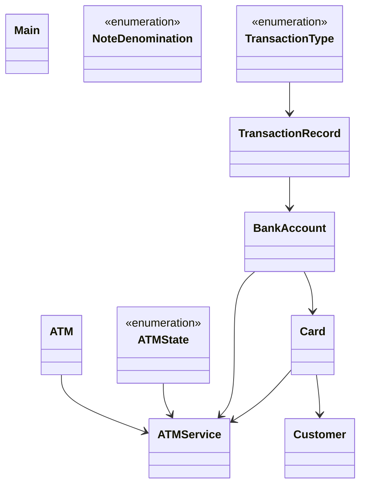

# Low-Level Design: ATM Machine

**Difficulty:** Hard 🔥  
**Interview duration:** 60–75 min  
**Code status:** ✅ Reference Java included (§3)  
**Companion code:** `LLD/ATM`  

---

## How to present in an interview

Present in this order — interviewers expect **flow first**, then **model**, then **code**:

1. **Core flow** — main use cases as numbered steps (happy path + key branches).
2. **Entities & relationships** — nouns and verbs from the flow; who owns whom.
3. **Reference implementation** — classes that map 1:1 to the model (only after flow is agreed).

Do not open with a class diagram or code dumps before the flow is clear.

---

## 1. Core flow

### 1.1 Withdraw / inquire

1. Customer inserts **card**; enters PIN → **authenticate**.
2. Select operation: balance / withdraw / mini statement.
3. Withdraw: validate account + ATM **cash inventory**; **dispense** notes.
4. Session ends; card ejected; transaction logged.

### 1.2 Admin

1. Restock note denominations in ATM cassette map.

---

## 2. Entities & relationships

_Deduced from the flows above — each entity should appear in at least one step._

| Entity | Responsibility | Key fields / collaborators |
|--------|----------------|----------------------------|
| **ATM** | Hardware + cash | note inventory, status |
| **ATMService** | Session facade | card session, operations |
| **Customer** | Owner | cards |
| **Card** | Auth token | PIN, linked BankAccount |
| **BankAccount** | Ledger | balance, transactions |
| **NoteDenomination** | Cash units | ₹100, ₹500, … |
| **TransactionRecord** | Audit | type, amount, timestamp |

### Relationships

- Customer **1—*** Card **1—1** BankAccount
- ATMService drives ATMState (insert card → auth → operate → eject)

### Class diagram



---

## 3. Reference implementation (Java)

Companion project: **`LLD/ATM/`**. Copies below for browsing on GitHub (logical order, not A–Z).

**Run locally:**
```bash
cd LLD/ATM
javac src/*.java
java -cp src Main
```

| # | Source |
|---|--------|
| 1 | [`ATMState.java`](code/12_atm_machine_lld/ATMState.java) |
| 2 | [`NoteDenomination.java`](code/12_atm_machine_lld/NoteDenomination.java) |
| 3 | [`TransactionType.java`](code/12_atm_machine_lld/TransactionType.java) |
| 4 | [`BankAccount.java`](code/12_atm_machine_lld/BankAccount.java) |
| 5 | [`Card.java`](code/12_atm_machine_lld/Card.java) |
| 6 | [`Customer.java`](code/12_atm_machine_lld/Customer.java) |
| 7 | [`TransactionRecord.java`](code/12_atm_machine_lld/TransactionRecord.java) |
| 8 | [`ATM.java`](code/12_atm_machine_lld/ATM.java) |
| 9 | [`ATMService.java`](code/12_atm_machine_lld/ATMService.java) |
| 10 | [`Main.java`](code/12_atm_machine_lld/Main.java) |

