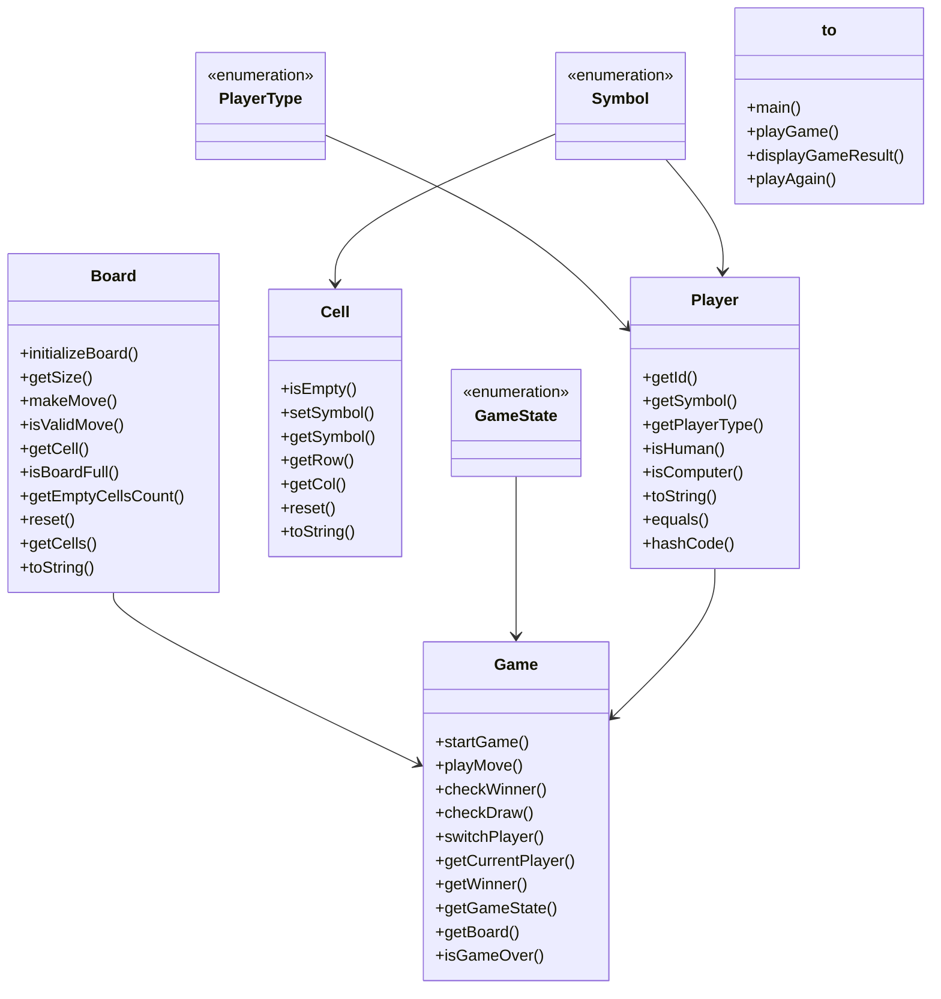

# Low-Level Design: Tic Tac Toe

**Difficulty:** Easy ✅ → Medium ⚡  
**Interview duration:** 30–45 min  
**Code status:** ✅ Reference Java included (§3)  
**Companion code:** `LLD/TicTacToe`  

---

## How to present in an interview

Present in this order — interviewers expect **flow first**, then **model**, then **code**:

1. **Core flow** — main use cases as numbered steps (happy path + key branches).
2. **Entities & relationships** — nouns and verbs from the flow; who owns whom.
3. **Reference implementation** — classes that map 1:1 to the model (only after flow is agreed).

Do not open with a class diagram or code dumps before the flow is clear.

---

## 1. Core flow

### 1.1 Play round

1. Two **players** (X and O) alternate turns.
2. **Board** cell click; validate empty cell.
3. Check win on row/col/diag or **draw** when full.
4. Reset starts new game.

---

## 2. Entities & relationships

_Deduced from the flows above — each entity should appear in at least one step._

| Entity | Responsibility | Key fields / collaborators |
|--------|----------------|----------------------------|
| **Game** | Rules engine | board, players, state, winner |
| **Board** | Grid | cells, size |
| **Cell** | Slot | symbol or empty |
| **Player** | Participant | name, symbol |
| **GameState** | Lifecycle | NOT_STARTED, IN_PROGRESS, WON, DRAW |

### Relationships

- Game **1—1** Board; Game **2—** Player
- TicTacToe facade wraps Game for CLI/demo

### Class diagram



---

## 3. Reference implementation (Java)

Reference implementation from **`LLD/TicTacToe/`** (all sources in this file).

Classes in **logical order**: enums → interfaces → domain → strategies → services → `Main`.

**Run:**
```bash
cd LLD/TicTacToe
javac src/*.java
java -cp src Main
```

### `GameState.java`

```java
/**
 * Enum representing the different states of the game
 */
public enum GameState {
    NOT_STARTED("Game has not started"),
    IN_PROGRESS("Game is in progress"),
    WIN("A player has won"),
    DRAW("Game is a draw");

    private final String description;

    GameState(String description) {
        this.description = description;
    }

    public String getDescription() {
        return description;
    }
}
```

### `PlayerType.java`

```java
/**
 * Enum representing the type of player
 */
public enum PlayerType {
    HUMAN("Human"),
    COMPUTER("Computer/AI");

    private final String description;

    PlayerType(String description) {
        this.description = description;
    }

    public String getDescription() {
        return description;
    }
}
```

### `Symbol.java`

```java
/**
 * Enum representing the symbols that can be placed on the board
 */
public enum Symbol {
    X("X"),
    O("O"),
    EMPTY(" ");

    private final String value;

    Symbol(String value) {
        this.value = value;
    }

    public String getValue() {
        return value;
    }

    /**
     * Check if the symbol is not empty
     */
    public boolean isNotEmpty() {
        return this != EMPTY;
    }
}
```

### `Game.java`

```java
/**
 * Main game orchestrator for Tic Tac Toe
 * Manages game flow, players, board state, and win/draw conditions
 */
public class Game {
    private final Board board;
    private final Player playerX;
    private final Player playerO;
    private Player currentPlayer;
    private GameState gameState;
    private Player winner;

    /**
     * Constructor for Game with two players
     * @param playerX The player with X symbol
     * @param playerO The player with O symbol
     */
    public Game(Player playerX, Player playerO) {
        if (playerX.getSymbol() != Symbol.X || playerO.getSymbol() != Symbol.O) {
            throw new IllegalArgumentException("playerX must have X symbol and playerO must have O symbol");
        }
        this.board = new Board();
        this.playerX = playerX;
        this.playerO = playerO;
        this.gameState = GameState.NOT_STARTED;
        this.winner = null;
        this.currentPlayer = null;
    }

    /**
     * Constructor for Game with custom board size
     * @param playerX The player with X symbol
     * @param playerO The player with O symbol
     * @param boardSize The size of the board
     */
    public Game(Player playerX, Player playerO, int boardSize) {
        if (playerX.getSymbol() != Symbol.X || playerO.getSymbol() != Symbol.O) {
            throw new IllegalArgumentException("playerX must have X symbol and playerO must have O symbol");
        }
        this.board = new Board(boardSize);
        this.playerX = playerX;
        this.playerO = playerO;
        this.gameState = GameState.NOT_STARTED;
        this.winner = null;
        this.currentPlayer = null;
    }

    /**
     * Start the game
     */
    public void startGame() {
        this.currentPlayer = playerX; // X always goes first
        this.gameState = GameState.IN_PROGRESS;
        this.winner = null;
        System.out.println("Game started! Player X goes first.");
    }

    /**
     * Execute a move by the current player
     * @param row Row index
     * @param col Column index
     * @return true if move was successful, false otherwise
     */
    public boolean playMove(int row, int col) {
        if (gameState != GameState.IN_PROGRESS) {
            System.out.println("Game is not in progress. Current state: " + gameState);
            return false;
        }

        try {
            if (!board.isValidMove(row, col)) {
                System.out.println("Invalid move! Cell at (" + row + ", " + col + ") is either out of bounds or already occupied.");
                return false;
            }

            board.makeMove(row, col, currentPlayer.getSymbol());
            System.out.println(currentPlayer.getId() + " placed " + currentPlayer.getSymbol() + " at (" + row + ", " + col + ")");

            // Check for winner
            if (checkWinner()) {
                gameState = GameState.WIN;
                winner = currentPlayer;
                System.out.println(currentPlayer.getId() + " wins!");
                return true;
            }

            // Check for draw
            if (checkDraw()) {
                gameState = GameState.DRAW;
                System.out.println("Game is a draw!");
                return true;
            }

            // Switch player
            switchPlayer();
            return true;
        } catch (IllegalArgumentException e) {
            System.out.println("Error: " + e.getMessage());
            return false;
        }
    }

    /**
     * Check if the current player has won
     * @return true if current player has won, false otherwise
     */
    private boolean checkWinner() {
        Symbol symbol = currentPlayer.getSymbol();
        int size = board.getSize();

        // Check rows
        for (int row = 0; row < size; row++) {
            boolean rowWin = true;
            for (int col = 0; col < size; col++) {
                if (board.getCell(row, col).getSymbol() != symbol) {
                    rowWin = false;
                    break;
                }
            }
            if (rowWin) return true;
        }

        // Check columns
        for (int col = 0; col < size; col++) {
            boolean colWin = true;
            for (int row = 0; row < size; row++) {
                if (board.getCell(row, col).getSymbol() != symbol) {
                    colWin = false;
                    break;
                }
            }
            if (colWin) return true;
        }

        // Check main diagonal (top-left to bottom-right)
        boolean mainDiagWin = true;
        for (int i = 0; i < size; i++) {
            if (board.getCell(i, i).getSymbol() != symbol) {
                mainDiagWin = false;
                break;
            }
        }
        if (mainDiagWin) return true;

        // Check anti-diagonal (top-right to bottom-left)
        boolean antiDiagWin = true;
        for (int i = 0; i < size; i++) {
            if (board.getCell(i, size - 1 - i).getSymbol() != symbol) {
                antiDiagWin = false;
                break;
            }
        }
        if (antiDiagWin) return true;

        return false;
    }

    /**
     * Check if the game is a draw
     * @return true if board is full and no winner, false otherwise
     */
    private boolean checkDraw() {
        return board.isBoardFull() && winner == null;
    }

    /**
     * Switch to the other player
     */
    private void switchPlayer() {
        currentPlayer = (currentPlayer == playerX) ? playerO : playerX;
    }

    /**
     * Get the current player
     * @return The current player
     */
    public Player getCurrentPlayer() {
        return currentPlayer;
    }

    /**
     * Get the winner of the game
     * @return The winning player, or null if no winner
     */
    public Player getWinner() {
        return winner;
    }

    /**
     * Get the current game state
     * @return The current game state
     */
    public GameState getGameState() {
        return gameState;
    }

    /**
     * Get the board
     * @return The board instance
     */
    public Board getBoard() {
        return board;
    }

    /**
     * Check if game is over
     * @return true if game is not in progress, false otherwise
     */
    public boolean isGameOver() {
        return gameState == GameState.WIN || gameState == GameState.DRAW;
    }

    /**
     * Reset the game for a new round
     */
    public void resetGame() {
        board.reset();
        currentPlayer = playerX;
        gameState = GameState.IN_PROGRESS;
        winner = null;
        System.out.println("Game has been reset.");
    }

    /**
     * Display the current board
     */
    public void displayBoard() {
        System.out.println("\n" + board.toString());
    }

    /**
     * Display game info
     */
    public void displayGameInfo() {
        System.out.println("========== Game Info ==========");
        System.out.println("Current Player: " + currentPlayer.getId() + " (" + currentPlayer.getSymbol() + ")");
        System.out.println("Game State: " + gameState.getDescription());
        if (winner != null) {
            System.out.println("Winner: " + winner.getId());
        }
        System.out.println("Empty Cells: " + board.getEmptyCellsCount());
        System.out.println("===============================\n");
    }

    /**
     * Get player X
     * @return Player X
     */
    public Player getPlayerX() {
        return playerX;
    }

    /**
     * Get player O
     * @return Player O
     */
    public Player getPlayerO() {
        return playerO;
    }
}
```

### `Player.java`

```java
/**
 * Represents a player in the Tic Tac Toe game
 */
public class Player {
    private final String id;
    private final Symbol symbol;
    private final PlayerType playerType;

    /**
     * Constructor for Player
     * @param id Unique identifier for the player
     * @param symbol The symbol for this player (X or O)
     * @param playerType Type of player (HUMAN or COMPUTER)
     */
    public Player(String id, Symbol symbol, PlayerType playerType) {
        if (symbol == Symbol.EMPTY) {
            throw new IllegalArgumentException("Player cannot have EMPTY symbol");
        }
        this.id = id;
        this.symbol = symbol;
        this.playerType = playerType;
    }

    /**
     * Get the player's unique identifier
     * @return Player ID
     */
    public String getId() {
        return id;
    }

    /**
     * Get the player's symbol
     * @return Player's symbol (X or O)
     */
    public Symbol getSymbol() {
        return symbol;
    }

    /**
     * Get the player's type
     * @return Player type (HUMAN or COMPUTER)
     */
    public PlayerType getPlayerType() {
        return playerType;
    }

    /**
     * Check if this player is a human player
     * @return true if player is human, false otherwise
     */
    public boolean isHuman() {
        return playerType == PlayerType.HUMAN;
    }

    /**
     * Check if this player is a computer player
     * @return true if player is computer, false otherwise
     */
    public boolean isComputer() {
        return playerType == PlayerType.COMPUTER;
    }

    @Override
    public String toString() {
        return "Player{" +
                "id='" + id + '\'' +
                ", symbol=" + symbol +
                ", playerType=" + playerType +
                '}';
    }

    @Override
    public boolean equals(Object obj) {
        if (this == obj) return true;
        if (obj == null || getClass() != obj.getClass()) return false;
        Player player = (Player) obj;
        return id.equals(player.id) && symbol == player.symbol;
    }

    @Override
    public int hashCode() {
        return id.hashCode() * 31 + symbol.hashCode();
    }
}
```

### `Cell.java`

```java
/**
 * Represents a single cell on the Tic Tac Toe board
 */
public class Cell {
    private final int row;
    private final int col;
    private Symbol symbol;

    /**
     * Constructor for Cell
     * @param row Row index of the cell
     * @param col Column index of the cell
     */
    public Cell(int row, int col) {
        this.row = row;
        this.col = col;
        this.symbol = Symbol.EMPTY;
    }

    /**
     * Check if the cell is empty
     * @return true if cell is empty, false otherwise
     */
    public boolean isEmpty() {
        return symbol == Symbol.EMPTY;
    }

    /**
     * Set the symbol in the cell
     * @param symbol The symbol to place (X or O)
     * @throws IllegalArgumentException if trying to place symbol in non-empty cell
     */
    public void setSymbol(Symbol symbol) {
        if (!isEmpty()) {
            throw new IllegalArgumentException("Cell already occupied at (" + row + ", " + col + ")");
        }
        if (symbol == Symbol.EMPTY) {
            throw new IllegalArgumentException("Cannot place EMPTY symbol in a cell");
        }
        this.symbol = symbol;
    }

    /**
     * Get the symbol in the cell
     * @return The current symbol
     */
    public Symbol getSymbol() {
        return symbol;
    }

    /**
     * Get the row index
     * @return Row index
     */
    public int getRow() {
        return row;
    }

    /**
     * Get the column index
     * @return Column index
     */
    public int getCol() {
        return col;
    }

    /**
     * Reset the cell to empty
     */
    public void reset() {
        this.symbol = Symbol.EMPTY;
    }

    @Override
    public String toString() {
        return symbol.getValue();
    }
}
```

### `Board.java`

```java
/**
 * Represents the Tic Tac Toe game board
 * Manages board state and cell operations
 */
public class Board {
    private final int size;
    private final Cell[][] cells;

    /**
     * Constructor for Board with default size 3x3
     */
    public Board() {
        this(3);
    }

    /**
     * Constructor for Board with custom size
     * @param size The size of the board (e.g., 3 for 3x3 board)
     */
    public Board(int size) {
        this.size = size;
        this.cells = new Cell[size][size];
        initializeBoard();
    }

    /**
     * Initialize the board with empty cells
     */
    private void initializeBoard() {
        for (int row = 0; row < size; row++) {
            for (int col = 0; col < size; col++) {
                cells[row][col] = new Cell(row, col);
            }
        }
    }

    /**
     * Get the size of the board
     * @return Board size
     */
    public int getSize() {
        return size;
    }

    /**
     * Make a move on the board by placing a symbol at given position
     * @param row Row index
     * @param col Column index
     * @param symbol The symbol to place
     * @return true if move was successful, false otherwise
     * @throws IllegalArgumentException if move is invalid
     */
    public boolean makeMove(int row, int col, Symbol symbol) {
        if (!isValidMove(row, col)) {
            throw new IllegalArgumentException("Invalid move at (" + row + ", " + col + ")");
        }
        cells[row][col].setSymbol(symbol);
        return true;
    }

    /**
     * Check if a move is valid (within bounds and cell is empty)
     * @param row Row index
     * @param col Column index
     * @return true if move is valid, false otherwise
     */
    public boolean isValidMove(int row, int col) {
        // Check bounds
        if (row < 0 || row >= size || col < 0 || col >= size) {
            return false;
        }
        // Check if cell is empty
        return cells[row][col].isEmpty();
    }

    /**
     * Get a cell at given position
     * @param row Row index
     * @param col Column index
     * @return The Cell object
     * @throws IndexOutOfBoundsException if position is out of bounds
     */
    public Cell getCell(int row, int col) {
        if (row < 0 || row >= size || col < 0 || col >= size) {
            throw new IndexOutOfBoundsException("Position (" + row + ", " + col + ") is out of bounds");
        }
        return cells[row][col];
    }

    /**
     * Check if the board is full
     * @return true if all cells are filled, false otherwise
     */
    public boolean isBoardFull() {
        for (int row = 0; row < size; row++) {
            for (int col = 0; col < size; col++) {
                if (cells[row][col].isEmpty()) {
                    return false;
                }
            }
        }
        return true;
    }

    /**
     * Count empty cells on the board
     * @return Number of empty cells
     */
    public int getEmptyCellsCount() {
        int count = 0;
        for (int row = 0; row < size; row++) {
            for (int col = 0; col < size; col++) {
                if (cells[row][col].isEmpty()) {
                    count++;
                }
            }
        }
        return count;
    }

    /**
     * Reset the board to initial state (all cells empty)
     */
    public void reset() {
        for (int row = 0; row < size; row++) {
            for (int col = 0; col < size; col++) {
                cells[row][col].reset();
            }
        }
    }

    /**
     * Get the 2D array of cells
     * @return The cells array
     */
    public Cell[][] getCells() {
        return cells;
    }

    @Override
    public String toString() {
        StringBuilder sb = new StringBuilder();
        for (int row = 0; row < size; row++) {
            for (int col = 0; col < size; col++) {
                sb.append(" ").append(cells[row][col].getSymbol().getValue()).append(" ");
                if (col < size - 1) {
                    sb.append("|");
                }
            }
            sb.append("\n");
            if (row < size - 1) {
                sb.append("-----------\n");
            }
        }
        return sb.toString();
    }
}
```

### `TicTacToe.java`

```java
import java.util.Scanner;

/**
 * Main class to run the Tic Tac Toe game
 * Provides an interactive command-line interface for playing the game
 */
public class TicTacToe {

    public static void main(String[] args) {
        System.out.println("========== Tic Tac Toe Game ==========");

        // Create players
        Player playerX = new Player("Player 1", Symbol.X, PlayerType.HUMAN);
        Player playerO = new Player("Player 2", Symbol.O, PlayerType.HUMAN);

        // Create game
        Game game = new Game(playerX, playerO);

        // Start game
        game.startGame();

        // Display initial board
        game.displayBoard();

        // Game loop
        playGame(game);

        System.out.println("Thanks for playing!");
    }

    /**
     * Main game loop - handles user input and game flow
     * @param game The game instance
     */
    private static void playGame(Game game) {
        Scanner scanner = new Scanner(System.in);

        while (!game.isGameOver()) {
            game.displayGameInfo();

            // Get player input
            int row = -1;
            int col = -1;
            boolean validInput = false;

            while (!validInput) {
                try {
                    System.out.print(game.getCurrentPlayer().getId() + ", enter row (0-" + (game.getBoard().getSize() - 1) + "): ");
                    row = scanner.nextInt();

                    System.out.print(game.getCurrentPlayer().getId() + ", enter column (0-" + (game.getBoard().getSize() - 1) + "): ");
                    col = scanner.nextInt();

                    // Validate input bounds
                    if (row < 0 || row >= game.getBoard().getSize() || col < 0 || col >= game.getBoard().getSize()) {
                        System.out.println("Invalid input! Please enter values between 0 and " + (game.getBoard().getSize() - 1) + ".");
                        continue;
                    }

                    validInput = true;
                } catch (Exception e) {
                    System.out.println("Invalid input! Please enter integers only.");
                    scanner.nextLine(); // Clear the input buffer
                }
            }

            // Play the move
            boolean moveSuccess = game.playMove(row, col);

            if (moveSuccess) {
                game.displayBoard();
            } else {
                System.out.println("Move failed. Try again.\n");
            }
        }

        // Game over
        scanner.close();
        displayGameResult(game);

        // Ask to play again
        playAgain(game);
    }

    /**
     * Display the final game result
     * @param game The game instance
     */
    private static void displayGameResult(Game game) {
        System.out.println("\n========== Game Over ==========");
        if (game.getGameState() == GameState.WIN) {
            System.out.println("🎉 " + game.getWinner().getId() + " (" + game.getWinner().getSymbol() + ") wins! 🎉");
        } else if (game.getGameState() == GameState.DRAW) {
            System.out.println("🤝 The game is a draw! 🤝");
        }
        System.out.println("Final Board:");
        game.displayBoard();
        System.out.println("==============================\n");
    }

    /**
     * Ask user if they want to play again
     * @param game The game instance
     */
    private static void playAgain(Game game) {
        Scanner scanner = new Scanner(System.in);

        System.out.print("Do you want to play again? (yes/no): ");
        String response = scanner.nextLine().trim().toLowerCase();

        if (response.equals("yes") || response.equals("y")) {
            game.resetGame();
            game.displayBoard();
            playGame(game);
        } else {
            System.out.println("Goodbye!");
        }

        scanner.close();
    }
}
```

