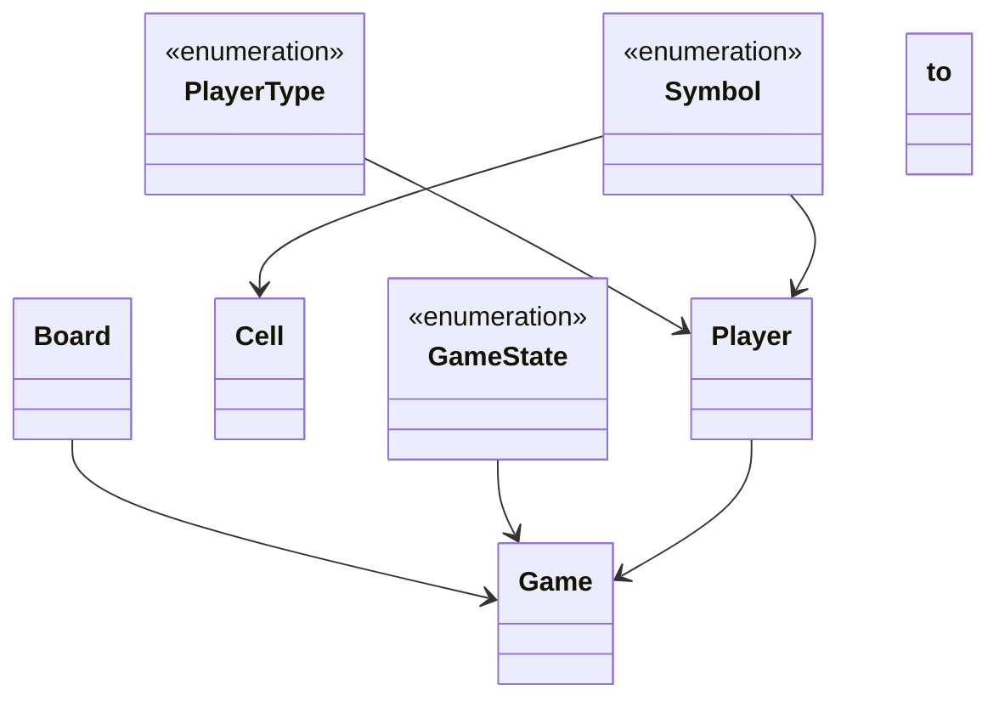

# Low-Level Design: Tic Tac Toe

**Difficulty:** Easy ✅ → Medium ⚡  
**Interview duration:** 30–45 min  
**Code status:** ✅ Reference Java included (§3)  
**Companion code:** `LLD/TicTacToe`  

---

## How to present in an interview

Present in this order — interviewers expect **flow first**, then **model**, then **code**:

1. **Core flow** — main use cases as numbered steps (happy path + key branches).
2. **Entities & relationships** — nouns and verbs from the flow; who owns whom.
3. **Reference implementation** — classes that map 1:1 to the model (only after flow is agreed).

Do not open with a class diagram or code dumps before the flow is clear.

---

## 1. Core flow

### 1.1 Play round

1. Two **players** (X and O) alternate turns.
2. **Board** cell click; validate empty cell.
3. Check win on row/col/diag or **draw** when full.
4. Reset starts new game.

---

## 2. Entities & relationships

_Deduced from the flows above — each entity should appear in at least one step._

| Entity | Responsibility | Key fields / collaborators |
|--------|----------------|----------------------------|
| **Game** | Rules engine | board, players, state, winner |
| **Board** | Grid | cells, size |
| **Cell** | Slot | symbol or empty |
| **Player** | Participant | name, symbol |
| **GameState** | Lifecycle | NOT_STARTED, IN_PROGRESS, WON, DRAW |

### Relationships

- Game **1—1** Board; Game **2—** Player
- TicTacToe facade wraps Game for CLI/demo

### Class diagram



---

## 3. Reference implementation (Java)

Companion project: **`LLD/TicTacToe/`**. Copies below for browsing on GitHub (logical order, not A–Z).

**Run locally:**
```bash
cd LLD/TicTacToe
javac src/*.java
java -cp src Main
```

| # | Source |
|---|--------|
| 1 | [`GameState.java`](code/13_tic_tac_toe_lld/GameState.java) |
| 2 | [`PlayerType.java`](code/13_tic_tac_toe_lld/PlayerType.java) |
| 3 | [`Symbol.java`](code/13_tic_tac_toe_lld/Symbol.java) |
| 4 | [`Game.java`](code/13_tic_tac_toe_lld/Game.java) |
| 5 | [`Player.java`](code/13_tic_tac_toe_lld/Player.java) |
| 6 | [`Cell.java`](code/13_tic_tac_toe_lld/Cell.java) |
| 7 | [`Board.java`](code/13_tic_tac_toe_lld/Board.java) |
| 8 | [`TicTacToe.java`](code/13_tic_tac_toe_lld/TicTacToe.java) |

