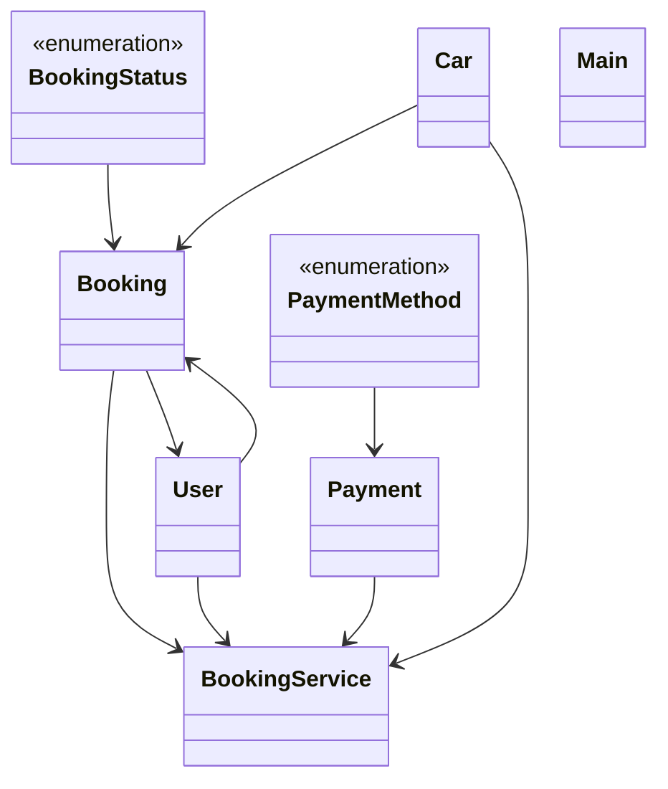

# Low-Level Design: Car Rental System (ZoomCar-style)

**Difficulty:** Hard 🔥  
**Interview duration:** 60–75 min  
**Code status:** ✅ Reference Java included (§3)  
**Companion code:** `LLD/ZoomCar`  

---

## How to present in an interview

Present in this order — interviewers expect **flow first**, then **model**, then **code**:

1. **Core flow** — main use cases as numbered steps (happy path + key branches).
2. **Entities & relationships** — nouns and verbs from the flow; who owns whom.
3. **Reference implementation** — classes that map 1:1 to the model (only after flow is agreed).

Do not open with a class diagram or code dumps before the flow is clear.

---

## 1. Core flow

### 1.1 Rent car

1. User picks available **car** and books for N km.
2. System charges **initial amount** (rate × km × location multiplier).
3. Ride completes → final km from odometer → **remaining payment**.
4. **Booking status**: BOOKED → COMPLETED with payment states.

---

## 2. Entities & relationships

_Deduced from the flows above — each entity should appear in at least one step._

| Entity | Responsibility | Key fields / collaborators |
|--------|----------------|----------------------------|
| **User** | Renter | bookings |
| **Car** | Fleet unit | availability, odometer, ratePerKm |
| **Booking** | Reservation | kmsBooked, status, amounts |
| **Payment** | Settlement | method, amount |
| **BookingService** | Workflow | book, complete, pay |

### Relationships

- User **1—*** Booking **1—1** Car
- Payment settles initial vs final fare on completion

### Class diagram



---

## 3. Reference implementation (Java)

Companion project: **`LLD/ZoomCar/`**. Copies below for browsing on GitHub (logical order, not A–Z).

**Run locally:**
```bash
cd LLD/ZoomCar
javac src/*.java
java -cp src Main
```

| # | Source |
|---|--------|
| 1 | [`BookingStatus.java`](code/14_car_rental_system_lld/BookingStatus.java) |
| 2 | [`PaymentMethod.java`](code/14_car_rental_system_lld/PaymentMethod.java) |
| 3 | [`Booking.java`](code/14_car_rental_system_lld/Booking.java) |
| 4 | [`Payment.java`](code/14_car_rental_system_lld/Payment.java) |
| 5 | [`User.java`](code/14_car_rental_system_lld/User.java) |
| 6 | [`Car.java`](code/14_car_rental_system_lld/Car.java) |
| 7 | [`BookingService.java`](code/14_car_rental_system_lld/BookingService.java) |
| 8 | [`Main.java`](code/14_car_rental_system_lld/Main.java) |

