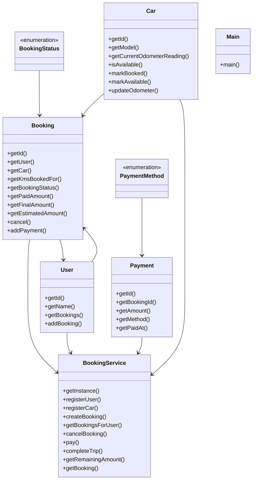

# Low-Level Design: Car Rental System (ZoomCar-style)

**Difficulty:** Hard 🔥  
**Interview duration:** 60–75 min  
**Code status:** ✅ Reference Java included (§3)  
**Companion code:** `LLD/ZoomCar`  

---

## How to present in an interview

Present in this order — interviewers expect **flow first**, then **model**, then **code**:

1. **Core flow** — main use cases as numbered steps (happy path + key branches).
2. **Entities & relationships** — nouns and verbs from the flow; who owns whom.
3. **Reference implementation** — classes that map 1:1 to the model (only after flow is agreed).

Do not open with a class diagram or code dumps before the flow is clear.

---

## 1. Core flow

### 1.1 Rent car

1. User picks available **car** and books for N km.
2. System charges **initial amount** (rate × km × location multiplier).
3. Ride completes → final km from odometer → **remaining payment**.
4. **Booking status**: BOOKED → COMPLETED with payment states.

---

## 2. Entities & relationships

_Deduced from the flows above — each entity should appear in at least one step._

| Entity | Responsibility | Key fields / collaborators |
|--------|----------------|----------------------------|
| **User** | Renter | bookings |
| **Car** | Fleet unit | availability, odometer, ratePerKm |
| **Booking** | Reservation | kmsBooked, status, amounts |
| **Payment** | Settlement | method, amount |
| **BookingService** | Workflow | book, complete, pay |

### Relationships

- User **1—*** Booking **1—1** Car
- Payment settles initial vs final fare on completion

### Class diagram



---

## 3. Reference implementation (Java)

Reference implementation from **`LLD/ZoomCar/`** (all sources in this file).

Classes in **logical order**: enums → interfaces → domain → strategies → services → `Main`.

**Run:**
```bash
cd LLD/ZoomCar
javac src/*.java
java -cp src Main
```

### `BookingStatus.java`

```java
public enum BookingStatus {
    BOOKED,
    CANCELLED,
    PAYMENT_PENDING,
    PAYMENT_COMPLETED,
    TRIP_COMPLETED
}
```

### `PaymentMethod.java`

```java
public enum PaymentMethod {
    UPI,
    CARD
}
```

### `Booking.java`

```java
import java.util.UUID;

public class Booking {
    private final String id;
    private final User user;
    private final Car car;
    private final int kmsBookedFor;
    private final double locationMultiplier;
    private final int ratePerKm;
    private final int startOdometer;

    private BookingStatus bookingStatus;
    private int paidAmount;
    private Integer endOdometer;
    private Integer finalAmount;

    public Booking(User user, Car car, int kmsBookedFor, double locationMultiplier,
                   int ratePerKm, int startOdometer) {
        this.id = UUID.randomUUID().toString();
        this.user = user;
        this.car = car;
        this.kmsBookedFor = kmsBookedFor;
        this.locationMultiplier = locationMultiplier;
        this.ratePerKm = ratePerKm;
        this.startOdometer = startOdometer;
        this.bookingStatus = BookingStatus.BOOKED;
        this.paidAmount = 0;
    }

    public String getId() { return id; }
    public User getUser() { return user; }
    public Car getCar() { return car; }
    public int getKmsBookedFor() { return kmsBookedFor; }
    public BookingStatus getBookingStatus() { return bookingStatus; }
    public int getPaidAmount() { return paidAmount; }
    public Integer getFinalAmount() { return finalAmount; }

    public int getEstimatedAmount() {
        return (int) Math.ceil(kmsBookedFor * ratePerKm * locationMultiplier);
    }

    public void cancel() {
        if (bookingStatus != BookingStatus.BOOKED) {
            throw new IllegalStateException("Only BOOKED booking can be cancelled");
        }
        bookingStatus = BookingStatus.CANCELLED;
    }

    public void addPayment(int amount) {
        if (amount <= 0) throw new IllegalArgumentException("Amount must be positive");
        paidAmount += amount;
    }

    public void completeTrip(int endOdometer) {
        if (endOdometer < startOdometer) {
            throw new IllegalArgumentException("End odometer cannot be less than start odometer");
        }
        this.endOdometer = endOdometer;
        int actualKms = endOdometer - startOdometer;
        this.finalAmount = (int) Math.ceil(actualKms * ratePerKm * locationMultiplier);
        this.bookingStatus = BookingStatus.TRIP_COMPLETED;
    }

    public int getRemainingAmount() {
        int payable = (finalAmount != null) ? finalAmount : getEstimatedAmount();
        return Math.max(0, payable - paidAmount);
    }

    public void markPaymentPending() {
        this.bookingStatus = BookingStatus.PAYMENT_PENDING;
    }

    public void markPaymentCompleted() {
        this.bookingStatus = BookingStatus.PAYMENT_COMPLETED;
    }
}
```

### `Payment.java`

```java
import java.time.LocalDateTime;
import java.util.UUID;

public class Payment {
    private final String id;
    private final String bookingId;
    private final int amount;
    private final PaymentMethod method;
    private final LocalDateTime paidAt;

    public Payment(String bookingId, int amount, PaymentMethod method) {
        this.id = UUID.randomUUID().toString();
        this.bookingId = bookingId;
        this.amount = amount;
        this.method = method;
        this.paidAt = LocalDateTime.now();
    }

    public String getId() { return id; }
    public String getBookingId() { return bookingId; }
    public int getAmount() { return amount; }
    public PaymentMethod getMethod() { return method; }
    public LocalDateTime getPaidAt() { return paidAt; }
}
```

### `User.java`

```java
import java.util.ArrayList;
import java.util.Collections;
import java.util.List;
import java.util.UUID;

public class User {
    private final String id;
    private final String name;
    private final List<Booking> bookings;

    public User(String name) {
        this.id = UUID.randomUUID().toString();
        this.name = name;
        this.bookings = new ArrayList<>();
    }

    public String getId() { return id; }
    public String getName() { return name; }
    public List<Booking> getBookings() { return Collections.unmodifiableList(bookings); }

    public void addBooking(Booking booking) {
        bookings.add(booking);
    }
}
```

### `Car.java`

```java
public class Car {
    private final String id;
    private final String model;
    private int currentOdometerReading;
    private boolean available;

    public Car(String id, String model, int currentOdometerReading) {
        this.id = id;
        this.model = model;
        this.currentOdometerReading = currentOdometerReading;
        this.available = true;
    }

    public String getId() { return id; }
    public String getModel() { return model; }
    public int getCurrentOdometerReading() { return currentOdometerReading; }
    public boolean isAvailable() { return available; }

    public void markBooked() { this.available = false; }
    public void markAvailable() { this.available = true; }
    public void updateOdometer(int newReading) { this.currentOdometerReading = newReading; }
}
```

### `BookingService.java`

```java
import java.util.*;

public class BookingService {
    private static final int BASE_RATE_PER_KM = 100;
    private static BookingService instance;

    private final Map<String, User> users = new HashMap<>();
    private final Map<String, Car> cars = new HashMap<>();
    private final Map<String, Booking> bookings = new HashMap<>();
    private final Map<String, List<Payment>> paymentsByBooking = new HashMap<>();

    private BookingService() {}

    public static synchronized BookingService getInstance() {
        if (instance == null) {
            instance = new BookingService();
        }
        return instance;
    }

    public String registerUser(String name) {
        User user = new User(name);
        users.put(user.getId(), user);
        return user.getId();
    }

    public void registerCar(String id, String model, int currentOdometerReading) {
        cars.put(id, new Car(id, model, currentOdometerReading));
    }

    public Booking createBooking(String userId, String carId, int kmsBookedFor, double locationMultiplier) {
        User user = users.get(userId);
        if (user == null) throw new IllegalArgumentException("Invalid user");
        if (kmsBookedFor <= 0) throw new IllegalArgumentException("kmsBookedFor must be > 0");
        if (locationMultiplier <= 0) throw new IllegalArgumentException("locationMultiplier must be > 0");

        Car car = cars.get(carId);
        if (car == null) throw new IllegalArgumentException("Invalid carId");
        if (!car.isAvailable()) throw new IllegalStateException("Selected car is not available");

        car.markBooked();
        Booking booking = new Booking(
                user,
                car,
                kmsBookedFor,
                locationMultiplier,
                BASE_RATE_PER_KM,
                car.getCurrentOdometerReading()
        );

        bookings.put(booking.getId(), booking);
        user.addBooking(booking);
        paymentsByBooking.put(booking.getId(), new ArrayList<>());
        return booking;
    }

    public List<Booking> getBookingsForUser(String userId) {
        User user = users.get(userId);
        if (user == null) throw new IllegalArgumentException("Invalid userId");
        return user.getBookings();
    }


    public void cancelBooking(String bookingId) {
        Booking booking = getBookingOrThrow(bookingId);
        booking.cancel();
        booking.getCar().markAvailable();
    }

    public Payment pay(String bookingId, int amount, PaymentMethod method) {
        Booking booking = getBookingOrThrow(bookingId);
        if (booking.getBookingStatus() == BookingStatus.CANCELLED) {
            throw new IllegalStateException("Cannot pay for cancelled booking");
        }

        Payment payment = new Payment(bookingId, amount, method);
        booking.addPayment(amount);
        paymentsByBooking.get(bookingId).add(payment);

        if (booking.getRemainingAmount() > 0) {
            booking.markPaymentPending();
        } else {
            booking.markPaymentCompleted();
        }
        return payment;
    }

    public void completeTrip(String bookingId, int endOdometerReading) {
        Booking booking = getBookingOrThrow(bookingId);
        Car car = booking.getCar();

        booking.completeTrip(endOdometerReading);
        car.updateOdometer(endOdometerReading);
        car.markAvailable();

        if (booking.getRemainingAmount() > 0) {
            booking.markPaymentPending();
        } else {
            booking.markPaymentCompleted();
        }
    }

    public int getRemainingAmount(String bookingId) {
        return getBookingOrThrow(bookingId).getRemainingAmount();
    }

    public Booking getBooking(String bookingId) {
        return getBookingOrThrow(bookingId);
    }

    private Booking getBookingOrThrow(String bookingId) {
        Booking booking = bookings.get(bookingId);
        if (booking == null) throw new IllegalArgumentException("Invalid bookingId");
        return booking;
    }

    private Car findAvailableCar() {
        for (Car car : cars.values()) {
            if (car.isAvailable()) return car;
        }
        return null;
    }
}
```

### `Main.java`

```java
public class Main {
    public static void main(String[] args) {
        BookingService service = BookingService.getInstance();

        String userId = service.registerUser("Aman");
        service.registerCar("KA01AA1111", "Swift", 10000);
        service.registerCar("KA01BB2222", "i20", 20000);

        String selectedCarId = "KA01BB2222"; // user-selected
        Booking booking = service.createBooking(userId, selectedCarId, 50, 1.2);
        System.out.println("Booking ID: " + booking.getId());
        System.out.println("Estimated amount: " + booking.getEstimatedAmount());

        service.pay(booking.getId(), 2000, PaymentMethod.UPI);
        service.completeTrip(booking.getId(), 20070);

        int remaining = service.getRemainingAmount(booking.getId());
        System.out.println("Remaining after trip: " + remaining);

        if (remaining > 0) {
            service.pay(booking.getId(), remaining, PaymentMethod.CARD);
        }

        System.out.println("Final status: " + service.getBooking(booking.getId()).getBookingStatus());
    }
}
```

