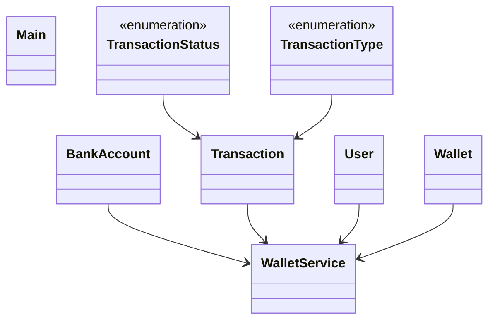

# Low-Level Design: Digital Wallet

**Difficulty:** Hard 🔥  
**Interview duration:** 60–75 min  
**Code status:** ✅ Reference Java included (§3)  
**Companion code:** `LLD/DigitalWallet`  

---

## How to present in an interview

Present in this order — interviewers expect **flow first**, then **model**, then **code**:

1. **Core flow** — main use cases as numbered steps (happy path + key branches).
2. **Entities & relationships** — nouns and verbs from the flow; who owns whom.
3. **Reference implementation** — classes that map 1:1 to the model (only after flow is agreed).

Do not open with a class diagram or code dumps before the flow is clear.

---

## 1. Core flow

### 1.1 Wallet ops

1. User registers **wallet** linked to **bank account**.
2. **Add money** from bank → wallet balance.
3. **Transfer** P2P: debit source, credit destination, **transaction** record.
4. Failed/invalid transfer rolls back or marks FAILED.

---

## 2. Entities & relationships

_Deduced from the flows above — each entity should appear in at least one step._

| Entity | Responsibility | Key fields / collaborators |
|--------|----------------|----------------------------|
| **User** | Identity | name, bank link |
| **Wallet** | Balance store | walletId, balance |
| **BankAccount** | External rail | account mask |
| **Transaction** | Immutable log | type, status, amount |
| **WalletService** | API | register, addMoney, transfer |

### Relationships

- User **1—1** Wallet; WalletService writes Transaction per transfer

### Class diagram



---

## 3. Reference implementation (Java)

Companion project: **`LLD/DigitalWallet/`**. Copies below for browsing on GitHub (logical order, not A–Z).

**Run locally:**
```bash
cd LLD/DigitalWallet
javac src/*.java
java -cp src Main
```

| # | Source |
|---|--------|
| 1 | [`TransactionStatus.java`](code/15_digital_wallet_lld/TransactionStatus.java) |
| 2 | [`TransactionType.java`](code/15_digital_wallet_lld/TransactionType.java) |
| 3 | [`Transaction.java`](code/15_digital_wallet_lld/Transaction.java) |
| 4 | [`BankAccount.java`](code/15_digital_wallet_lld/BankAccount.java) |
| 5 | [`User.java`](code/15_digital_wallet_lld/User.java) |
| 6 | [`Wallet.java`](code/15_digital_wallet_lld/Wallet.java) |
| 7 | [`WalletService.java`](code/15_digital_wallet_lld/WalletService.java) |
| 8 | [`Main.java`](code/15_digital_wallet_lld/Main.java) |

