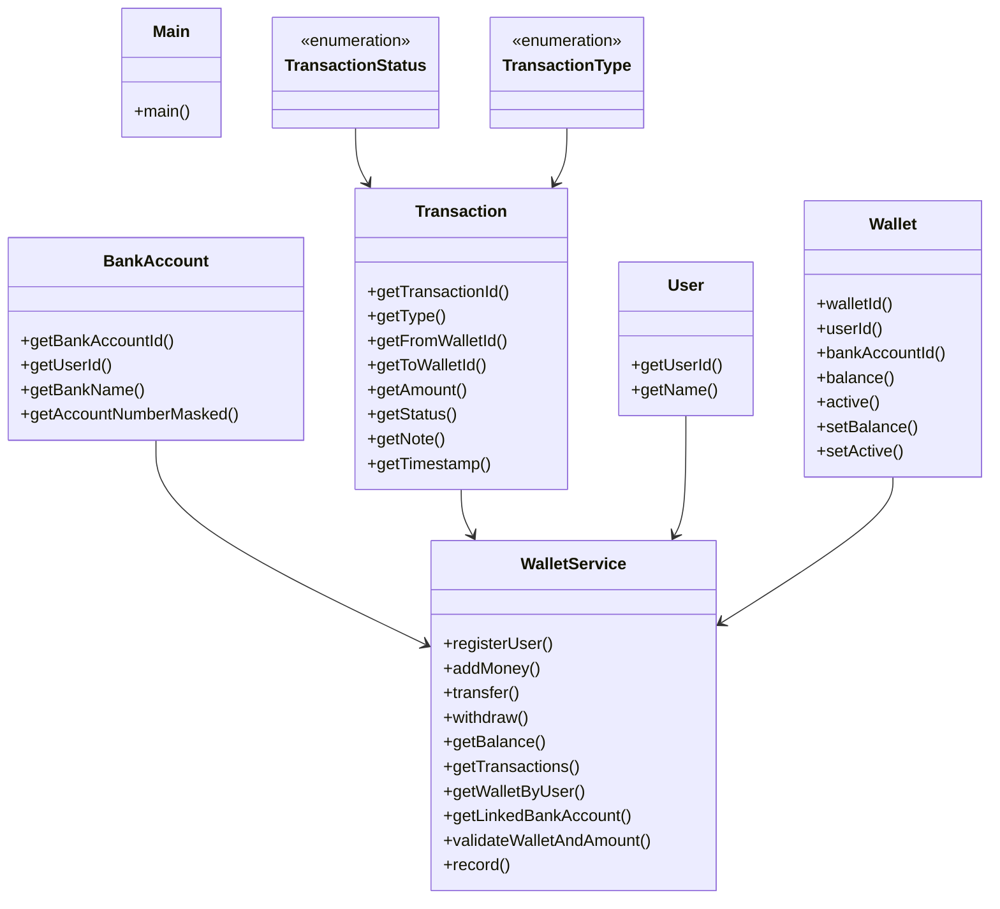

# Low-Level Design: Digital Wallet

**Difficulty:** Hard 🔥  
**Interview duration:** 60–75 min  
**Code status:** ✅ Reference Java included (§3)  
**Companion code:** `LLD/DigitalWallet`  

---

## How to present in an interview

Present in this order — interviewers expect **flow first**, then **model**, then **code**:

1. **Core flow** — main use cases as numbered steps (happy path + key branches).
2. **Entities & relationships** — nouns and verbs from the flow; who owns whom.
3. **Reference implementation** — classes that map 1:1 to the model (only after flow is agreed).

Do not open with a class diagram or code dumps before the flow is clear.

---

## 1. Core flow

### 1.1 Wallet ops

1. User registers **wallet** linked to **bank account**.
2. **Add money** from bank → wallet balance.
3. **Transfer** P2P: debit source, credit destination, **transaction** record.
4. Failed/invalid transfer rolls back or marks FAILED.

---

## 2. Entities & relationships

_Deduced from the flows above — each entity should appear in at least one step._

| Entity | Responsibility | Key fields / collaborators |
|--------|----------------|----------------------------|
| **User** | Identity | name, bank link |
| **Wallet** | Balance store | walletId, balance |
| **BankAccount** | External rail | account mask |
| **Transaction** | Immutable log | type, status, amount |
| **WalletService** | API | register, addMoney, transfer |

### Relationships

- User **1—1** Wallet; WalletService writes Transaction per transfer

### Class diagram



---

## 3. Reference implementation (Java)

Reference implementation from **`LLD/DigitalWallet/`** (all sources in this file).

Classes in **logical order**: enums → interfaces → domain → strategies → services → `Main`.

**Run:**
```bash
cd LLD/DigitalWallet
javac src/*.java
java -cp src Main
```

### `TransactionStatus.java`

```java
public enum TransactionStatus {
    SUCCESS,
    FAILED
}
```

### `TransactionType.java`

```java
public enum TransactionType {
    ADD_MONEY,
    TRANSFER,
    WITHDRAW
}
```

### `Transaction.java`

```java
public class Transaction {
    private final String transactionId;
    private final TransactionType type;
    private final String fromWalletId;
    private final String toWalletId;
    private final double amount;
    private final TransactionStatus status;
    private final String note;
    private final long timestamp;

    public Transaction(String transactionId,
                       TransactionType type,
                       String fromWalletId,
                       String toWalletId,
                       double amount,
                       TransactionStatus status,
                       String note,
                       long timestamp) {
        this.transactionId = transactionId;
        this.type = type;
        this.fromWalletId = fromWalletId;
        this.toWalletId = toWalletId;
        this.amount = amount;
        this.status = status;
        this.note = note;
        this.timestamp = timestamp;
    }

    public String getTransactionId() {
        return transactionId;
    }

    public TransactionType getType() {
        return type;
    }

    public String getFromWalletId() {
        return fromWalletId;
    }

    public String getToWalletId() {
        return toWalletId;
    }

    public double getAmount() {
        return amount;
    }

    public TransactionStatus getStatus() {
        return status;
    }

    public String getNote() {
        return note;
    }

    public long getTimestamp() {
        return timestamp;
    }
}
```

### `BankAccount.java`

```java
public class BankAccount {
    private final String bankAccountId;
    private final String userId;
    private final String bankName;
    private final String accountNumberMasked;

    public BankAccount(String bankAccountId, String userId, String bankName, String accountNumberMasked) {
        this.bankAccountId = bankAccountId;
        this.userId = userId;
        this.bankName = bankName;
        this.accountNumberMasked = accountNumberMasked;
    }

    public String getBankAccountId() {
        return bankAccountId;
    }

    public String getUserId() {
        return userId;
    }

    public String getBankName() {
        return bankName;
    }

    public String getAccountNumberMasked() {
        return accountNumberMasked;
    }
}
```

### `User.java`

```java
public class User {
    private final String userId;
    private final String name;

    public User(String userId, String name) {
        this.userId = userId;
        this.name = name;
    }

    public String getUserId() {
        return userId;
    }

    public String getName() {
        return name;
    }
}
```

### `Wallet.java`

```java
public class Wallet {
    private final String walletId;
    private final String userId;
    private final String bankAccountId;
    private double balance;
    private boolean active;

    public Wallet(String walletId, String userId, String bankAccountId, double balance, boolean active) {
        this.walletId = walletId;
        this.userId = userId;
        this.bankAccountId = bankAccountId;
        this.balance = balance;
        this.active = active;
    }

    public String walletId() {
        return walletId;
    }

    public String userId() {
        return userId;
    }

    public String bankAccountId() {
        return bankAccountId;
    }

    public double balance() {
        return balance;
    }

    public boolean active() {
        return active;
    }

    public void setBalance(double balance) {
        this.balance = balance;
    }

    public void setActive(boolean active) {
        this.active = active;
    }
}
```

### `WalletService.java`

```java

import java.time.Instant;
import java.util.ArrayList;
import java.util.HashMap;
import java.util.List;
import java.util.Map;
import java.util.UUID;

public class WalletService {
    private final Map<String, User> usersById = new HashMap<>();
    private final Map<String, BankAccount> bankAccountsByUserId = new HashMap<>();
    private final Map<String, Wallet> walletsById = new HashMap<>();
    private final Map<String, String> walletIdByUserId = new HashMap<>();
    private final Map<String, List<Transaction>> transactionsByWallet = new HashMap<>();

    public synchronized Wallet registerUser(String name, String bankName, String accountNumberMasked) {
        User user = new User(newId(), name);
        BankAccount bankAccount = new BankAccount(newId(), user.getUserId(), bankName, accountNumberMasked);
        Wallet wallet = new Wallet(newId(), user.getUserId(), bankAccount.getBankAccountId(), 0.0, true);

        usersById.put(user.getUserId(), user);
        bankAccountsByUserId.put(user.getUserId(), bankAccount);
        walletsById.put(wallet.walletId(), wallet);
        walletIdByUserId.put(user.getUserId(), wallet.walletId());

        return wallet;
    }

    public synchronized Transaction addMoney(String walletId, double amount) {
        Wallet wallet = walletsById.get(walletId);
        if (wallet == null) {
            return record(TransactionType.ADD_MONEY, null, walletId, amount, TransactionStatus.FAILED, "Wallet not found");
        }
        String error = validateWalletAndAmount(wallet, amount);
        if (error != null) {
            return record(TransactionType.ADD_MONEY, null, walletId, amount, TransactionStatus.FAILED, error);
        }

        wallet.setBalance(wallet.balance() + amount);
        return record(TransactionType.ADD_MONEY, null, walletId, amount, TransactionStatus.SUCCESS, "Bank to wallet top up");
    }

    public synchronized Transaction transfer(String fromWalletId, String toWalletId, double amount) {
        Wallet fromWallet = walletsById.get(fromWalletId);
        Wallet toWallet = walletsById.get(toWalletId);

        if (fromWallet == null || toWallet == null) {
            return record(TransactionType.TRANSFER, fromWalletId, toWalletId, amount, TransactionStatus.FAILED,
                    "One or both wallets not found");
        }
        if (fromWalletId.equals(toWalletId)) {
            return record(TransactionType.TRANSFER, fromWalletId, toWalletId, amount, TransactionStatus.FAILED,
                    "Source and destination wallets must be different");
        }

        String fromError = validateWalletAndAmount(fromWallet, amount);
        String toError = validateWalletAndAmount(toWallet, amount);
        if (fromError != null || toError != null) {
            return record(TransactionType.TRANSFER, fromWalletId, toWalletId, amount, TransactionStatus.FAILED,
                    fromError != null ? fromError : toError);
        }
        if (fromWallet.balance() < amount) {
            return record(TransactionType.TRANSFER, fromWalletId, toWalletId, amount, TransactionStatus.FAILED,
                    "Insufficient balance");
        }

        fromWallet.setBalance(fromWallet.balance() - amount);
        toWallet.setBalance(toWallet.balance() + amount);

        return record(TransactionType.TRANSFER, fromWalletId, toWalletId, amount, TransactionStatus.SUCCESS,
                "Wallet to wallet transfer");
    }

    public synchronized Transaction withdraw(String walletId, double amount) {
        Wallet wallet = walletsById.get(walletId);
        if (wallet == null) {
            return record(TransactionType.WITHDRAW, walletId, null, amount, TransactionStatus.FAILED, "Wallet not found");
        }

        String error = validateWalletAndAmount(wallet, amount);
        if (error != null) {
            return record(TransactionType.WITHDRAW, walletId, null, amount, TransactionStatus.FAILED, error);
        }
        if (wallet.balance() < amount) {
            return record(TransactionType.WITHDRAW, walletId, null, amount, TransactionStatus.FAILED,
                    "Insufficient balance");
        }

        wallet.setBalance(wallet.balance() - amount);
        return record(TransactionType.WITHDRAW, walletId, null, amount, TransactionStatus.SUCCESS,
                "Wallet to bank withdrawal");
    }

    public synchronized double getBalance(String walletId) {
        Wallet wallet = walletsById.get(walletId);
        if (wallet == null) {
            throw new IllegalArgumentException("Wallet not found");
        }
        return wallet.balance();
    }

    public synchronized List<Transaction> getTransactions(String walletId) {
        return new ArrayList<>(transactionsByWallet.getOrDefault(walletId, List.of()));
    }

    public synchronized Wallet getWalletByUser(String userId) {
        String walletId = walletIdByUserId.get(userId);
        if (walletId == null) {
            throw new IllegalArgumentException("Wallet not found for user");
        }
        return walletsById.get(walletId);
    }

    public synchronized BankAccount getLinkedBankAccount(String walletId) {
        Wallet wallet = walletsById.get(walletId);
        if (wallet == null) {
            throw new IllegalArgumentException("Wallet not found");
        }

        BankAccount bankAccount = bankAccountsByUserId.get(wallet.userId());
        if (bankAccount == null || !bankAccount.getBankAccountId().equals(wallet.bankAccountId())) {
            throw new IllegalStateException("Linked bank account not found for wallet");
        }
        return bankAccount;
    }

    private String validateWalletAndAmount(Wallet wallet, double amount) {
        if (!wallet.active()) {
            return "Wallet is inactive";
        }
        if (amount <= 0) {
            return "Amount should be greater than zero";
        }
        return null;
    }

    private Transaction record(TransactionType type,
                               String fromWalletId,
                               String toWalletId,
                               double amount,
                               TransactionStatus status,
                               String note) {
        Transaction txn = new Transaction(newId(), type, fromWalletId, toWalletId, amount, status, note,
                Instant.now().getEpochSecond());

        if (fromWalletId != null) {
            transactionsByWallet.computeIfAbsent(fromWalletId, key -> new ArrayList<>()).add(txn);
        }
        if (toWalletId != null && !toWalletId.equals(fromWalletId)) {
            transactionsByWallet.computeIfAbsent(toWalletId, key -> new ArrayList<>()).add(txn);
        }
        return txn;
    }

    private String newId() {
        return UUID.randomUUID().toString();
    }
}
```

### `Main.java`

```java
public class Main {
    public static void main(String[] args) {
        WalletService service = new WalletService();

        Wallet first = service.registerUser("Aman", "HDFC", "XXXX1234");
        Wallet second = service.registerUser("Riya", "ICICI", "XXXX5678");

        service.addMoney(first.walletId(), 1000);
        Transaction transfer = service.transfer(first.walletId(), second.walletId(), 250);

        System.out.println("Transfer status: " + transfer.getStatus());
        System.out.println("Wallet A balance: " + service.getBalance(first.walletId()));
        System.out.println("Wallet B balance: " + service.getBalance(second.walletId()));
        System.out.println("Wallet A transactions: " + service.getTransactions(first.walletId()).size());
    }
}
```

