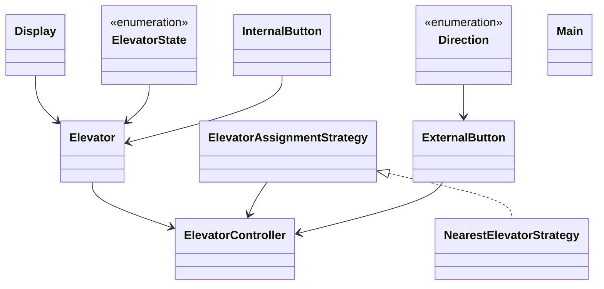

# Low-Level Design: Elevator System

**Difficulty:** Hard 🔥  
**Interview duration:** 60–75 min  
**Code status:** ✅ Reference Java included (§3)  
**Companion code:** `LLD/Elevator Management System`  

---

## How to present in an interview

Present in this order — interviewers expect **flow first**, then **model**, then **code**:

1. **Core flow** — main use cases as numbered steps (happy path + key branches).
2. **Entities & relationships** — nouns and verbs from the flow; who owns whom.
3. **Reference implementation** — classes that map 1:1 to the model (only after flow is agreed).

Do not open with a class diagram or code dumps before the flow is clear.

---

## 1. Core flow

### 1.1 Serve request

1. Passenger presses **external** (up/down) or **internal** (floor) button.
2. **ElevatorController** assigns elevator (nearest strategy).
3. Elevator moves floor-by-floor; updates **direction** and **state**.
4. Doors open at requested floors; queue drained.

---

## 2. Entities & relationships

_Deduced from the flows above — each entity should appear in at least one step._

| Entity | Responsibility | Key fields / collaborators |
|--------|----------------|----------------------------|
| **ElevatorController** | Building brain | elevator pool |
| **Elevator** | Car | current floor, direction, state, requests |
| **ExternalButton / InternalButton** | Inputs | floor, direction |
| **Display** | UI | floor indicator |
| **ElevatorAssignmentStrategy** | Dispatch | nearest idle |

### Relationships

- ElevatorController **1—*** Elevator
- Each Elevator maintains pending up/down stops

### Class diagram



---

## 3. Reference implementation (Java)

Companion project: **`LLD/Elevator Management System/`**. Copies below for browsing on GitHub (logical order, not A–Z).

**Run locally:**
```bash
cd LLD/Elevator Management System
javac src/*.java
java -cp src Main
```

| # | Source |
|---|--------|
| 1 | [`Direction.java`](code/16_elevator_system_lld/Direction.java) |
| 2 | [`ElevatorState.java`](code/16_elevator_system_lld/ElevatorState.java) |
| 3 | [`ElevatorAssignmentStrategy.java`](code/16_elevator_system_lld/ElevatorAssignmentStrategy.java) |
| 4 | [`Elevator.java`](code/16_elevator_system_lld/Elevator.java) |
| 5 | [`ExternalButton.java`](code/16_elevator_system_lld/ExternalButton.java) |
| 6 | [`NearestElevatorStrategy.java`](code/16_elevator_system_lld/NearestElevatorStrategy.java) |
| 7 | [`Display.java`](code/16_elevator_system_lld/Display.java) |
| 8 | [`InternalButton.java`](code/16_elevator_system_lld/InternalButton.java) |
| 9 | [`ElevatorController.java`](code/16_elevator_system_lld/ElevatorController.java) |
| 10 | [`Main.java`](code/16_elevator_system_lld/Main.java) |

