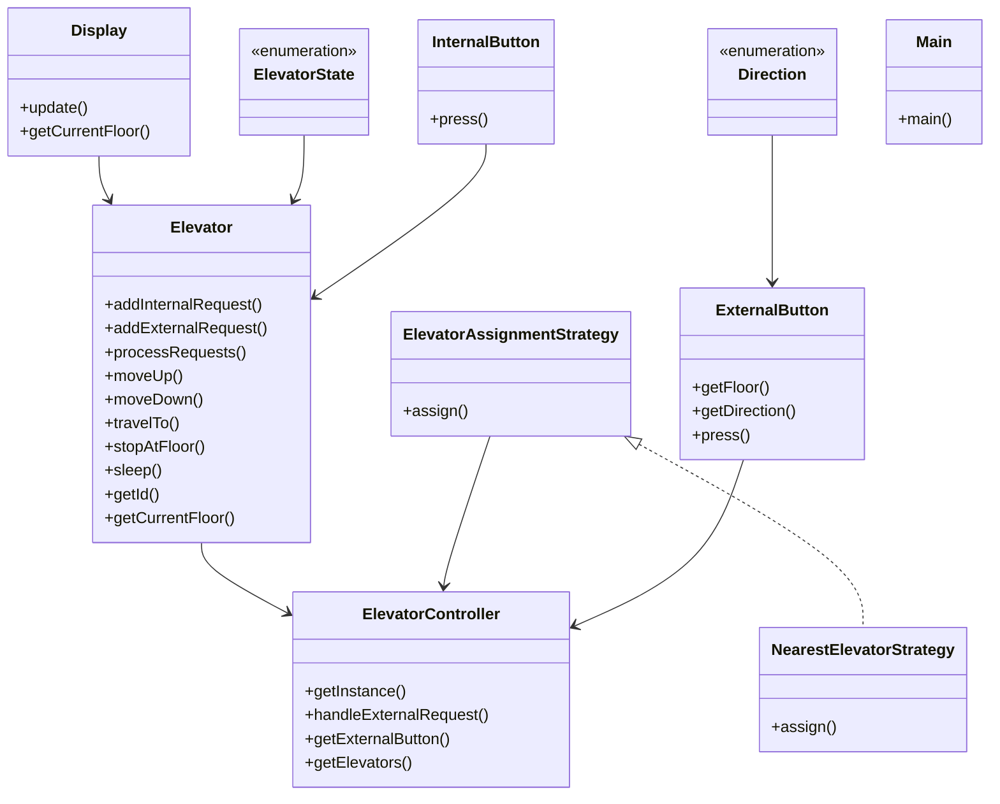

# Low-Level Design: Elevator System

**Difficulty:** Hard 🔥  
**Interview duration:** 60–75 min  
**Code status:** ✅ Reference Java included (§3)  
**Companion code:** `LLD/Elevator Management System`  

---

## How to present in an interview

Present in this order — interviewers expect **flow first**, then **model**, then **code**:

1. **Core flow** — main use cases as numbered steps (happy path + key branches).
2. **Entities & relationships** — nouns and verbs from the flow; who owns whom.
3. **Reference implementation** — classes that map 1:1 to the model (only after flow is agreed).

Do not open with a class diagram or code dumps before the flow is clear.

---

## 1. Core flow

### 1.1 Serve request

1. Passenger presses **external** (up/down) or **internal** (floor) button.
2. **ElevatorController** assigns elevator (nearest strategy).
3. Elevator moves floor-by-floor; updates **direction** and **state**.
4. Doors open at requested floors; queue drained.

---

## 2. Entities & relationships

_Deduced from the flows above — each entity should appear in at least one step._

| Entity | Responsibility | Key fields / collaborators |
|--------|----------------|----------------------------|
| **ElevatorController** | Building brain | elevator pool |
| **Elevator** | Car | current floor, direction, state, requests |
| **ExternalButton / InternalButton** | Inputs | floor, direction |
| **Display** | UI | floor indicator |
| **ElevatorAssignmentStrategy** | Dispatch | nearest idle |

### Relationships

- ElevatorController **1—*** Elevator
- Each Elevator maintains pending up/down stops

### Class diagram



---

## 3. Reference implementation (Java)

Reference implementation from **`LLD/Elevator Management System/`** (all sources in this file).

Classes in **logical order**: enums → interfaces → domain → strategies → services → `Main`.

**Run:**
```bash
cd LLD/Elevator Management System
javac src/*.java
java -cp src Main
```

### `Direction.java`

```java
public enum Direction {
    UP,
    DOWN,
}
```

### `ElevatorState.java`

```java
public enum ElevatorState {
    IDLE,
    MOVING_UP,
    MOVING_DOWN,
}
```

### `ElevatorAssignmentStrategy.java`

```java
import java.util.List;

// ElevatorAssignmentStrategy.java
public interface ElevatorAssignmentStrategy {
    Elevator assign(List<Elevator> elevators, int requestedFloor, Direction direction);
}
```

### `Elevator.java`

```java
// Elevator.java
import java.util.ArrayList;
import java.util.LinkedList;
import java.util.List;
import java.util.Queue;

public class Elevator {
    private final int id;
    private int currentFloor;
    private ElevatorState state;

    // Display shows only current floor as per requirement.
    private final Display display;

    // One button per floor inside this elevator cabin.
    private final List<InternalButton> internalButtons;

    // FIFO queues for pending stops by direction.
    private final Queue<Integer> upQueue;
    private final Queue<Integer> downQueue;

    private final int totalFloors;

    public Elevator(int id, int totalFloors) {
        this.id = id;
        this.totalFloors = totalFloors;
        this.currentFloor = 0; // ground floor
        this.state = ElevatorState.IDLE;
        this.display = new Display();
        this.upQueue = new LinkedList<>();
        this.downQueue = new LinkedList<>();

        this.internalButtons = new ArrayList<>();
        for (int i = 0; i < totalFloors; i++) {
            internalButtons.add(new InternalButton(i));
        }
    }

    /** Adds an internal floor request (pressed from inside cabin). */
    public void addInternalRequest(int floor) {
        if (floor > currentFloor) {
            upQueue.add(floor);
        } else if (floor < currentFloor) {
            downQueue.add(floor);
        } else {
            // Already at requested floor: simulate stop/open-close delay.
            stopAtFloor();
            return;
        }
        processRequests();
    }

    /** Adds an external request assigned by ElevatorController. */
    public void addExternalRequest(int floor, Direction direction) {
        if (direction == Direction.UP) {
            upQueue.add(floor);
        } else {
            downQueue.add(floor);
        }
        processRequests();
    }

    /**
     * Drains pending requests.
     * Rule:
     * - Continue UP if already moving up, or if idle and UP requests exist.
     * - Otherwise serve DOWN requests.
     */
    private void processRequests() {
        while (!upQueue.isEmpty() || !downQueue.isEmpty()) {
            if (state == ElevatorState.MOVING_UP
                    || (state == ElevatorState.IDLE && !upQueue.isEmpty())) {
                moveUp();
            } else if (state == ElevatorState.MOVING_DOWN || !downQueue.isEmpty()) {
                moveDown();
            }
        }
        state = ElevatorState.IDLE;
        display.update(currentFloor);
    }

    /** Serve all queued UP stops in FIFO order. */
    private void moveUp() {
        state = ElevatorState.MOVING_UP;
        while (!upQueue.isEmpty()) {
            int nextFloor = upQueue.poll();
            travelTo(nextFloor);
        }
    }

    /** Serve all queued DOWN stops in FIFO order. */
    private void moveDown() {
        state = ElevatorState.MOVING_DOWN;
        while (!downQueue.isEmpty()) {
            int nextFloor = downQueue.poll();
            travelTo(nextFloor);
        }
    }

    /** Moves floor-by-floor to target and updates display at each step. */
    private void travelTo(int targetFloor) {
        System.out.println("[Elevator-" + id + "] Travelling from floor " + currentFloor + " to " + targetFloor);
        while (currentFloor != targetFloor) {
            if (currentFloor < targetFloor) {
                currentFloor++;
            } else {
                currentFloor--;
            }
            display.update(currentFloor);
            sleep(500); // transit time between floors
        }
        stopAtFloor();
    }

    /** Simulates dwell time at a stop (door mechanics intentionally omitted). */
    private void stopAtFloor() {
        System.out.println("[Elevator-" + id + "] Stopped at floor: " + currentFloor);
        sleep(1000);
    }

    private void sleep(int ms) {
        try {
            Thread.sleep(ms);
        } catch (InterruptedException e) {
            Thread.currentThread().interrupt();
        }
    }

    // Getters
    public int getId() {
        return id;
    }

    public int getCurrentFloor() {
        return currentFloor;
    }

    public ElevatorState getState() {
        return state;
    }

    public List<InternalButton> getInternalButtons() {
        return internalButtons;
    }

    /** Public entrypoint for cabin button press. */
    public void pressInternalButton(int floor) {
        if (floor >= 0 && floor < totalFloors) {
            internalButtons.get(floor).press(); // log/UX only
            addInternalRequest(floor);          // scheduling happens in elevator
        } else {
            System.out.println("[Elevator-" + id + "] Invalid floor: " + floor);
        }
    }
}
```

### `ExternalButton.java`

```java
// ExternalButton.java
public class ExternalButton {
    private final int floor;
    private final Direction direction;

    public ExternalButton(int floor, Direction direction) {
        this.floor = floor;
        this.direction = direction;
    }

    public int getFloor() {
        return floor;
    }

    public Direction getDirection() {
        return direction;
    }

    public void press() {
        System.out.println("[ExternalButton] Floor: " + floor + " Direction: " + direction);
    }
}
```

### `NearestElevatorStrategy.java`

```java
// NearestElevatorStrategy.java
import java.util.List;

public class NearestElevatorStrategy implements ElevatorAssignmentStrategy {

    @Override
    public Elevator assign(List<Elevator> elevators, int requestedFloor, Direction direction) {
        Elevator best = null;
        int minDistance = Integer.MAX_VALUE;

        for (Elevator elevator : elevators) {
            int distance = Math.abs(elevator.getCurrentFloor() - requestedFloor);

            // Prefer IDLE elevators or ones already moving in the same direction
            boolean sameDirection = (direction == Direction.UP && elevator.getState() == ElevatorState.MOVING_UP
                    && elevator.getCurrentFloor() <= requestedFloor)
                    || (direction == Direction.DOWN && elevator.getState() == ElevatorState.MOVING_DOWN
                    && elevator.getCurrentFloor() >= requestedFloor);

            boolean isIdle = elevator.getState() == ElevatorState.IDLE;

            if ((isIdle || sameDirection) && distance < minDistance) {
                minDistance = distance;
                best = elevator;
            }
        }

        // Fallback: pick closest regardless of state
        if (best == null) {
            for (Elevator elevator : elevators) {
                int distance = Math.abs(elevator.getCurrentFloor() - requestedFloor);
                if (distance < minDistance) {
                    minDistance = distance;
                    best = elevator;
                }
            }
        }

        return best;
    }
}
```

### `Display.java`

```java
public class Display {
    private int currentFloor;

    public void update(int floor) {
        this.currentFloor = floor;
        System.out.println("[Display] Floor: " + floor);
    }

    public int getCurrentFloor() {
        return currentFloor;
    }
}
```

### `InternalButton.java`

```java
// InternalButton.java
public class InternalButton {
    private final int floor;

    public InternalButton(int floor) {
        this.floor = floor;
    }

    public void press() {
        System.out.println("[InternalButton] Requested floor: " + floor);
    }
}
```

### `ElevatorController.java`

```java
// ElevatorController.java
import java.util.ArrayList;
import java.util.List;

public class ElevatorController {

    private static ElevatorController instance;

    private final List<Elevator> elevators;
    private final List<ExternalButton> externalButtons;  // Single list
    private final ElevatorAssignmentStrategy strategy;

    private ElevatorController(int totalElevators, int totalFloors, ElevatorAssignmentStrategy strategy) {
        this.strategy = strategy;
        this.elevators = new ArrayList<>();
        this.externalButtons = new ArrayList<>();

        for (int i = 0; i < totalElevators; i++) {
            elevators.add(new Elevator(i + 1, totalFloors));
        }

        // Create external buttons for each floor
        for (int floor = 0; floor < totalFloors; floor++) {
            externalButtons.add(new ExternalButton(floor, Direction.UP));
            externalButtons.add(new ExternalButton(floor, Direction.DOWN));
        }
    }

    public static ElevatorController getInstance(int totalElevators, int totalFloors, ElevatorAssignmentStrategy strategy) {
        if (instance == null) {
            instance = new ElevatorController(totalElevators, totalFloors, strategy);
        }
        return instance;
    }

    /** Internal controller handling */
    public Elevator handleExternalRequest(int floor, Direction direction) {
        Elevator assigned = strategy.assign(elevators, floor, direction);
        if (assigned != null) {
            assigned.addExternalRequest(floor, direction);
        }
        return assigned;
    }

    /** Get an external button at a floor with given direction */
    public ExternalButton getExternalButton(int floor, Direction direction) {
        int index = floor * 2 + (direction == Direction.UP ? 0 : 1);
        return externalButtons.get(index);
    }

    public List<Elevator> getElevators() { return elevators; }
}
```

### `Main.java`

```java
// Main.java
public class Main {
    public static void main(String[] args) throws InterruptedException {
        int totalFloors = 10;
        int totalElevators = 3;

        ElevatorController controller = ElevatorController.getInstance(
                totalElevators, totalFloors, new NearestElevatorStrategy()
        );

        // Person on floor 0 wants to go UP
        Elevator assigned = controller.handleExternalRequest(0, Direction.UP);
        Thread.sleep(1000);

        if (assigned != null) {
            assigned.pressInternalButton(5);
        }

        // Another person on floor 7 wants to go DOWN
        Elevator assigned2 = controller.handleExternalRequest(7, Direction.DOWN);
        Thread.sleep(1000);

        // They press floor 2 inside the elevator that was assigned to them
        if (assigned2 != null) {
            assigned2.pressInternalButton(2);
        }
    }
}
```

