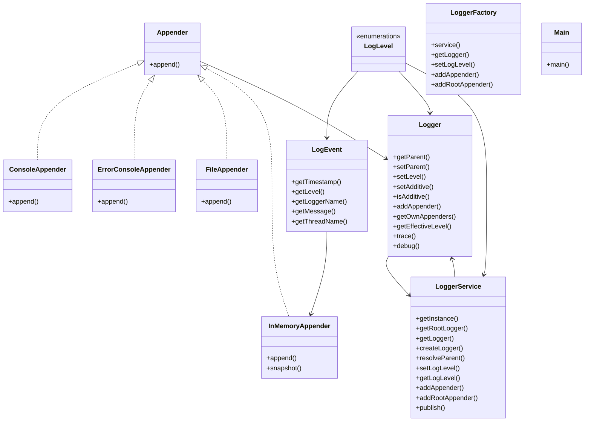

# Low-Level Design: Logging Framework

**Difficulty:** Medium ⚡  
**Interview duration:** 45–60 min  
**Code status:** ✅ Reference Java included (§3)  
**Companion code:** `LLD/Logger`  

---

## How to present in an interview

Present in this order — interviewers expect **flow first**, then **model**, then **code**:

1. **Core flow** — main use cases as numbered steps (happy path + key branches).
2. **Entities & relationships** — nouns and verbs from the flow; who owns whom.
3. **Reference implementation** — classes that map 1:1 to the model (only after flow is agreed).

Do not open with a class diagram or code dumps before the flow is clear.

---

## 1. Core flow

### 1.1 Log event

1. App requests **logger** by hierarchical name (`com.shop.order`).
2. Logger checks **level** (inherits from parent if unset).
3. Event fan-out to attached **appenders** (console, file, memory).
4. If **additive**, parent appenders also receive event.

---

## 2. Entities & relationships

_Deduced from the flows above — each entity should appear in at least one step._

| Entity | Responsibility | Key fields / collaborators |
|--------|----------------|----------------------------|
| **Logger** | Named node | level, appenders, additive flag |
| **LoggerService / LoggerFactory** | Registry | hierarchy, root |
| **LogEvent** | Payload | level, message, timestamp |
| **Appender** | Sink interface | append(LogEvent) |
| **ConsoleAppender / FileAppender / …** | Outputs | concrete sinks |
| **LogLevel** | Filter threshold | DEBUG … FATAL |

### Relationships

- Parent Logger **1—*** child Logger (name prefix tree)
- Logger **1—*** Appender; propagation controlled by additive

### Class diagram



---

## 3. Reference implementation (Java)

Reference implementation from **`LLD/Logger/`** (all sources in this file).

Classes in **logical order**: enums → interfaces → domain → strategies → services → `Main`.

**Run:**
```bash
cd LLD/Logger
javac src/*.java
java -cp src Main
```

### `LogLevel.java`

```java
public enum LogLevel {
    TRACE(10),
    DEBUG(20),
    INFO(30),
    WARN(40),
    ERROR(50),
    FATAL(60);

    private final int severity;

    LogLevel(int severity) {
        this.severity = severity;
    }

    public boolean isEnabledFor(LogLevel threshold) {
        return this.severity >= threshold.severity;
    }
}
```

### `Appender.java`

```java
public interface Appender {
    void append(LogEvent event);
}
```

### `Logger.java`

```java
import java.util.ArrayList;
import java.util.Collections;
import java.util.List;

public class Logger {
    private final String name;
    private final LoggerService service;
    private volatile LogLevel level;
    private volatile Logger parent;
    private volatile boolean additive = true;
    private final List<Appender> appenders = new ArrayList<>();

    public Logger(String name, LoggerService service) {
        this.name = name;
        this.service = service;
    }

    public Logger getParent() {
        return parent;
    }

    public void setParent(Logger parent) {
        this.parent = parent;
    }

    public void setLevel(LogLevel level) {
        this.level = level;
    }

    public void setAdditive(boolean additive) {
        this.additive = additive;
    }

    public boolean isAdditive() {
        return additive;
    }

    public synchronized void addAppender(Appender appender) {
        appenders.add(appender);
    }

    public synchronized List<Appender> getOwnAppenders() {
        return Collections.unmodifiableList(new ArrayList<>(appenders));
    }

    public LogLevel getEffectiveLevel() {
        if (level != null) {
            return level;
        }
        if (parent != null) {
            return parent.getEffectiveLevel();
        }
        return service.getLogLevel();
    }

    public void trace(String message) {
        log(LogLevel.TRACE, message);
    }

    public void debug(String message) {
        log(LogLevel.DEBUG, message);
    }

    public void info(String message) {
        log(LogLevel.INFO, message);
    }

    public void warn(String message) {
        log(LogLevel.WARN, message);
    }

    public void error(String message) {
        log(LogLevel.ERROR, message);
    }

    public void fatal(String message) {
        log(LogLevel.FATAL, message);
    }

    public void log(LogLevel eventLevel, String message) {
        if (!eventLevel.isEnabledFor(getEffectiveLevel())) {
            return;
        }

        LogEvent event = new LogEvent(eventLevel, name, message);
        service.publish(this, event);
    }
}
```

### `InMemoryAppender.java`

```java
import java.util.ArrayList;
import java.util.Collections;
import java.util.List;

public class InMemoryAppender implements Appender {
    private final List<LogEvent> events = new ArrayList<>();

    @Override
    public synchronized void append(LogEvent event) {
        events.add(event);
    }

    public synchronized List<LogEvent> snapshot() {
        return Collections.unmodifiableList(new ArrayList<>(events));
    }
}
```

### `ConsoleAppender.java`

```java
public class ConsoleAppender implements Appender {
    @Override
    public void append(LogEvent event) {
        System.out.printf(
                "%s [%s] %s %s - %s%n",
                event.getTimestamp(),
                event.getThreadName(),
                event.getLevel(),
                event.getLoggerName(),
                event.getMessage()
        );
    }
}
```

### `ErrorConsoleAppender.java`

```java
public class ErrorConsoleAppender implements Appender {
    @Override
    public void append(LogEvent event) {
        if (event.getLevel().isEnabledFor(LogLevel.ERROR)) {
            System.err.printf(
                    "%s [%s] %s %s - %s%n",
                    event.getTimestamp(),
                    event.getThreadName(),
                    event.getLevel(),
                    event.getLoggerName(),
                    event.getMessage()
            );
        }
    }
}
```

### `FileAppender.java`

```java
import java.io.FileWriter;
import java.io.IOException;
import java.io.PrintWriter;

public class FileAppender implements Appender {
    private final String filePath;

    public FileAppender(String filePath) {
        this.filePath = filePath;
    }

    @Override
    public synchronized void append(LogEvent event) {
        try (PrintWriter writer = new PrintWriter(new FileWriter(filePath, true))) {
            writer.printf(
                    "%s [%s] %s %s - %s%n",
                    event.getTimestamp(),
                    event.getThreadName(),
                    event.getLevel(),
                    event.getLoggerName(),
                    event.getMessage()
            );
        } catch (IOException e) {
            throw new RuntimeException("Failed to write log to file: " + filePath, e);
        }
    }
}
```

### `LogEvent.java`

```java
import java.time.Instant;

public class LogEvent {
    private final Instant timestamp;
    private final LogLevel level;
    private final String loggerName;
    private final String message;
    private final String threadName;

    public LogEvent(LogLevel level, String loggerName, String message) {
        this.timestamp = Instant.now();
        this.level = level;
        this.loggerName = loggerName;
        this.message = message;
        this.threadName = Thread.currentThread().getName();
    }

    public Instant getTimestamp() {
        return timestamp;
    }

    public LogLevel getLevel() {
        return level;
    }

    public String getLoggerName() {
        return loggerName;
    }

    public String getMessage() {
        return message;
    }

    public String getThreadName() {
        return threadName;
    }
}
```

### `LoggerFactory.java`

```java
public final class LoggerFactory {
    private LoggerFactory() {
    }

    private static LoggerService service() {
        return LoggerService.getInstance();
    }

    public static Logger getLogger(String name) {
        return service().getLogger(name);
    }

    public static Logger getLogger(Class<?> type) {
        if (type == null) {
            return getLogger("ROOT");
        }
        return getLogger(type.getName());
    }

    public static void setLogLevel(LogLevel logLevel) {
        service().setLogLevel(logLevel);
    }

    public static void addAppender(String loggerName, Appender appender) {
        service().addAppender(loggerName, appender);
    }

    public static void addAppender(Logger logger, Appender appender) {
        service().addAppender(logger, appender);
    }

    public static void addRootAppender(Appender appender) {
        service().addRootAppender(appender);
    }
}
```

### `LoggerService.java`

```java
import java.util.LinkedHashSet;
import java.util.Map;
import java.util.Set;
import java.util.concurrent.ConcurrentHashMap;

public class LoggerService {
    private static final String ROOT_NAME = "ROOT";
    private static final LoggerService INSTANCE = new LoggerService();

    private volatile LogLevel logLevel = LogLevel.INFO;
    private final Map<String, Logger> loggerCache = new ConcurrentHashMap<>();
    private final Logger rootLogger;

    private LoggerService() {
        rootLogger = new Logger(ROOT_NAME, this);
        rootLogger.setAdditive(false);
        loggerCache.put(ROOT_NAME, rootLogger);
    }

    public static LoggerService getInstance() {
        return INSTANCE;
    }

    public Logger getRootLogger() {
        return rootLogger;
    }

    public Logger getLogger(String name) {
        if (name == null || name.isBlank() || ROOT_NAME.equals(name)) {
            return rootLogger;
        }
        return loggerCache.computeIfAbsent(name, this::createLogger);
    }

    private Logger createLogger(String name) {
        Logger logger = new Logger(name, this);
        logger.setParent(resolveParent(name));
        return logger;
    }

    private Logger resolveParent(String name) {
        int lastDot = name.lastIndexOf('.');
        if (lastDot <= 0) {
            return rootLogger;
        }
        String parentName = name.substring(0, lastDot);
        return getLogger(parentName);
    }

    public void setLogLevel(LogLevel logLevel) {
        this.logLevel = logLevel;
    }

    public LogLevel getLogLevel() {
        return logLevel;
    }

    public void addAppender(String loggerName, Appender appender) {
        Logger logger = loggerCache.get(loggerName);
        if (logger == null) {
            throw new IllegalStateException("Logger must be created before adding appenders: " + loggerName);
        }
        logger.addAppender(appender);
    }

    public void addAppender(Logger logger, Appender appender) {
        if (logger == null) {
            throw new IllegalArgumentException("Logger cannot be null");
        }
        logger.addAppender(appender);
    }

    public void addRootAppender(Appender appender) {
        rootLogger.addAppender(appender);
    }

    public void publish(Logger sourceLogger, LogEvent event) {
        Set<Appender> appenders = collectAppenders(sourceLogger);
        for (Appender appender : appenders) {
            appender.append(event);
        }
    }


    private Set<Appender> collectAppenders(Logger sourceLogger) {
        Set<Appender> collected = new LinkedHashSet<>();
        Logger cursor = sourceLogger;
        while (cursor != null) {
            collected.addAll(cursor.getOwnAppenders());
            if (!cursor.isAdditive()) {
                break;
            }
            cursor = cursor.getParent();
        }
        return collected;
    }
}
```

### `Main.java`

```java
public class Main {
    public static void main(String[] args) {
        Logger parentLogger = LoggerFactory.getLogger("com.shop");
        Logger orderLogger = LoggerFactory.getLogger("com.shop.order");
        Logger paymentLogger = LoggerFactory.getLogger("com.shop.order.payment");

        LoggerFactory.addAppender(parentLogger, new ConsoleAppender());
        LoggerFactory.addAppender(paymentLogger, new FileAppender("payments.log"));
        LoggerFactory.addAppender(paymentLogger, new ErrorConsoleAppender());
        LoggerFactory.setLogLevel(LogLevel.INFO);

        parentLogger.setLevel(LogLevel.DEBUG);
        parentLogger.addAppender(new InMemoryAppender());


        orderLogger.debug("Order pipeline warm-up complete");
        paymentLogger.info("Payment started for order=101");
        paymentLogger.error("Payment failed for order=101");

        Logger isolatedLogger = LoggerFactory.getLogger("com.shop.audit");
        isolatedLogger.setAdditive(false);
        isolatedLogger.addAppender(new ConsoleAppender());
        isolatedLogger.info("Audit trail event with isolated appender");
    }
}
```

