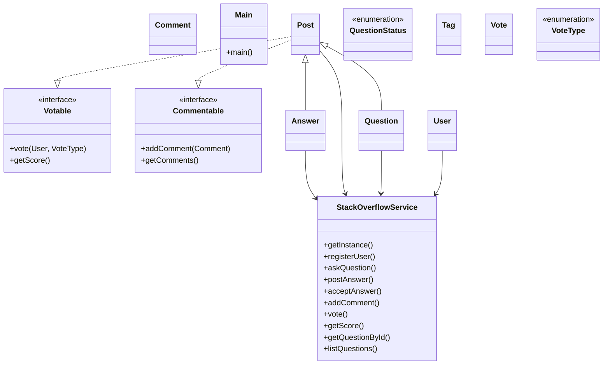

# Low-Level Design: Stack Overflow (Q&A)

**Difficulty:** Hard 🔥  
**Interview duration:** 60–75 min  
**Code status:** ✅ Reference Java included (§3)  
**Companion code:** `LLD/Stack Overflow`  

---

## How to present in an interview

Present in this order — interviewers expect **flow first**, then **model**, then **code**:

1. **Core flow** — main use cases as numbered steps (happy path + key branches).
2. **Entities & relationships** — nouns and verbs from the flow; who owns whom.
3. **Reference implementation** — classes that map 1:1 to the model (only after flow is agreed).

Do not open with a class diagram or code dumps before the flow is clear.

---

## 1. Core flow

### 1.1 Q&A flow

1. User posts **question** with **tags**.
2. Others post **answers** and **comments**.
3. Voting (up/down) on posts; reputation side-effect (optional).
4. Question author **accepts** one answer.

---

## 2. Entities & relationships

_Deduced from the flows above — each entity should appear in at least one step._

| Entity | Responsibility | Key fields / collaborators |
|--------|----------------|----------------------------|
| **User** | Member | reputation |
| **Question** | Thread root | title, body, tags, status |
| **Answer** | Response | body, votes |
| **Comment** | Short reply | on question or answer |
| **Vote** | Feedback | type, voter |
| **Tag** | Topic label | name |
| **StackOverflowService** | Facade | post, vote, accept |

### Relationships

- Question **1—*** Answer; Post hierarchy for comments
- Vote attached to Question or Answer
- `Post` implements **`Votable`** and **`Commentable`** — voting and commenting rules (one vote per user, score tallying, comment storage) live on the entity itself, not scattered across the service. The service just calls `post.vote(...)` / `post.addComment(...)` instead of reaching into `post.votes`/`post.comments` directly. This also means any future entity that should be votable or commentable (e.g. a `Comment` that itself accepts votes) can opt in without inheriting from `Post`.

### Class diagram



---

## 3. Reference implementation (Java)

Reference implementation from **`LLD/Stack Overflow/`** (all sources in this file).

Classes in **logical order**: enums → interfaces → domain → strategies → services → `Main`.

**Run:**
```bash
cd LLD/Stack Overflow
javac src/*.java
java -cp src Main
```

### `QuestionStatus.java`

```java
public enum QuestionStatus {
    OPEN,
    CLOSED
}
```

### `VoteType.java`

```java
public enum VoteType {
    UPVOTE,
    DOWNVOTE,
}
```

### `Votable.java`

```java
public interface Votable {
    void vote(User user, VoteType voteType);
    int getScore();
}
```

### `Commentable.java`

```java
import java.util.List;

public interface Commentable {
    void addComment(Comment comment);
    List<Comment> getComments();
}
```

### `Answer.java`

```java
public class Answer extends Post {
    boolean accepted;
    public Answer(String content, User createdBy) {
        super(content,createdBy);
        this.accepted = false;
    }
}
```

### `Question.java`

```java
import java.time.LocalDateTime;
import java.util.ArrayList;
import java.util.List;
import java.util.UUID;

public class Question extends Post {
    String title;
    List<Tag>  tags;
    List<Answer> answerList;
    QuestionStatus questionStatus;
    public Question(String title, String content, List<Tag> tags, User createdBy) {
        super(content, createdBy);
        this.title = title;
        this.tags = tags;
        this.answerList = new ArrayList<>();
    }
}
```

### `Comment.java`

```java
import java.time.LocalDateTime;
import java.util.UUID;

public class Comment {
    String id;
    User user;
    Post post;
    String content;
    LocalDateTime createdAt;

    public Comment(User user, Post post, String content) {
        this.user = user;
        this.post = post;
        this.content = content;
        this.createdAt = LocalDateTime.now();
        this.id = UUID.randomUUID().toString();
    }
}
```

### `Post.java`

```java
import java.time.LocalDateTime;
import java.util.ArrayList;
import java.util.List;
import java.util.UUID;

abstract class Post implements Votable, Commentable {
    String id;
    String content;
    LocalDateTime createdAt;
    private final List<Comment> comments;
    private final List<Vote> votes;
    User createdBy;

    public Post(String content, User user) {
        this.content = content;
        this.createdAt = LocalDateTime.now();
        this.id = UUID.randomUUID().toString();
        this.votes = new ArrayList<>();
        this.comments = new ArrayList<>();
        this.createdBy = user;
    }

    @Override
    public void vote(User user, VoteType voteType) {
        votes.removeIf(v -> v.user.id.equals(user.id)); // one vote per user
        votes.add(new Vote(user, voteType, this));
    }

    @Override
    public int getScore() {
        int score = 0;
        for (Vote vote : votes) {
            score += (vote.voteType == VoteType.UPVOTE) ? 1 : -1;
        }
        return score;
    }

    @Override
    public void addComment(Comment comment) {
        comments.add(comment);
    }

    @Override
    public List<Comment> getComments() {
        return comments;
    }
}
```

### `Tag.java`

```java
import java.util.UUID;

public class Tag {
    String id;
    String name;
    public Tag(String name) {
        this.id = UUID.randomUUID().toString();
        this.name = name;
    }
}
```

### `User.java`

```java
import java.util.UUID;

public class User {
    String id;
    String name;

    public User(String name) {
        this.name = name;
        this.id = UUID.randomUUID().toString();
    }
}
```

### `Vote.java`

```java
import java.time.LocalDateTime;
import java.util.UUID;

public class Vote {
    String id;
    User user;
    Post post;
    VoteType voteType;
    LocalDateTime createdAt;

    public Vote(User user, VoteType voteType, Post post) {
        this.user = user;
        this.voteType = voteType;
        this.post = post;
        this.id = UUID.randomUUID().toString();
        this.createdAt = LocalDateTime.now();
    }
}
```

### `StackOverflowService.java`

```java
import java.util.ArrayList;
import java.util.LinkedHashMap;
import java.util.List;
import java.util.Map;
import java.util.Objects;

public final class StackOverflowService {
    private static final StackOverflowService INSTANCE = new StackOverflowService();

    private final Map<String, User> users = new LinkedHashMap<>();
    private final Map<String, Question> questions = new LinkedHashMap<>();
    private final Map<String, Answer> answers = new LinkedHashMap<>();
    private final Map<String, Post> posts = new LinkedHashMap<>();

    private StackOverflowService() {}

    public static StackOverflowService getInstance() {
        return INSTANCE;
    }

    public User registerUser(String name) {
        User user = new User(name);
        users.put(user.id, user);
        return user;
    }

    public Question askQuestion(User user, String title, String content, List<String> tagNames) {
        validateUser(user);

        List<Tag> tags = new ArrayList<>();
        for (String tagName : tagNames) {
            tags.add(new Tag(tagName));
        }

        Question question = new Question(title, content, tags, user);
        question.questionStatus = QuestionStatus.OPEN;

        questions.put(question.id, question);
        posts.put(question.id, question);
        return question;
    }

    public Answer postAnswer(User user, String questionId, String content) {
        validateUser(user);

        Question question = getExistingQuestion(questionId);
        if (question.questionStatus == QuestionStatus.CLOSED) {
            throw new IllegalStateException("Question is closed.");
        }

        Answer answer = new Answer(content, user);
        question.answerList.add(answer);

        answers.put(answer.id, answer);
        posts.put(answer.id, answer);
        return answer;
    }

    public void acceptAnswer(User questionOwner, String questionId, String answerId) {
        validateUser(questionOwner);
        Question question = getExistingQuestion(questionId);

        if (!question.createdBy.id.equals(questionOwner.id)) {
            throw new IllegalStateException("Only question owner can accept an answer.");
        }

        Answer toAccept = answers.get(answerId);
        if (toAccept == null || !question.answerList.contains(toAccept)) {
            throw new IllegalArgumentException("Answer does not belong to this question.");
        }

        for (Answer answer : question.answerList) {
            answer.accepted = false;
        }
        toAccept.accepted = true;
    }

    public Comment addComment(User user, String postId, String content) {
        validateUser(user);
        Post post = getExistingPost(postId);

        Comment comment = new Comment(user, post, content);
        post.addComment(comment); // Commentable owns its own comment storage
        return comment;
    }

    public void vote(User user, String postId, VoteType voteType) {
        validateUser(user);
        Votable votable = getExistingPost(postId); // Post is-a Votable

        votable.vote(user, voteType); // Votable owns the "one vote per user" rule
    }

    public int getScore(String postId) {
        Votable votable = getExistingPost(postId);
        return votable.getScore();
    }

    public Question getQuestionById(String questionId) {
        return getExistingQuestion(questionId);
    }

    public List<Question> listQuestions() {
        return new ArrayList<>(questions.values());
    }

    private void validateUser(User user) {
        Objects.requireNonNull(user, "User cannot be null.");
        if (!users.containsKey(user.id)) {
            throw new IllegalArgumentException("User is not registered.");
        }
    }

    private Question getExistingQuestion(String questionId) {
        Question question = questions.get(questionId);
        if (question == null) {
            throw new IllegalArgumentException("Question not found: " + questionId);
        }
        return question;
    }

    private Post getExistingPost(String postId) {
        Post post = posts.get(postId);
        if (post == null) {
            throw new IllegalArgumentException("Post not found: " + postId);
        }
        return post;
    }
}
```

### `Main.java`

```java
import java.util.Arrays;

public class Main {
    public static void main(String[] args) {
        StackOverflowService service = StackOverflowService.getInstance();

        User aman = service.registerUser("Aman");
        User rita = service.registerUser("Rita");
        User dev = service.registerUser("Dev");

        Question question = service.askQuestion(
                aman,
                "How to design Stack Overflow LLD?",
                "Need entities, service, and flow.",
                Arrays.asList("java", "lld", "design")
        );

        Answer answer1 = service.postAnswer(rita, question.id, "Start with Post abstraction.");
        Answer answer2 = service.postAnswer(dev, question.id, "Use one singleton service first.");

        service.addComment(aman, question.id, "Thanks for the quick answers!");
        service.addComment(aman, answer2.id, "Can you add repository layer later?");

        service.vote(aman, answer1.id, VoteType.UPVOTE);
        service.vote(aman, answer2.id, VoteType.UPVOTE);
        service.vote(rita, question.id, VoteType.UPVOTE);
        service.vote(dev, question.id, VoteType.DOWNVOTE);

        service.acceptAnswer(aman, question.id, answer2.id);

        System.out.println("Question: " + question.title);
        System.out.println("Question score: " + service.getScore(question.id));
        System.out.println("Question comments: " + question.getComments().size());
        System.out.println("Answers count: " + question.answerList.size());

        for (Answer answer : question.answerList) {
            System.out.println(
                    "- " + answer.content
                            + " | accepted=" + answer.accepted
                            + " | score=" + service.getScore(answer.id)
                            + " | comments=" + answer.getComments().size()
            );
        }
    }
}
```

