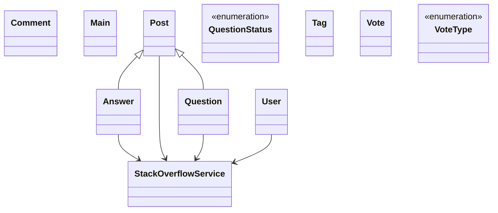

# Low-Level Design: Stack Overflow (Q&A)

**Difficulty:** Hard 🔥  
**Interview duration:** 60–75 min  
**Code status:** ✅ Reference Java included (§3)  
**Companion code:** `LLD/Stack Overflow`  

---

## How to present in an interview

Present in this order — interviewers expect **flow first**, then **model**, then **code**:

1. **Core flow** — main use cases as numbered steps (happy path + key branches).
2. **Entities & relationships** — nouns and verbs from the flow; who owns whom.
3. **Reference implementation** — classes that map 1:1 to the model (only after flow is agreed).

Do not open with a class diagram or code dumps before the flow is clear.

---

## 1. Core flow

### 1.1 Q&A flow

1. User posts **question** with **tags**.
2. Others post **answers** and **comments**.
3. Voting (up/down) on posts; reputation side-effect (optional).
4. Question author **accepts** one answer.

---

## 2. Entities & relationships

_Deduced from the flows above — each entity should appear in at least one step._

| Entity | Responsibility | Key fields / collaborators |
|--------|----------------|----------------------------|
| **User** | Member | reputation |
| **Question** | Thread root | title, body, tags, status |
| **Answer** | Response | body, votes |
| **Comment** | Short reply | on question or answer |
| **Vote** | Feedback | type, voter |
| **Tag** | Topic label | name |
| **StackOverflowService** | Facade | post, vote, accept |

### Relationships

- Question **1—*** Answer; Post hierarchy for comments
- Vote attached to Question or Answer

### Class diagram



---

## 3. Reference implementation (Java)

Companion project: **`LLD/Stack Overflow/`**. Copies below for browsing on GitHub (logical order, not A–Z).

**Run locally:**
```bash
cd LLD/Stack Overflow
javac src/*.java
java -cp src Main
```

| # | Source |
|---|--------|
| 1 | [`QuestionStatus.java`](code/18_stack_overflow_lld/QuestionStatus.java) |
| 2 | [`VoteType.java`](code/18_stack_overflow_lld/VoteType.java) |
| 3 | [`Answer.java`](code/18_stack_overflow_lld/Answer.java) |
| 4 | [`Question.java`](code/18_stack_overflow_lld/Question.java) |
| 5 | [`Comment.java`](code/18_stack_overflow_lld/Comment.java) |
| 6 | [`Post.java`](code/18_stack_overflow_lld/Post.java) |
| 7 | [`Tag.java`](code/18_stack_overflow_lld/Tag.java) |
| 8 | [`User.java`](code/18_stack_overflow_lld/User.java) |
| 9 | [`Vote.java`](code/18_stack_overflow_lld/Vote.java) |
| 10 | [`StackOverflowService.java`](code/18_stack_overflow_lld/StackOverflowService.java) |
| 11 | [`Main.java`](code/18_stack_overflow_lld/Main.java) |

