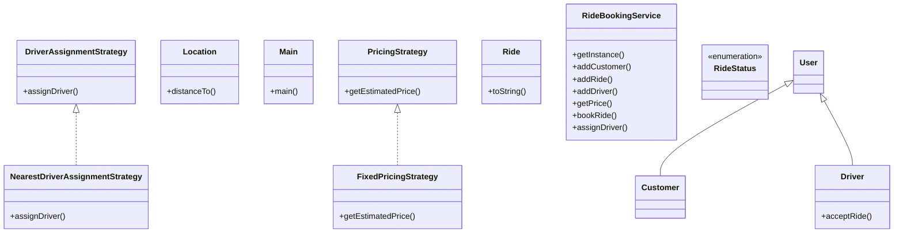

# Low-Level Design: Ride Booking System (Uber-style)

**Difficulty:** Hard 🔥  
**Interview duration:** 60–75 min  
**Code status:** ✅ Reference Java included (§3)  
**Companion code:** `LLD/Uber`  

---

## How to present in an interview

Present in this order — interviewers expect **flow first**, then **model**, then **code**:

1. **Core flow** — main use cases as numbered steps (happy path + key branches).
2. **Entities & relationships** — nouns and verbs from the flow; who owns whom.
3. **Reference implementation** — classes that map 1:1 to the model (only after flow is agreed).

Do not open with a class diagram or code dumps before the flow is clear.

---

## 1. Core flow

### 1.1 Book ride

1. Rider sets **source** and **destination**; sees **price** (pricing strategy).
2. Rider confirms → **ride** created.
3. System assigns **nearest driver** (assignment strategy).
4. Driver accepts → trip in progress → completed; **ride status** updates.

---

## 2. Entities & relationships

_Deduced from the flows above — each entity should appear in at least one step._

| Entity | Responsibility | Key fields / collaborators |
|--------|----------------|----------------------------|
| **User / Customer** | Rider | ride history |
| **Driver** | Supply | location, isFree |
| **Ride** | Trip | source, dest, price, status |
| **Location** | Geo | lat, lon |
| **PricingStrategy** | Fare | fixed, surge, … |
| **DriverAssignmentStrategy** | Match | nearest driver |
| **RideBookingService** | Orchestration | estimate, book, assign |

### Relationships

- Ride **2—** Location; Ride **1—1** Customer and Driver
- RideBookingService composes pricing + assignment strategies

### Class diagram



---

## 3. Reference implementation (Java)

Reference implementation from **`LLD/Uber/`** (all sources in this file).

Classes in **logical order**: enums → interfaces → domain → strategies → services → `Main`.

**Run:**
```bash
cd LLD/Uber
javac src/*.java
java -cp src Main
```

### `RideStatus.java`

```java
public enum RideStatus {
    FINDING_DRIVER,
    DRIVER_ASSIGNED,
    DRIVER_REACHED,
    IN_PROGRESS,
    CANCELLED,
    COMPLETED
}
```

### `DriverAssignmentStrategy.java`

```java
import java.util.List;

public interface DriverAssignmentStrategy {
    Driver assignDriver(List<Driver> driverList, Location source);
}
```

### `PricingStrategy.java`

```java
public interface PricingStrategy {
    double getEstimatedPrice(Location from, Location to);
}
```

### `Customer.java`

```java
import java.util.ArrayList;
import java.util.List;

public class Customer extends User {
    List<Ride> pastRides;
    public Customer(String name, String email) {
        super(name, email);
        this.pastRides = new ArrayList<>();
    }
}
```

### `Driver.java`

```java
import java.util.ArrayList;
import java.util.Collections;
import java.util.List;

public class Driver extends User {
    List<Ride> previousRides;
    boolean isAvailable;
    Location location;
    public Driver(String name, String email, Location location) {
        super(name, email);
        this.location = location;
        this.isAvailable = true;
        this.previousRides = new ArrayList<>();
    }

    void acceptRide(Ride ride) {
        this.previousRides.add(ride);
        this.isAvailable = false;
    }
}
```

### `FixedPricingStrategy.java`

```java
public class FixedPricingStrategy  implements PricingStrategy{
    @Override
    public double getEstimatedPrice(Location from, Location to) {
        return 2.0 * from.distanceTo(to);
    }
}
```

### `NearestDriverAssignmentStrategy.java`

```java
import java.util.List;

public class NearestDriverAssignmentStrategy implements DriverAssignmentStrategy {
    @Override
    public Driver assignDriver(List<Driver> driverList, Location source) {
        double minDistance = Double.MAX_VALUE;
        Driver nearestDriver = null;
        for (Driver driver : driverList) {
            if (driver.isAvailable && driver.location.distanceTo(source) < minDistance) {
                minDistance = driver.location.distanceTo(source);
                nearestDriver = driver;
            }
        }

        return nearestDriver;
    }
}
```

### `Location.java`

```java
public class Location {
    double latitude;
    double longitude;

    public Location(double latitude, double longitude) {
        this.latitude = latitude;
        this.longitude = longitude;
    }

    double distanceTo(Location location) {
        double x = Math.abs(location.latitude - this.latitude);
        double y = Math.abs(location.longitude - this.longitude);
        return Math.sqrt(Math.pow(x,2) + Math.pow(y,2));
    }
}
```

### `Ride.java`

```java
import java.time.LocalDateTime;
import java.util.UUID;

public class Ride {
    String rideId;
    Location start;
    Location end;
    double price;
    Customer bookedByCustomer;
    Driver driver;
    RideStatus rideStatus;
    LocalDateTime rideTime;


    public Ride(Location start, Location end, double price, Customer bookedByCustomer) {
        this.start = start;
        this.rideId = UUID.randomUUID().toString();
        this.end = end;
        this.price = price;
        this.bookedByCustomer = bookedByCustomer;
        this.driver = null;
        this.rideTime = LocalDateTime.now();
        this.rideStatus = RideStatus.FINDING_DRIVER;
    }

    @Override
    public String toString() {
        return "Ride{" +
                "rideId='" + rideId + '\'' +
                ", start=" + start +
                ", end=" + end +
                ", price=" + price +
                ", bookedByCustomer=" + bookedByCustomer +
                ", driver=" + driver +
                ", rideStatus=" + rideStatus +
                ", rideTime=" + rideTime +
                '}';
    }
}
```

### `User.java`

```java
import java.util.UUID;

abstract class User {
String name;
String id;
String email;

    public User(String name, String email) {
        this.name = name;
        this.id = UUID.randomUUID().toString();
        this.email = email;
    }
}
```

### `RideBookingService.java`

```java
import java.util.HashMap;
import java.util.List;
import java.util.Map;

public class RideBookingService {
    Map<String, Customer> customerMap;
    Map<String, Ride> rideMap;
    Map<String, Driver> driverMap;
    DriverAssignmentStrategy driverAssignmentStrategy;
    private static  RideBookingService instance;
    private RideBookingService(DriverAssignmentStrategy driverAssignmentStrategy) {
        customerMap = new HashMap<>();
        rideMap = new HashMap<>();
        driverMap = new HashMap<>();
        this.driverAssignmentStrategy = driverAssignmentStrategy;

    }

    public static RideBookingService getInstance(DriverAssignmentStrategy driverAssignmentStrategy) {
        if (instance == null) {
            instance = new RideBookingService(driverAssignmentStrategy);
        }
        return instance;
    }

    void addCustomer(Customer customer) {
        customerMap.put(customer.id, customer);
    }


    void addRide(Ride ride) {
        rideMap.put(ride.rideId, ride);
    }
    void addDriver(Driver driver) {
        driverMap.put(driver.id, driver);
    }

    double getPrice(PricingStrategy pricingStrategy, Location from, Location to) {
        return 2 * pricingStrategy.getEstimatedPrice(from, to);
    }

    Ride bookRide(Customer customer, Location from, Location to, PricingStrategy pricingStrategy) {
        double price = getPrice(pricingStrategy, from, to);
        Ride ride = new Ride(from, to, price, customer);
        rideMap.put(ride.rideId, ride);
        return ride;
    }

    Driver assignDriver(Ride ride) {
        Driver driver = driverAssignmentStrategy.assignDriver(driverMap.values().stream().toList(), ride.start);
        if (driver != null) {
            driver.isAvailable = false;
            ride.driver = driver;
            ride.rideStatus = RideStatus.DRIVER_ASSIGNED;
            return driver;
        }
        return null;
    }


}
```

### `Main.java`

```java
public class Main {
    public static void main(String[] args) {
        DriverAssignmentStrategy driverAssignmentStrategy = new NearestDriverAssignmentStrategy();
        RideBookingService rideBookingService = RideBookingService.getInstance(driverAssignmentStrategy);
        Customer aman = new Customer("Aman","emamkl");
        Customer ben = new Customer("Ben","emamkl");
        Customer jan = new Customer("Jan","emamkl");
        Driver kamlesh = new Driver("Kamlesh", "enak", new Location(32.12,43.54));
        Driver raju = new Driver("Raju", "eana", new Location(12.23,54.21));
        rideBookingService.addCustomer(aman);
        rideBookingService.addCustomer(ben);
        rideBookingService.addCustomer(jan);
        rideBookingService.addDriver(kamlesh);
        rideBookingService.addDriver(raju);

        Ride ride = rideBookingService.bookRide(aman, new Location(53.21,32.11), new Location(11.32,23.45), new FixedPricingStrategy());
        Ride ride2 = rideBookingService.bookRide(ben, new Location(53.21,32.11), new Location(11.32,23.45), new FixedPricingStrategy());
        Ride ride3 = rideBookingService.bookRide(ben, new Location(53.21,32.11), new Location(11.32,23.45), new FixedPricingStrategy());
        System.out.println(ride);
        System.out.println(ride2);
        System.out.println(ride3);
        rideBookingService.assignDriver(ride);
        System.out.println(ride);
        rideBookingService.assignDriver(ride2);
        System.out.println(ride2);
        rideBookingService.assignDriver(ride3);
        System.out.println(ride3);

    }
}
```

