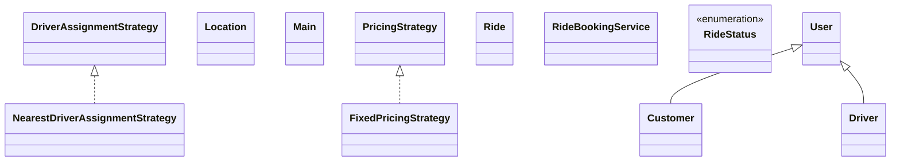

# Low-Level Design: Ride Booking System (Uber-style)

**Difficulty:** Hard 🔥  
**Interview duration:** 60–75 min  
**Code status:** ✅ Reference Java included (§3)  
**Companion code:** `LLD/Uber`  

---

## How to present in an interview

Present in this order — interviewers expect **flow first**, then **model**, then **code**:

1. **Core flow** — main use cases as numbered steps (happy path + key branches).
2. **Entities & relationships** — nouns and verbs from the flow; who owns whom.
3. **Reference implementation** — classes that map 1:1 to the model (only after flow is agreed).

Do not open with a class diagram or code dumps before the flow is clear.

---

## 1. Core flow

### 1.1 Book ride

1. Rider sets **source** and **destination**; sees **price** (pricing strategy).
2. Rider confirms → **ride** created.
3. System assigns **nearest driver** (assignment strategy).
4. Driver accepts → trip in progress → completed; **ride status** updates.

---

## 2. Entities & relationships

_Deduced from the flows above — each entity should appear in at least one step._

| Entity | Responsibility | Key fields / collaborators |
|--------|----------------|----------------------------|
| **User / Customer** | Rider | ride history |
| **Driver** | Supply | location, isFree |
| **Ride** | Trip | source, dest, price, status |
| **Location** | Geo | lat, lon |
| **PricingStrategy** | Fare | fixed, surge, … |
| **DriverAssignmentStrategy** | Match | nearest driver |
| **RideBookingService** | Orchestration | estimate, book, assign |

### Relationships

- Ride **2—** Location; Ride **1—1** Customer and Driver
- RideBookingService composes pricing + assignment strategies

### Class diagram



---

## 3. Reference implementation (Java)

Companion project: **`LLD/Uber/`**. Copies below for browsing on GitHub (logical order, not A–Z).

**Run locally:**
```bash
cd LLD/Uber
javac src/*.java
java -cp src Main
```

| # | Source |
|---|--------|
| 1 | [`RideStatus.java`](code/19_ride_booking_system_lld/RideStatus.java) |
| 2 | [`DriverAssignmentStrategy.java`](code/19_ride_booking_system_lld/DriverAssignmentStrategy.java) |
| 3 | [`PricingStrategy.java`](code/19_ride_booking_system_lld/PricingStrategy.java) |
| 4 | [`Customer.java`](code/19_ride_booking_system_lld/Customer.java) |
| 5 | [`Driver.java`](code/19_ride_booking_system_lld/Driver.java) |
| 6 | [`FixedPricingStrategy.java`](code/19_ride_booking_system_lld/FixedPricingStrategy.java) |
| 7 | [`NearestDriverAssignmentStrategy.java`](code/19_ride_booking_system_lld/NearestDriverAssignmentStrategy.java) |
| 8 | [`Location.java`](code/19_ride_booking_system_lld/Location.java) |
| 9 | [`Ride.java`](code/19_ride_booking_system_lld/Ride.java) |
| 10 | [`User.java`](code/19_ride_booking_system_lld/User.java) |
| 11 | [`RideBookingService.java`](code/19_ride_booking_system_lld/RideBookingService.java) |
| 12 | [`Main.java`](code/19_ride_booking_system_lld/Main.java) |

