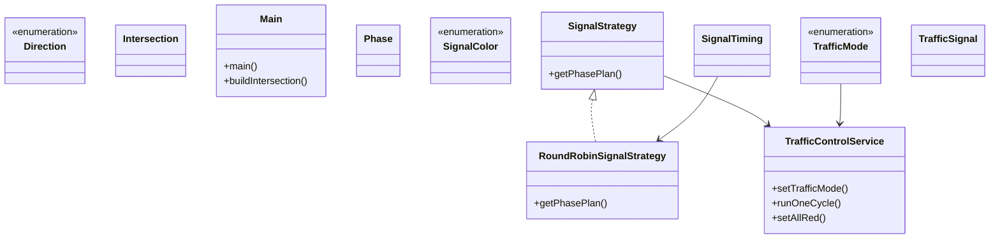

# Low-Level Design: Traffic Control System

**Difficulty:** Medium ⚡  
**Interview duration:** 45–60 min  
**Code status:** ✅ Reference Java included (§3)  
**Companion code:** `LLD/Traffic Control System`  

---

## How to present in an interview

Present in this order — interviewers expect **flow first**, then **model**, then **code**:

1. **Core flow** — main use cases as numbered steps (happy path + key branches).
2. **Entities & relationships** — nouns and verbs from the flow; who owns whom.
3. **Reference implementation** — classes that map 1:1 to the model (only after flow is agreed).

Do not open with a class diagram or code dumps before the flow is clear.

---

## 1. Core flow

### 1.1 Signal cycle

1. **Intersection** has multiple **traffic signals** (directions).
2. **Signal strategy** (e.g. round-robin) picks next green phase.
3. Only compatible signals green; others red/yellow.
4. **Traffic mode** (normal vs peak) adjusts **timing**.

---

## 2. Entities & relationships

_Deduced from the flows above — each entity should appear in at least one step._

| Entity | Responsibility | Key fields / collaborators |
|--------|----------------|----------------------------|
| **Intersection** | Junction | 2/3/4-way, signals |
| **TrafficSignal** | Light group | direction, current color |
| **SignalColor** | Phase | RED, YELLOW, GREEN |
| **SignalTiming / Phase** | Duration config | per mode |
| **SignalStrategy** | Scheduler | RoundRobin, … |
| **TrafficControlService** | Runner | start cycle, switch phases |

### Relationships

- Intersection **1—*** TrafficSignal
- TrafficControlService applies SignalStrategy so one conflicting path is green

### Class diagram



---

## 3. Reference implementation (Java)

Reference implementation from **`LLD/Traffic Control System/`** (all sources in this file).

Classes in **logical order**: enums → interfaces → domain → strategies → services → `Main`.

**Run:**
```bash
cd LLD/Traffic Control System
javac src/*.java
java -cp src Main
```

### `Direction.java`

```java
public enum Direction {
    NORTH,
    SOUTH,
    EAST,
    WEST,
}
```

### `SignalColor.java`

```java
public enum SignalColor {
    RED,
    GREEN,
    YELLOW,
}
```

### `TrafficMode.java`

```java
public enum TrafficMode {
    NORMAL,
    PEAK
}
```

### `SignalStrategy.java`

```java
import java.util.List;

public interface SignalStrategy {
    List<Phase> getPhasePlan(Intersection intersection, TrafficMode trafficMode);
}
```

### `RoundRobinSignalStrategy.java`

```java
import java.util.ArrayList;
import java.util.List;
import java.util.Map;

public class RoundRobinSignalStrategy implements SignalStrategy {

    private final SignalTiming normalTiming;
    private final SignalTiming peakTiming;

    public RoundRobinSignalStrategy(SignalTiming normalTiming, SignalTiming peakTiming) {
        this.normalTiming = normalTiming;
        this.peakTiming = peakTiming;
    }

    @Override
    public List<Phase> getPhasePlan(Intersection intersection, TrafficMode trafficMode) {
        List<Phase> phases = new ArrayList<>();
        if (intersection == null || intersection.signalMap == null || intersection.signalMap.isEmpty()) {
            return phases;
        }

        SignalTiming timing = (trafficMode == TrafficMode.PEAK) ? peakTiming : normalTiming;

        // Deterministic order avoids random switching behavior.
        Direction[] order = new Direction[] {
                Direction.NORTH, Direction.EAST, Direction.SOUTH, Direction.WEST
        };

        Map<Direction, TrafficSignal> signalMap = intersection.signalMap;
        for (Direction direction : order) {
            if (signalMap.containsKey(direction)) {
                phases.add(new Phase(direction, timing));
            }
        }
        return phases;
    }
}
```

### `Intersection.java`

```java
import java.util.Map;

public class Intersection {
    String id;
    Map<Direction, TrafficSignal> signalMap;
}
```

### `Phase.java`

```java
public class Phase {
    Direction direction;
    SignalTiming signalTiming;

    public Phase(Direction direction, SignalTiming signalTiming) {
        this.direction = direction;
        this.signalTiming = signalTiming;
    }
}
```

### `SignalTiming.java`

```java
public class SignalTiming {
    int greenSec;
    int yellowSec;

    public SignalTiming(int greenSec, int yellowSec) {
        this.greenSec = greenSec;
        this.yellowSec = yellowSec;
    }
}
```

### `TrafficSignal.java`

```java
public class TrafficSignal {
    String id;
    Direction direction;
    SignalColor signalColor;


}
```

### `TrafficControlService.java`

```java
import java.util.List;
import java.util.Map;

public class TrafficControlService {

    private final SignalStrategy signalStrategy;
    private TrafficMode trafficMode;

    public TrafficControlService(SignalStrategy signalStrategy, TrafficMode initialMode) {
        this.signalStrategy = signalStrategy;
        this.trafficMode = initialMode;
    }

    public void setTrafficMode(TrafficMode trafficMode) {
        this.trafficMode = trafficMode;
    }

    public void runOneCycle(Intersection intersection) {
        List<Phase> plan = signalStrategy.getPhasePlan(intersection, trafficMode);
        if (plan.isEmpty()) {
            System.out.println("No phases available for intersection: " +
                    (intersection != null ? intersection.id : "null"));
            return;
        }

        System.out.println("Running cycle for intersection: " + intersection.id + " [Mode=" + trafficMode + "]");

        for (Phase phase : plan) {
            setAllRed(intersection.signalMap);

            TrafficSignal active = intersection.signalMap.get(phase.direction);
            if (active == null) {
                continue;
            }

            active.signalColor = SignalColor.GREEN;
            System.out.println("GREEN  -> " + phase.direction + " for " + phase.signalTiming.greenSec + " sec");

            active.signalColor = SignalColor.YELLOW;
            System.out.println("YELLOW -> " + phase.direction + " for " + phase.signalTiming.yellowSec + " sec");

            active.signalColor = SignalColor.RED;
            System.out.println("RED    -> " + phase.direction);
        }
    }

    private void setAllRed(Map<Direction, TrafficSignal> signalMap) {
        for (TrafficSignal signal : signalMap.values()) {
            signal.signalColor = SignalColor.RED;
        }
    }
}
```

### `Main.java`

```java
import java.util.EnumMap;

public class Main {

    public static void main(String[] args) {
        Intersection intersection = buildIntersection("INT-1");

        SignalStrategy strategy = new RoundRobinSignalStrategy(
                new SignalTiming(30, 5), // NORMAL
                new SignalTiming(45, 5)  // PEAK
        );

        TrafficControlService service = new TrafficControlService(strategy, TrafficMode.NORMAL);
        service.runOneCycle(intersection);

        System.out.println("---- Switching to PEAK mode ----");
        service.setTrafficMode(TrafficMode.PEAK);
        service.runOneCycle(intersection);
    }

    private static Intersection buildIntersection(String id) {
        Intersection intersection = new Intersection();
        intersection.id = id;
        intersection.signalMap = new EnumMap<>(Direction.class);

        for (Direction direction : Direction.values()) {
            TrafficSignal signal = new TrafficSignal();
            signal.id = id + "-" + direction;
            signal.direction = direction;
            signal.signalColor = SignalColor.RED;
            intersection.signalMap.put(direction, signal);
        }

        return intersection;
    }
}
```

