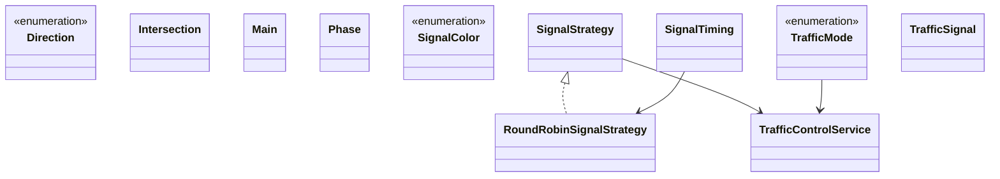

# Low-Level Design: Traffic Control System

**Difficulty:** Medium ⚡  
**Interview duration:** 45–60 min  
**Code status:** ✅ Reference Java included (§3)  
**Companion code:** `LLD/Traffic Control System`  

---

## How to present in an interview

Present in this order — interviewers expect **flow first**, then **model**, then **code**:

1. **Core flow** — main use cases as numbered steps (happy path + key branches).
2. **Entities & relationships** — nouns and verbs from the flow; who owns whom.
3. **Reference implementation** — classes that map 1:1 to the model (only after flow is agreed).

Do not open with a class diagram or code dumps before the flow is clear.

---

## 1. Core flow

### 1.1 Signal cycle

1. **Intersection** has multiple **traffic signals** (directions).
2. **Signal strategy** (e.g. round-robin) picks next green phase.
3. Only compatible signals green; others red/yellow.
4. **Traffic mode** (normal vs peak) adjusts **timing**.

---

## 2. Entities & relationships

_Deduced from the flows above — each entity should appear in at least one step._

| Entity | Responsibility | Key fields / collaborators |
|--------|----------------|----------------------------|
| **Intersection** | Junction | 2/3/4-way, signals |
| **TrafficSignal** | Light group | direction, current color |
| **SignalColor** | Phase | RED, YELLOW, GREEN |
| **SignalTiming / Phase** | Duration config | per mode |
| **SignalStrategy** | Scheduler | RoundRobin, … |
| **TrafficControlService** | Runner | start cycle, switch phases |

### Relationships

- Intersection **1—*** TrafficSignal
- TrafficControlService applies SignalStrategy so one conflicting path is green

### Class diagram



---

## 3. Reference implementation (Java)

Companion project: **`LLD/Traffic Control System/`**. Copies below for browsing on GitHub (logical order, not A–Z).

**Run locally:**
```bash
cd LLD/Traffic Control System
javac src/*.java
java -cp src Main
```

| # | Source |
|---|--------|
| 1 | [`Direction.java`](code/20_traffic_control_system_lld/Direction.java) |
| 2 | [`SignalColor.java`](code/20_traffic_control_system_lld/SignalColor.java) |
| 3 | [`TrafficMode.java`](code/20_traffic_control_system_lld/TrafficMode.java) |
| 4 | [`SignalStrategy.java`](code/20_traffic_control_system_lld/SignalStrategy.java) |
| 5 | [`RoundRobinSignalStrategy.java`](code/20_traffic_control_system_lld/RoundRobinSignalStrategy.java) |
| 6 | [`Intersection.java`](code/20_traffic_control_system_lld/Intersection.java) |
| 7 | [`Phase.java`](code/20_traffic_control_system_lld/Phase.java) |
| 8 | [`SignalTiming.java`](code/20_traffic_control_system_lld/SignalTiming.java) |
| 9 | [`TrafficSignal.java`](code/20_traffic_control_system_lld/TrafficSignal.java) |
| 10 | [`TrafficControlService.java`](code/20_traffic_control_system_lld/TrafficControlService.java) |
| 11 | [`Main.java`](code/20_traffic_control_system_lld/Main.java) |

