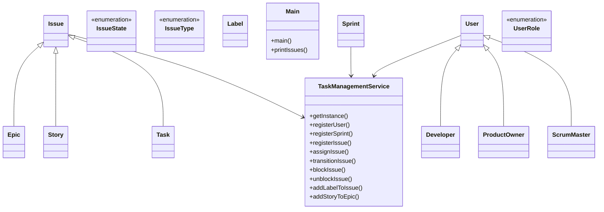

# Low-Level Design: Task Management System (Jira-style)

**Difficulty:** Hard 🔥  
**Interview duration:** 60–75 min  
**Code status:** ✅ Reference Java included (§3)  
**Companion code:** `LLD/Jira`  

---

## How to present in an interview

Present in this order — interviewers expect **flow first**, then **model**, then **code**:

1. **Core flow** — main use cases as numbered steps (happy path + key branches).
2. **Entities & relationships** — nouns and verbs from the flow; who owns whom.
3. **Reference implementation** — classes that map 1:1 to the model (only after flow is agreed).

Do not open with a class diagram or code dumps before the flow is clear.

---

## 1. Core flow

### 1.1 Create & organize work

1. Register **users** (Developer, Scrum Master, Product Owner) and **issues** (Epic, Story, Task).
2. Build hierarchy: **Epic → Story → Task**, plus **sub-tasks** on a Task.
3. Create **Sprint** with date range; add Epic (and related Story/Task tree) to sprint.
4. Assign issues to users; add **labels**; transition **IssueState** (OPEN → IN_PROGRESS → … → RESOLVED).

### 1.2 Block / unblock

1. Mark issue **blocked by** another issue (dependency).
2. Clear blocker when unblocked.

### 1.3 Query board

1. Filter issues by state, assignee, type, or blocked status.

---

## 2. Entities & relationships

_Deduced from the flows above — each entity should appear in at least one step._

| Entity | Responsibility | Key fields / collaborators |
|--------|----------------|----------------------------|
| **TaskManagementService** | Singleton facade | users, sprints, issues maps; workflow APIs |
| **Issue** | Abstract work item | title, state, assignee, labels, blockedBy |
| **Epic / Story / Task** | Issue hierarchy | Epic→stories, Story→tasks, Task→children |
| **Sprint** | Time box | start, end, issues list |
| **User** | Person | Developer, ScrumMaster, ProductOwner roles |
| **Label** | Tag | name |
| **IssueState / IssueType** | Enums | workflow + EPIC/STORY/TASK |

### Relationships

- Issue <|-- Epic, Story, Task
- User <|-- Developer, ScrumMaster, ProductOwner
- Epic **1—*** Story **1—*** Task; Task **parent/children** for sub-tasks
- Sprint **1—*** Issue (flat list; tree collected when adding from Epic root)
- TaskManagementService owns registration, assignment, transitions, blocking, queries

### Design notes

- Issue is package-private abstract base — concrete types are public

### Class diagram



---

## 3. Reference implementation (Java)

Reference implementation from **`LLD/Jira/`** (all sources in this file).

Classes in **logical order**: enums → interfaces → domain → strategies → services → `Main`.

**Run:**
```bash
cd LLD/Jira
javac src/*.java
java -cp src Main
```

### `IssueState.java`

```java
public enum IssueState {
    OPEN,
    IN_PROGRESS,
    IN_REVIEW,
    VERIFIED,
    RESOLVED,
    CLOSED
}
```

### `IssueType.java`

```java
public enum IssueType {
    EPIC,STORY, TASK
}
```

### `UserRole.java`

```java
public enum UserRole {
    DEVELOPER,SCRUM_MASTER,PRODUCT_OWNER
}
```

### `Developer.java`

```java
public class Developer extends User {
    public Developer(String name) {
        super(name, UserRole.DEVELOPER);
    }
}
```

### `Epic.java`

```java
import java.util.ArrayList;
import java.util.List;

public class Epic extends Issue{
    List<Story> stories;
    public Epic(String title, String description, List<Label> labels) {
        super(title, description, IssueType.EPIC, labels);
        this.stories = new ArrayList<>();
    }
}
```

### `ProductOwner.java`

```java
public class ProductOwner extends User {
    public ProductOwner(String name) {
        super(name, UserRole.PRODUCT_OWNER);
    }
}
```

### `ScrumMaster.java`

```java
public class ScrumMaster extends User {
    public ScrumMaster(String name) {
        super(name, UserRole.SCRUM_MASTER);
    }
}
```

### `Story.java`

```java
import java.util.ArrayList;
import java.util.List;

public class Story extends Issue {
    List<Task> tasks;
    public Story(String title, String description, List<Label> labels) {
        super(title, description, IssueType.STORY, labels);
        tasks = new ArrayList<>();
    }
}
```

### `Task.java`

```java
import java.util.List;

public class Task extends Issue {
    Task parentTask;
    List<Task> children;
    public Task(String title, String description, List<Label> labels) {
        super(title, description, IssueType.TASK, labels);
        this.parentTask = null;
        this.children = null;
    }
}
```

### `Issue.java`

```java
import java.util.List;
import java.util.UUID;

abstract class Issue {
    String issueId;
    String title;
    String description;
    IssueType issueType;
    IssueState issueState;
    User assignee;
    Issue blockedBy;
    List<Label> labels;


    public Issue(String title, String description, IssueType issueType, List<Label> labels) {
        this.title = title;
        this.description = description;
        this.issueType = issueType;
        this.issueId = UUID.randomUUID().toString();
        this.issueState = IssueState.OPEN;
        this.assignee = null;
        this.blockedBy = null;
        this.labels = labels;
    }
}
```

### `Label.java`

```java
import java.util.UUID;

public class Label {
    String id;
    String name;

    public Label(String name) {
        this.name = name;
        this.id = UUID.randomUUID().toString();
    }
}
```

### `Sprint.java`

```java
import java.time.LocalDateTime;
import java.util.List;
import java.util.UUID;

public class Sprint {
    String name;
    String id;
    LocalDateTime start;
    LocalDateTime end;
    List<Issue> issues;

    public Sprint(String name, LocalDateTime start, LocalDateTime end, List<Issue> issues) {
        this.name = name;
        this.start = start;
        this.id = UUID.randomUUID().toString();
        this.end = end;
        this.issues = issues;
    }
}
```

### `User.java`

```java
import java.util.UUID;

abstract class User {
    String id;
    String name;
    UserRole role;

    public User(String name, UserRole role) {
        this.name = name;
        this.role = role;
        this.id = UUID.randomUUID().toString();
    }
}
```

### `TaskManagementService.java`

```java
import java.time.LocalDateTime;
import java.util.*;
import java.util.stream.Collectors;

public class TaskManagementService {

    // ── Singleton ──────────────────────────────────────────────────
    private static TaskManagementService instance;

    private final Map<String, User>   users;
    private final Map<String, Sprint> sprints;
    private final Map<String, Issue>  issues;

    private TaskManagementService() {
        users   = new HashMap<>();
        sprints = new HashMap<>();
        issues  = new HashMap<>();
    }

    public static TaskManagementService getInstance() {
        if (instance == null) {
            synchronized (TaskManagementService.class) {
                if (instance == null) instance = new TaskManagementService();
            }
        }
        return instance;
    }

    // ── Registration ───────────────────────────────────────────────
    public void registerUser(User user) {
        users.put(user.id, user);
    }

    public void registerSprint(Sprint sprint) {
        sprints.put(sprint.id, sprint);
    }

    public void registerIssue(Issue issue) {
        issues.put(issue.issueId, issue);
    }

    // ── Issue Operations ───────────────────────────────────────────
    public void assignIssue(String issueId, String userId) {
        Issue issue = getIssue(issueId);
        User  user  = getUser(userId);
        if (issue == null) throw new IllegalArgumentException("Issue not found: " + issueId);
        if (user  == null) throw new IllegalArgumentException("User not found: "  + userId);
        issue.assignee = user;
        System.out.println("[ASSIGN] " + issue.title + " → " + user.name);
    }

    public void transitionIssue(String issueId, IssueState newState) {
        Issue issue = getIssue(issueId);
        if (issue == null) throw new IllegalArgumentException("Issue not found: " + issueId);
        if (issue.issueState == IssueState.CLOSED) {
            throw new IllegalStateException("Cannot transition a CLOSED issue.");
        }
        IssueState prev = issue.issueState;
        issue.issueState = newState;
        System.out.println("[TRANSITION] " + issue.title + ": " + prev + " → " + newState);
    }

    public void blockIssue(String issueId, String blockedByIssueId) {
        Issue issue   = getIssue(issueId);
        Issue blocker = getIssue(blockedByIssueId);
        if (issue == null || blocker == null) throw new IllegalArgumentException("Issue not found.");
        if (issue == blocker) throw new IllegalArgumentException("Issue cannot block itself.");
        issue.blockedBy  = blocker;
        System.out.println("[BLOCKED] '" + issue.title + "' is blocked by → '" + blocker.title + "'");
    }

    public void unblockIssue(String issueId) {
        Issue issue = getIssue(issueId);
        if (issue == null) throw new IllegalArgumentException("Issue not found: " + issueId);
        if (issue.blockedBy == null) {
            System.out.println("[UNBLOCK] '" + issue.title + "' was not blocked.");
            return;
        }
        issue.blockedBy = null;
        System.out.println("[UNBLOCKED] '" + issue.title + "' is now unblocked.");
    }

    public void addLabelToIssue(String issueId, Label label) {
        Issue issue = getIssue(issueId);
        if (issue == null) throw new IllegalArgumentException("Issue not found: " + issueId);
        if (issue.labels == null) issue.labels = new ArrayList<>();
        issue.labels.add(label);
        System.out.println("[LABEL] '" + label.name + "' added to '" + issue.title + "'");
    }

    // ── Epic / Story / Task Hierarchy ──────────────────────────────
    public void addStoryToEpic(String epicId, String storyId) {
        Issue e = getIssue(epicId);
        Issue s = getIssue(storyId);
        if (!(e instanceof Epic))  throw new IllegalArgumentException(epicId  + " is not an Epic.");
        if (!(s instanceof Story)) throw new IllegalArgumentException(storyId + " is not a Story.");
        ((Epic) e).stories.add((Story) s);
        System.out.println("[HIERARCHY] Story '" + s.title + "' → Epic '" + e.title + "'");
    }

    public void addTaskToStory(String storyId, String taskId) {
        Issue s = getIssue(storyId);
        Issue t = getIssue(taskId);
        if (!(s instanceof Story)) throw new IllegalArgumentException(storyId + " is not a Story.");
        if (!(t instanceof Task))  throw new IllegalArgumentException(taskId  + " is not a Task.");
        ((Story) s).tasks.add((Task) t);
        System.out.println("[HIERARCHY] Task '" + t.title + "' → Story '" + s.title + "'");
    }

    public void addSubTask(String parentTaskId, String childTaskId) {
        Issue p = getIssue(parentTaskId);
        Issue c = getIssue(childTaskId);
        if (!(p instanceof Task)) throw new IllegalArgumentException(parentTaskId + " is not a Task.");
        if (!(c instanceof Task)) throw new IllegalArgumentException(childTaskId  + " is not a Task.");
        Task parent = (Task) p;
        Task child  = (Task) c;
        if (parent.children == null) parent.children = new ArrayList<>();
        child.parentTask = parent;
        parent.children.add(child);
        System.out.println("[SUBTASK] '" + child.title + "' → parent '" + parent.title + "'");
    }

    // ── Sprint Operations ──────────────────────────────────────────
    public Sprint createSprint(String name, LocalDateTime start, LocalDateTime end) {
        Sprint sprint = new Sprint(name, start, end, new ArrayList<>());
        registerSprint(sprint);
        System.out.println("[SPRINT CREATED] " + sprint.name + " (id: " + sprint.id + ")");
        return sprint;
    }
    public void addIssueToSprint(String sprintId, String issueId) {
        Sprint sprint = getSprint(sprintId);
        Issue rootIssue = getIssue(issueId);

        if (sprint == null) throw new IllegalArgumentException("Sprint not found: " + sprintId);
        if (rootIssue == null) throw new IllegalArgumentException("Issue not found: " + issueId);

        LinkedHashSet<Issue> relatedIssues = new LinkedHashSet<>();
        collectRelatedIssues(rootIssue, relatedIssues);

        int addedCount = 0;
        for (Issue issue : relatedIssues) {
            if (addIssueIfAbsent(sprint, issue)) {
                addedCount++;
                System.out.println("[SPRINT] '" + issue.title + "' added to '" + sprint.name + "'");
            }
        }

        System.out.println("[SPRINT] Added " + addedCount + " related issue(s) from root '" + rootIssue.title + "'");
    }

    private void collectRelatedIssues(Issue issue, Set<Issue> collector) {
        if (issue == null || !collector.add(issue)) return;

        if (issue instanceof Epic) {
            Epic epic = (Epic) issue;
            if (epic.stories != null) {
                for (Story story : epic.stories) {
                    collectRelatedIssues(story, collector);
                }
            }
        } else if (issue instanceof Story) {
            Story story = (Story) issue;
            if (story.tasks != null) {
                for (Task task : story.tasks) {
                    collectRelatedIssues(task, collector);
                }
            }
        } else if (issue instanceof Task) {
            Task task = (Task) issue;
            if (task.children != null) {
                for (Task child : task.children) {
                    collectRelatedIssues(child, collector);
                }
            }
        }
    }

    private boolean addIssueIfAbsent(Sprint sprint, Issue issue) {
        for (Issue existing : sprint.issues) {
            if (existing.issueId.equals(issue.issueId)) {
                return false;
            }
        }
        sprint.issues.add(issue);
        return true;
    }


    // ── Queries ────────────────────────────────────────────────────
    public List<Issue> getIssuesByState(IssueState state) {
        return issues.values().stream()
                .filter(i -> i.issueState == state)
                .collect(Collectors.toList());
    }

    public List<Issue> getIssuesByAssignee(String userId) {
        return issues.values().stream()
                .filter(i -> i.assignee != null && i.assignee.id.equals(userId))
                .collect(Collectors.toList());
    }

    public List<Issue> getIssuesByType(IssueType type) {
        return issues.values().stream()
                .filter(i -> i.issueType == type)
                .collect(Collectors.toList());
    }

    public List<Issue> getBlockedIssues() {
        return issues.values().stream()
                .filter(i -> i.blockedBy != null)
                .collect(Collectors.toList());
    }

    // ── Lookups ────────────────────────────────────────────────────
    public User   getUser(String id)   { return users.get(id); }
    public Sprint getSprint(String id) { return sprints.get(id); }
    public Issue  getIssue(String id)  { return issues.get(id); }

    // ── Summary ────────────────────────────────────────────────────
    public void printBoardSummary() {
        System.out.println("\n========== JIRA BOARD SUMMARY ==========");
        System.out.println("Users    : " + users.size());
        System.out.println("Sprints  : " + sprints.size());
        System.out.println("Issues   : " + issues.size());
        for (IssueState state : IssueState.values()) {
            long count = issues.values().stream()
                    .filter(i -> i.issueState == state).count();
            System.out.printf("  %-12s: %d%n", state, count);
        }
        System.out.println("=========================================\n");
    }
}
```

### `Main.java`

```java
import java.time.LocalDateTime;
import java.util.ArrayList;
import java.util.Arrays;
import java.util.List;

public class Main {
    public static void main(String[] args) {
        TaskManagementService service = TaskManagementService.getInstance();

        // Users
        Developer devA = new Developer("Aman");
        Developer devB = new Developer("Riya");
        ScrumMaster scrumMaster = new ScrumMaster("Karan");
        ProductOwner productOwner = new ProductOwner("Neha");

        service.registerUser(devA);
        service.registerUser(devB);
        service.registerUser(scrumMaster);
        service.registerUser(productOwner);

        // Labels
        Label backend = new Label("backend");
        Label api = new Label("api");
        Label bug = new Label("bug");

        // Issues
        Epic epic = new Epic(
                "Checkout Revamp",
                "Improve checkout experience and payment flow",
                new ArrayList<>(Arrays.asList(backend))
        );

        Story story = new Story(
                "Implement payment API integration",
                "Support UPI and card flows",
                new ArrayList<>(Arrays.asList(api))
        );

        Task task1 = new Task(
                "Create payment service layer",
                "Build abstraction for payment gateway calls",
                new ArrayList<>(Arrays.asList(backend))
        );

        Task task2 = new Task(
                "Add retry for timeout failures",
                "Retry gateway call on transient failures",
                new ArrayList<>(Arrays.asList(bug))
        );

        Task subTask = new Task(
                "Add unit tests for retries",
                "Cover success/failure retry scenarios",
                new ArrayList<>()
        );

        service.registerIssue(epic);
        service.registerIssue(story);
        service.registerIssue(task1);
        service.registerIssue(task2);
        service.registerIssue(subTask);

        // Hierarchy
        service.addStoryToEpic(epic.issueId, story.issueId);
        service.addTaskToStory(story.issueId, task1.issueId);
        service.addTaskToStory(story.issueId, task2.issueId);
        service.addSubTask(task2.issueId, subTask.issueId);

        // Assignments
        service.assignIssue(story.issueId, devA.id);
        service.assignIssue(task1.issueId, devA.id);
        service.assignIssue(task2.issueId, devB.id);
        service.assignIssue(subTask.issueId, devB.id);

        // Sprint
        Sprint sprint1 = service.createSprint(
                "Sprint 1",
                LocalDateTime.now(),
                LocalDateTime.now().plusDays(14)
        );

        service.addIssueToSprint(sprint1.id, epic.issueId);

        // Workflow operations
        service.transitionIssue(story.issueId, IssueState.IN_PROGRESS);
        service.transitionIssue(task1.issueId, IssueState.IN_PROGRESS);
        service.blockIssue(task1.issueId, task2.issueId);
        service.unblockIssue(task1.issueId);
        service.transitionIssue(task1.issueId, IssueState.IN_REVIEW);
        service.transitionIssue(task1.issueId, IssueState.RESOLVED);

        // Optional dynamic label addition
        service.addLabelToIssue(task1.issueId, new Label("priority-high"));

        // Board summary
        service.printBoardSummary();

        // Query examples
        printIssues("IN_PROGRESS Issues", service.getIssuesByState(IssueState.IN_PROGRESS));
        printIssues(devA.name + "'s Issues", service.getIssuesByAssignee(devA.id));
        printIssues("Blocked Issues", service.getBlockedIssues());
    }

    private static void printIssues(String title, List<Issue> issues) {
        System.out.println("---- " + title + " ----");
        if (issues == null || issues.isEmpty()) {
            System.out.println("No issues found.");
            return;
        }
        for (Issue issue : issues) {
            String assigneeName = (issue.assignee == null) ? "Unassigned" : issue.assignee.name;
            System.out.println(
                    issue.issueId + " | " +
                            issue.issueType + " | " +
                            issue.issueState + " | " +
                            issue.title + " | Assignee: " + assigneeName
            );
        }
        System.out.println();
    }
}
```

