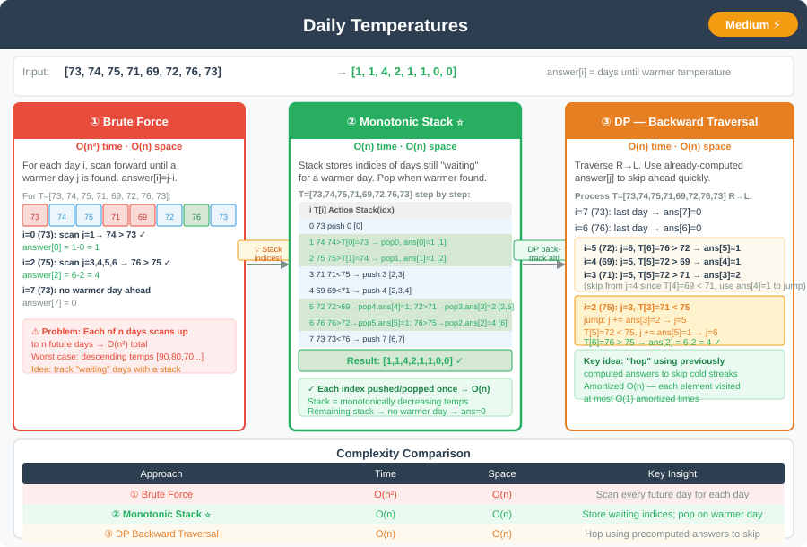

# 🔹 Daily Temperatures




---

## 📌 Problem Statement
Given an array of integers `temperatures` representing daily temperatures, return an array `answer` such that `answer[i]` is the **number of days** you have to wait after the `i`-th day to get a warmer temperature.  
If there is no future day for which this is possible, put `0` instead.

**Example Inputs & Outputs**  
Input: `[73, 74, 75, 71, 69, 72, 76, 73]` → Output: `[1, 1, 4, 2, 1, 1, 0, 0]`

Input: `[30, 40, 50, 60]` → Output: `[1, 1, 1, 0]`

Input: `[30, 60, 90]` → Output: `[1, 1, 0]`

---

## 💡 Logic & Intuition
- For each day, we want the **next warmer day** to the **right**.
- Main approaches:
    1. **Brute Force:** scan forward from each `i`.
    2. **Stack left → right:** indices on a **monotonic decreasing** stack; warmer day at `i` resolves pending colder days.
    3. **Stack right → left (from end of array):** scan **`i = n - 1 … 0`**. Stack holds indices of days **already seen to the right** with **increasing** temperatures toward the **top**; before pushing `i`, **pop** while `T[peek] <= T[i]`. If stack non-empty, **`answer[i] = peek - i`** (top is the **nearest** warmer day to the right). Each index is pushed and popped at most once → **O(n)** time, **O(n)** stack.
    4. **DP / jump using `answer`:** backward pass using previously computed waits to **skip** blocks (no stack).

---

## 💻 Java Code (All Approaches Together)

```java
import java.util.Stack;

public class DailyTemperatures {

    // Approach 1: Brute Force
    public int[] dailyTemperaturesBruteForce(int[] temperatures) {
        int n = temperatures.length;
        int[] answer = new int[n];

        for (int i = 0; i < n; i++) {
            for (int j = i + 1; j < n; j++) {
                if (temperatures[j] > temperatures[i]) {
                    answer[i] = j - i;
                    break;
                }
            }
        }

        return answer;
    }

    // Approach 2: Stack left → right (monotonic decreasing)
    public int[] dailyTemperaturesStack(int[] temperatures) {
        int n = temperatures.length;
        int[] answer = new int[n];
        Stack<Integer> stack = new Stack<>();

        for (int i = 0; i < n; i++) {
            while (!stack.isEmpty() && temperatures[i] > temperatures[stack.peek()]) {
                int idx = stack.pop();
                answer[idx] = i - idx;
            }
            stack.push(i);
        }

        return answer;
    }

    // Approach 2b: Stack right → left — scan from end of array
    public int[] dailyTemperaturesStackFromEnd(int[] temperatures) {
        int n = temperatures.length;
        int[] answer = new int[n];
        Stack<Integer> stack = new Stack<>();

        for (int i = n - 1; i >= 0; i--) {
            while (!stack.isEmpty() && temperatures[stack.peek()] <= temperatures[i]) {
                stack.pop();
            }
            if (!stack.isEmpty()) {
                answer[i] = stack.peek() - i;
            }
            stack.push(i);
        }

        return answer;
    }

    // Approach 3: DP / Next-Greater-Index (Backward Traversal)
    public int[] dailyTemperaturesDP(int[] temperatures) {
        int n = temperatures.length;
        int[] answer = new int[n];

        for (int i = n - 2; i >= 0; i--) {
            int j = i + 1;
            while (j < n && temperatures[j] <= temperatures[i]) {
                if (answer[j] > 0) {
                    j += answer[j];
                } else {
                    j = n; // no warmer day ahead
                }
            }
            if (j < n) answer[i] = j - i;
        }

        return answer;
    }
}
```
---

## 🔹 Complexity Analysis

| Approach                    | Time Complexity | Space Complexity |
|-----------------------------|-----------------|------------------|
| Brute Force                 | O(n²)           | O(1)             |
| Stack (left → right)        | O(n)            | O(n)             |
| Stack (right → left / end)  | O(n)            | O(n)             |
| DP / backward jump          | O(n) amortized  | O(1)             |

---

## 🔹 Edge Cases
1. All temperatures the same → all `0`s.
2. Strictly decreasing temperatures → all `0`s.
3. Single temperature → `[0]`.
4. Very large array → stack-based or DP solution required for efficiency.

---

## 🔹 Follow-Up Questions
1. How to modify for **next colder day** instead?
2. Can we **reduce space usage** if we are allowed to modify input array?
3. How to **stream temperatures one by one** and still find next warmer day efficiently?

---
