# 🔹 Evaluate Reverse Polish Notation




---

## 📌 Problem Statement
Given an array of strings `tokens` representing an arithmetic expression in **Reverse Polish Notation (RPN)**, evaluate the expression and return the result.

- Valid operators: `+`, `-`, `*`, `/`
- Each operand may be an integer or another expression.
- Division should truncate towards zero.

**Example Inputs & Outputs**  
Input: `["2","1","+","3","*"]` → Output: 9  
Explanation: `(2 + 1) * 3 = 9`

Input: `["4","13","5","/","+"]` → Output: 6  
Explanation: `4 + (13 / 5) = 6`

Input: `["10","6","9","3","+","-11","*","/","*","17","+","5","+"]` → Output: 22

---

## 💡 Logic & Intuition
- Use a **stack** to store operands.
- Traverse tokens from left to right:
    1. If token is a number → push onto the stack.
    2. If token is an operator → pop two operands, perform operation, push result back.
- At the end, the stack contains a single result.

---

## 🔹 Approaches

### 1. Stack-Based Evaluation (Standard)
- Intuition:
    - Stack holds operands until an operator is encountered.
    - For each operator, pop the last two operands, apply the operation, and push the result back.

---

## 💻 Java Code (All Approaches)

```java
import java.util.Stack;

public class ReversePolishNotation {

    public int evalRPN(String[] tokens) {
        Stack<Integer> stack = new Stack<>();

        for (String token : tokens) {
            if (token.equals("+")) {
                int b = stack.pop();
                int a = stack.pop();
                stack.push(a + b);
            } else if (token.equals("-")) {
                int b = stack.pop();
                int a = stack.pop();
                stack.push(a - b);
            } else if (token.equals("*")) {
                int b = stack.pop();
                int a = stack.pop();
                stack.push(a * b);
            } else if (token.equals("/")) {
                int b = stack.pop();
                int a = stack.pop();
                stack.push(a / b);
            } else {
                stack.push(Integer.parseInt(token));
            }
        }

        return stack.pop();
    }
}
```
---

## 💡 Intuition Behind the Approach

- The **stack** keeps track of operands until an operator is encountered.
- When an operator appears, the **last two operands** are popped, the operation is applied, and the result is pushed back.
- This ensures the correct **order of operations** and works naturally for the RPN format.
- Handles all operators (`+`, `-`, `*`, `/`) and negative numbers correctly.

---

## 📊 Complexity Analysis

| Approach               | Time Complexity | Space Complexity |
|------------------------|-----------------|------------------|
| Stack-Based Evaluation | O(n)            | O(n)             |

- **n** = number of tokens in the input array.
- Each token is processed once, and the stack holds at most n/2 operands at any time.

---

## 🔹 Edge Cases
1. Single token → simply return its integer value.
2. Division by zero → should be avoided or handled (assume input is valid).
3. Negative numbers → operations respect sign.
4. Empty input → should return 0 or raise an exception depending on constraints.

---

## 🔹 Follow-Up Questions
1. Can you **evaluate RPN without using a stack** (e.g., recursion)?
2. How would you **support additional operators** like modulus `%` or exponent `^`?
3. How to **evaluate tokens in a streaming fashion**, one by one, without storing the whole array?

---
