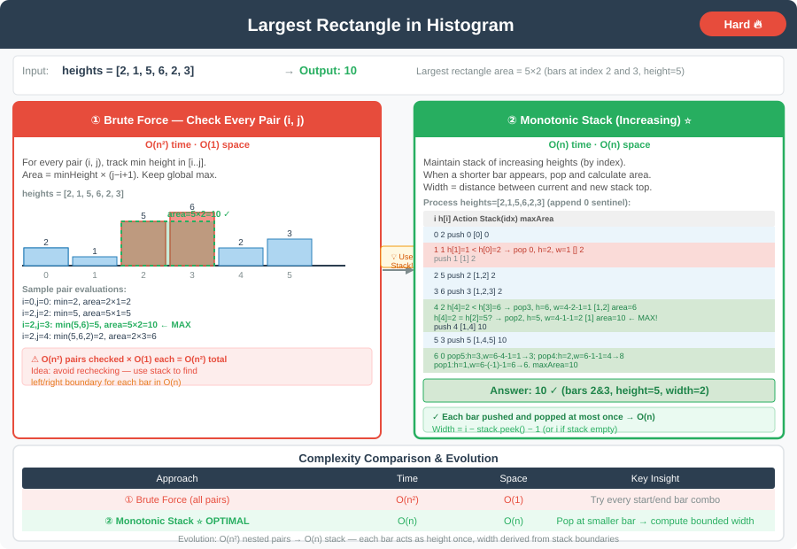

# 🔹 Largest Rectangle in Histogram




---

## 📌 Problem Statement
Given an array of integers representing the heights of bars in a histogram, find the **area of the largest rectangle** that can be formed within the bounds of the histogram.

---

## 📊 Example Input & Output

**Input:** `[2, 1, 5, 6, 2, 3]`  
**Output:** `10`

---

## 💻 Java Code (All Approaches)

```java
import java.util.Stack;

public class LargestRectangleHistogram {

    // Approach 1: Brute Force
    public int largestRectangleAreaBruteForce(int[] heights) {
        int n = heights.length;
        int maxArea = 0;

        for (int i = 0; i < n; i++) {
            int minHeight = heights[i];
            for (int j = i; j < n; j++) {
                minHeight = Math.min(minHeight, heights[j]);
                int width = j - i + 1;
                maxArea = Math.max(maxArea, minHeight * width);
            }
        }

        return maxArea;
    }

    // Approach 2: Stack-Based (Optimized)
    public int largestRectangleAreaStack(int[] heights) {
        int n = heights.length;
        Stack<Integer> stack = new Stack<>();
        int maxArea = 0;

        for (int i = 0; i <= n; i++) {
            int currentHeight = (i == n) ? 0 : heights[i];

            while (!stack.isEmpty() && heights[stack.peek()] > currentHeight) {
                int height = heights[stack.pop()];
                int width = stack.isEmpty() ? i : i - stack.peek() - 1;
                maxArea = Math.max(maxArea, height * width);
            }

            stack.push(i);
        }

        return maxArea;
    }
}
```
---

## 💡 Intuition Behind Each Approach

- **Brute Force:**  
  For each bar, extend left and right until a smaller height is found.  
  Area = `height * width`. Keep track of the maximum area.

- **Stack-Based (Optimized):**  
  Maintain a stack of indices with **ascending heights**.  
  When a lower bar is encountered, pop from stack and calculate area using the popped bar as the smallest bar.  
  Width = `i - stack.peek() - 1` (or `i` if stack is empty). Update max area.

---

## 📊 Complexity Analysis

| Approach                | Time Complexity | Space Complexity |
|-------------------------|-----------------|------------------|
| Brute Force             | O(n²)           | O(1)             |
| Stack-Based (Optimized) | O(n)            | O(n)             |

---

## 🔹 Edge Cases
1. **Empty histogram** → largest area = 0.
2. **All bars same height** → largest area = `height * n`.
3. **Strictly increasing or decreasing heights** → area depends on consecutive bars.
4. **Single bar** → largest area = height of that bar.

---

## 🔹 Follow-Up Questions
- Can this be extended to a **2D matrix of heights** (Maximal Rectangle problem)?
- How to compute largest rectangle in **streaming input**?
- Can we track **left and right limits in a single pass** without using an explicit stack?

---
