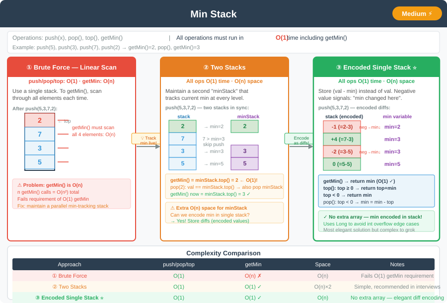

# 🔹 Min Stack




---

## 📌 Problem Statement
Design a stack that supports `push`, `pop`, `top`, and retrieving the **minimum element** in constant time.

**Operations to Support:**
- `push(x)` — Push element `x` onto stack.
- `pop()` — Removes the element on top of the stack.
- `top()` — Get the top element.
- `getMin()` — Retrieve the minimum element in the stack.

**Bonus (for symmetry with [Max Stack](max_stack.md)):**
- `popMin()` — Remove the minimum element and return it, wherever it sits in the stack. If duplicates exist, remove the one closest to the top.

---

## 💻 Java Code (All Approaches)

```java
import java.util.ArrayList;
import java.util.List;
import java.util.Stack;
import java.util.TreeMap;

public class MinStackSolutions {

    // Approach 1: Brute Force
    static class MinStackBrute {
        private Stack<Integer> stack;

        public MinStackBrute() {
            stack = new Stack<>();
        }

        public void push(int x) {
            stack.push(x);
        }

        public void pop() {
            if (!stack.isEmpty()) stack.pop();
        }

        public int top() {
            return stack.peek();
        }

        public int getMin() {
            int min = Integer.MAX_VALUE;
            for (int val : stack) {
                if (val < min) min = val;
            }
            return min;
        }
    }

    // Approach 2: Two Stacks (Optimized) - also supports popMin, mirroring Max Stack's popMax
    static class MinStackTwoStacks {
        private Stack<Integer> stack;
        private Stack<Integer> minStack;

        public MinStackTwoStacks() {
            stack = new Stack<>();
            minStack = new Stack<>();
        }

        public void push(int x) {
            stack.push(x);
            if (minStack.isEmpty() || x <= minStack.peek()) {
                minStack.push(x);
            }
        }

        public int pop() {
            int val = stack.pop();
            if (val == minStack.peek()) minStack.pop();
            return val;
        }

        public int top() {
            return stack.peek();
        }

        public int getMin() {
            return minStack.peek();
        }

        // Removes the minimum element from anywhere in the stack (same buffer trick as Max Stack's popMax)
        public int popMin() {
            int min = minStack.peek();
            Stack<Integer> buffer = new Stack<>();

            // Buffer everything above the min element
            while (stack.peek() != min) {
                buffer.push(pop());
            }
            pop(); // discard the min itself

            // Push the buffered elements back (recomputes minStack correctly)
            while (!buffer.isEmpty()) {
                push(buffer.pop());
            }

            return min;
        }
    }

    // Approach 3: One Stack with Encoded Values (Optimized)
    static class MinStackEncoded {
        private Stack<Long> stack;
        private long min;

        public MinStackEncoded() {
            stack = new Stack<>();
        }

        public void push(int x) {
            if (stack.isEmpty()) {
                stack.push(0L);
                min = x;
            } else {
                stack.push(x - min);
                if (x < min) min = x;
            }
        }

        public void pop() {
            long top = stack.pop();
            if (top < 0) min = min - top;
        }

        public int top() {
            long top = stack.peek();
            if (top > 0) return (int)(top + min);
            else return (int)min;
        }

        public int getMin() {
            return (int)min;
        }
    }

    // Approach 4: Doubly Linked List + TreeMap (Optimized) - supports popMin in O(log n), mirroring Max Stack
    static class MinStackOptimized {
        private static class Node {
            int val;
            Node prev, next;
            Node(int val) { this.val = val; }
        }

        private final Node head = new Node(0); // sentinel
        private final Node tail = new Node(0); // sentinel
        private final TreeMap<Integer, List<Node>> map = new TreeMap<>();

        public MinStackOptimized() {
            head.next = tail;
            tail.prev = head;
        }

        public void push(int x) {
            Node node = new Node(x);
            Node prevTail = tail.prev;
            prevTail.next = node;
            node.prev = prevTail;
            node.next = tail;
            tail.prev = node;

            map.computeIfAbsent(x, k -> new ArrayList<>()).add(node);
        }

        public int pop() {
            Node node = tail.prev;
            unlink(node);
            removeFromMap(node);
            return node.val;
        }

        public int top() {
            return tail.prev.val;
        }

        public int getMin() {
            return map.firstKey();
        }

        public int popMin() {
            int minVal = map.firstKey();
            List<Node> bucket = map.get(minVal);
            Node node = bucket.remove(bucket.size() - 1);
            if (bucket.isEmpty()) map.remove(minVal);

            unlink(node);
            return minVal;
        }

        private void removeFromMap(Node node) {
            List<Node> bucket = map.get(node.val);
            bucket.remove(bucket.size() - 1);
            if (bucket.isEmpty()) map.remove(node.val);
        }

        private void unlink(Node node) {
            node.prev.next = node.next;
            node.next.prev = node.prev;
        }
    }
}
```
---

## 💡 Intuition Behind Each Approach

- **Brute Force:**  
  Maintain all elements in a stack. On `getMin()`, iterate through the stack to find the minimum. Simple but inefficient (O(n) for `getMin()`).

- **Two Stacks (Optimized):**  
  Use a secondary stack to keep track of the minimum value at each push. Ensures O(1) for all operations, as the top of the min stack is always the current minimum.  
  Extending it with `popMin()` uses the exact same buffer trick as [Max Stack's](max_stack.md) `popMax()`: buffer elements above the minimum into a temporary stack, discard the minimum, then push the buffer back to recompute `minStack` correctly. This makes `popMin` O(n), while everything else stays O(1).

- **One Stack with Encoded Values (Optimized):**  
  Store the difference between the current value and the current minimum.  
  Negative values indicate that the minimum has changed. This approach saves space and maintains O(1) operations. Note: this encoding is inherently sequential, so it does **not** extend to `popMin()` — removing from the middle would require decoding and re-encoding everything above it anyway, at which point the two-stack or DLL+TreeMap approach is simpler.

- **Doubly Linked List + TreeMap (Optimized):**  
  Mirrors [Max Stack's](max_stack.md) optimized approach exactly, just tracking the minimum instead of the maximum: a doubly linked list lets any node be unlinked in O(1), and a `TreeMap<Integer, List<Node>>` indexes nodes by value so the current minimum is always `map.firstKey()` in O(log n). Each value's bucket is used as a stack (`add`/`remove(size() - 1)`). This brings `push`, `pop`, and `popMin` down to O(log n), while `top` and `getMin` stay O(1).

---

## 📊 Complexity Analysis

| Approach                      | push     | pop      | top  | getMin | popMin   | Space Complexity |
|--------------------------------|----------|----------|------|--------|----------|-------------------|
| Brute Force                   | O(1)     | O(1)     | O(1) | O(n)   | —        | O(n)              |
| Two Stacks (Optimized)        | O(1)     | O(1)     | O(1) | O(1)   | O(n)     | O(n)              |
| One Stack with Encoded Values | O(1)     | O(1)     | O(1) | O(1)   | —        | O(n)              |
| Doubly Linked List + TreeMap (Optimized) | O(log n) | O(log n) | O(1) | O(1) | O(log n) | O(n)  |

---

## 🔹 Edge Cases
1. Calling `getMin()`/`popMin()` on an **empty stack** → should handle exceptions.
2. All elements are the **same** → min remains constant; `popMin` behaves like a normal `pop` from the top.
3. Negative numbers → encoded approach handles properly.
4. Single element stack → min = that element; `popMin` empties the stack.
5. **Duplicate minimum values** → `popMin` removes only the most recently pushed occurrence; the rest remain in place.
6. **Interleaved push/popMin calls** → verify relative order of the remaining elements is preserved after a `popMin` removes a non-top element.

---

## 🔹 Follow-Up Questions
- Can we **reduce space further** for `getMin` without a second stack?
- Can you support `getKthMin()` efficiently with the TreeMap-based design (mirroring [Max Stack's](max_stack.md) `getKthMax()` follow-up)?
- Can we implement this efficiently for **streaming input** where the stack is huge?

---
