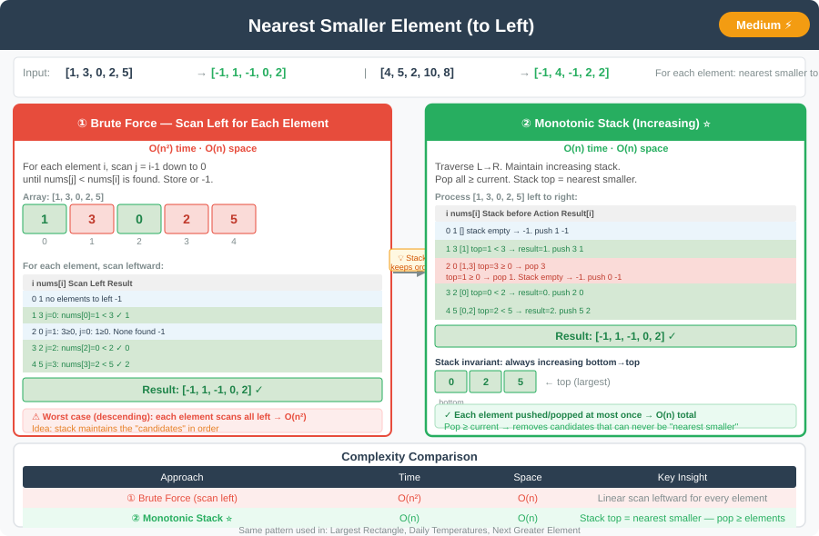

# 🔹 Nearest Smaller Element




---

## 📌 Problem Statement
Given an array of integers, for each element, find the **nearest smaller element to the left**.  
If no such element exists, return `-1`.

---

## 📊 Example Inputs & Outputs

**Input:**  `[1, 3, 0, 2, 5]`  
**Output:** `[-1, 1, -1, 0, 2]`

**Input:**  `[4, 5, 2, 10, 8]`  
**Output:** `[-1, 4, -1, 2, 2]`

---

## 💻 Java Code (All Approaches)

```java
import java.util.Stack;

public class NearestSmallerElement {

    // Approach 1: Brute Force
    public int[] nearestSmallerToLeftBruteForce(int[] nums) {
        int n = nums.length;
        int[] result = new int[n];

        for (int i = 0; i < n; i++) {
            result[i] = -1;
            for (int j = i - 1; j >= 0; j--) {
                if (nums[j] < nums[i]) {
                    result[i] = nums[j];
                    break;
                }
            }
        }
        return result;
    }

    // Approach 2: Stack-Based (Efficient)
    public int[] nearestSmallerToLeft(int[] nums) {
        int n = nums.length;
        int[] result = new int[n];
        Stack<Integer> stack = new Stack<>();

        for (int i = 0; i < n; i++) {
            while (!stack.isEmpty() && stack.peek() >= nums[i]) {
                stack.pop();
            }

            result[i] = stack.isEmpty() ? -1 : stack.peek();
            stack.push(nums[i]);
        }
        return result;
    }
}
```

---

## 💡 Intuition Behind Each Approach

- **Brute Force:**  
  For every element, scan all elements to its **left** until a smaller one is found. Simple but inefficient (O(n²)).

- **Stack-Based:**  
  Maintain a **monotonic increasing stack** while traversing from left to right.
    - Pop all elements ≥ current element.
    - If the stack is not empty, its top is the nearest smaller to left.
    - Push current element onto the stack.

---

## 📊 Complexity Analysis

| Approach       | Time Complexity | Space Complexity |
|----------------|-----------------|------------------|
| Brute Force    | O(n²)           | O(1) + O(n)      |
| Stack-Based    | O(n)            | O(n)             |

---

## 🔹 Edge Cases
1. **Strictly increasing array** → each element's nearest smaller is the previous element.
2. **Strictly decreasing array** → all elements → `-1`.
3. **Single element array** → result = `[-1]`.
4. **All elements equal** → all elements → `-1`.

---

## 🔹 Follow-Up Questions
- How would you modify this for **Nearest Greater to Left**?
- How to compute **Nearest Smaller / Greater to Right** efficiently?
- Can this logic be extended to **2D arrays or histogram problems**?

---
