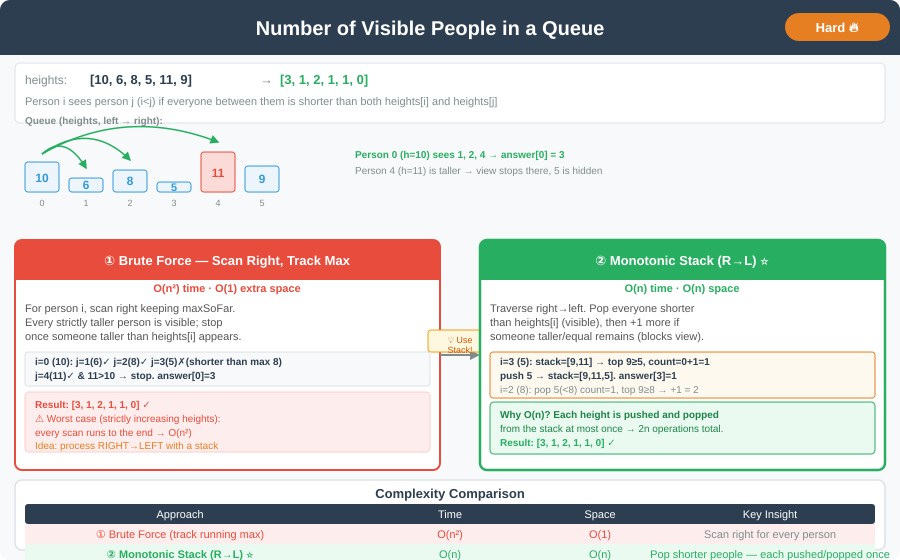

# 🔹 Number of Visible People in a Queue



---

## 📌 Problem Statement
There are `n` people standing in a queue, and they numbered from `0` to `n - 1` in **left to right** order. You are given an array `heights` of distinct integers where `heights[i]` represents the height of the `i-th` person.

A person can **see** another person to their right in the queue if everybody in between is **shorter** than both of them. More formally, the `i-th` person can see the `j-th` person if `i < j` and `min(heights[i], heights[j]) > heights[k]` for all `i < k < j`.

Return an array `answer` of length `n` where `answer[i]` is the **number of people** the `i-th` person can see to their right in the queue.

**Example:**
```
Input:  heights = [10, 6, 8, 5, 11, 9]
Output: [3, 1, 2, 1, 1, 0]
```
- Person 0 (10) sees 1(6), 2(8), and 4(11) → 3 people.
- Person 1 (6) sees only 2(8) → 1 person.
- Person 2 (8) sees 3(5) and 4(11) → 2 people.
- Person 4 (11) sees 5(9) → 1 person.
- Person 5 (9) sees nobody to their right → 0.

---

## 💻 Java Code (All Approaches)

```java
import java.util.ArrayDeque;
import java.util.Deque;

public class NumberOfVisiblePeopleInQueue {

    // Approach 1: Brute Force
    public int[] canSeePersonsCountBrute(int[] heights) {
        int n = heights.length;
        int[] answer = new int[n];

        for (int i = 0; i < n; i++) {
            int count = 0;
            int maxSoFar = -1;
            for (int j = i + 1; j < n; j++) {
                if (heights[j] > maxSoFar) {
                    count++;
                    maxSoFar = heights[j];
                }
                if (heights[j] > heights[i]) break; // blocked, can't see beyond
            }
            answer[i] = count;
        }
        return answer;
    }

    // Approach 2: Monotonic Stack (Optimized) - traverse right to left
    public int[] canSeePersonsCount(int[] heights) {
        int n = heights.length;
        int[] answer = new int[n];
        Deque<Integer> stack = new ArrayDeque<>(); // heights, decreasing from bottom to top

        for (int i = n - 1; i >= 0; i--) {
            int count = 0;
            while (!stack.isEmpty() && stack.peek() < heights[i]) {
                stack.pop();
                count++;
            }
            if (!stack.isEmpty()) {
                count++; // can see the taller (or equal) person blocking the view, but no further
            }
            answer[i] = count;
            stack.push(heights[i]);
        }
        return answer;
    }
}
```
---

## 💡 Intuition Behind Each Approach

- **Brute Force:**
  For each person, walk to the right and keep track of the tallest person seen so far. Every strictly taller person than `maxSoFar` is visible. Stop as soon as someone taller than the current person blocks the view. Simple, but O(n²) in the worst case (e.g., strictly increasing heights).

- **Monotonic Stack (Optimized):**
  Traverse from **right to left** while maintaining a stack that is monotonically **non-increasing** from bottom to top (it stores the heights of people visible/relevant so far to the right).
  For the current person `i`:
    - Pop every person from the stack shorter than `heights[i]` — person `i` can see over all of them, so count them.
    - If the stack still has someone left (they are `>= heights[i]`), person `i` can see that one too (their view stops there), so add one more.
    - Push `heights[i]` onto the stack so the people to its left can reason about it.
  Since each element is pushed and popped from the stack at most once, the total work is O(n).

---

## 📊 Complexity Analysis

| Approach                | Time  | Space | Notes                                    |
|--------------------------|-------|-------|-------------------------------------------|
| Brute Force              | O(n²) | O(1)  | Worst case for strictly increasing input |
| Monotonic Stack (Optimized) | O(n)  | O(n)  | Each element pushed/popped once          |

---

## 🔹 Edge Cases
1. Strictly increasing heights (e.g., `[1,2,3,4,5]`) → each person sees only the next one; last person sees `0`.
2. Strictly decreasing heights (e.g., `[5,4,3,2,1]`) → each person sees everyone to their right.
3. Single person in the queue → `answer = [0]`.
4. All heights distinct is guaranteed by the problem, but the stack logic (using `<` instead of `<=` when popping) still generalizes correctly if duplicates were allowed.

---

## 🔹 Follow-Up Questions
- How would the solution change if two people of **equal height** could see each other regardless of anyone taller standing between them?
- Can you solve it while streaming heights **left to right** instead of right to left?
- How does this problem relate to [Next Greater Element](next_greater_element.md) and [Daily Temperatures](daily_temperatures.md)?

---
