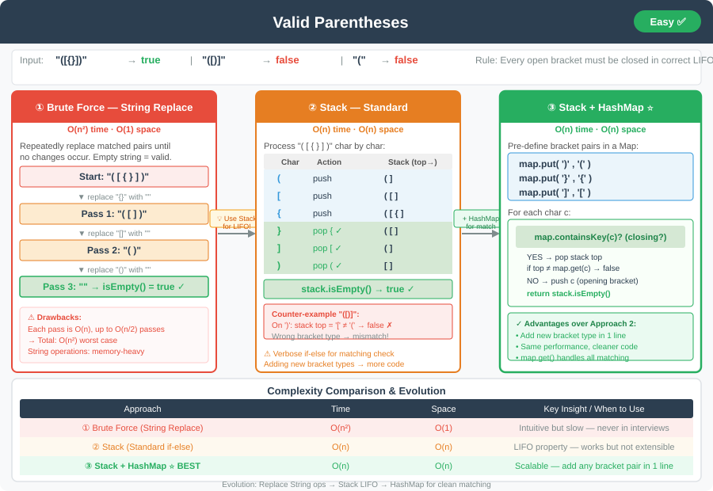

# Valid Parentheses




**Difficulty:** Easy ✅

---

## 🔹 Problem Statement
Given a string `s` consisting of the characters `'('`, `')'`, `'{'`, `'}'`, `'['`, and `']'`, determine if the string is **valid**.

A string is valid if:
1. Open brackets are closed by the same type of bracket.
2. Open brackets are closed in the correct order.
3. Every closing bracket has a corresponding open bracket before it.

---

## 🔹 Examples
| Input      | Output  |
|------------|---------|
| `"()[]{}"` | `true`  |
| `"([{}])"` | `true`  |
| `"(]"`     | `false` |
| `"([)]"`   | `false` |
| `"("`      | `false` |

---

## 🔹 Intuition & Logic
- Brackets must **match in type** and follow **LIFO order**.
- A **stack** is the natural choice.
- Approaches:
    1. **Brute Force (Replace method)**
    2. **Stack-based (Standard)**
    3. **Stack + HashMap (Cleaner)**

---

## 💻 Java Code (All Approaches Together)

```java
import java.util.*;

public class ValidParentheses {

    // Approach 1: Brute Force (Replace Method)
    public boolean isValidBruteForce(String s) {
        int length;
        do {
            length = s.length();
            s = s.replace("()", "")
                 .replace("{}", "")
                 .replace("[]", "");
        } while (s.length() != length);

        return s.isEmpty();
    }

    // Approach 2: Stack-Based (Standard)
    public boolean isValidStack(String s) {
        Stack<Character> stack = new Stack<>();
        for (char c : s.toCharArray()) {
            if (c == '(' || c == '{' || c == '[') {
                stack.push(c);
            } else {
                if (stack.isEmpty()) return false;
                char top = stack.pop();
                if ((c == ')' && top != '(') ||
                    (c == '}' && top != '{') ||
                    (c == ']' && top != '[')) {
                    return false;
                }
            }
        }
        return stack.isEmpty();
    }

    // Approach 3: Stack with HashMap (Cleaner)
    public boolean isValidHashMap(String s) {
        Map<Character, Character> map = new HashMap<>();
        map.put(')', '(');
        map.put('}', '{');
        map.put(']', '[');

        Stack<Character> stack = new Stack<>();

        for (char c : s.toCharArray()) {
            if (map.containsKey(c)) {
                char top = stack.isEmpty() ? '#' : stack.pop();
                if (top != map.get(c)) return false;
            } else {
                stack.push(c);
            }
        }
        return stack.isEmpty();
    }
}
```
---

## 🔹 Complexity Analysis

| Approach                  | Time Complexity | Space Complexity |
|---------------------------|-----------------|------------------|
| Brute Force (Replace)     | O(n²)           | O(1)             |
| Stack (Standard)          | O(n)            | O(n)             |
| Stack + HashMap (Cleaner) | O(n)            | O(n)             |

---

## 🔹 Edge Cases
- Empty string → valid (`true`).
- Single unmatched bracket → invalid.
- Nested structures like `"([{}])"` → valid.
- Incorrect order like `"([)]"` → invalid.

---

## 🔹 Follow-Up Questions
1. Can this be extended to handle **other paired symbols** (e.g., `< >`)?
2. How would you optimize for **huge inputs (millions of chars)**?
3. Can it be solved **without a stack**, only using counters?

---
