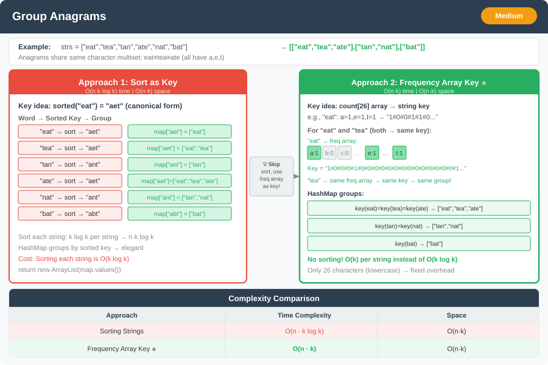

# 🔹 Problem: Group Anagrams




**Difficulty:** Medium ⚡

---

## 🔹 Problem Statement
Given an array of strings `strs`, group the strings that are **anagrams of each other**.  
Return the answer as a list of lists. You may return the groups in **any order**.

**Example:**  
Input: `strs = ["eat","tea","tan","ate","nat","bat"]`  
Output: `[["eat","tea","ate"],["tan","nat"],["bat"]]`

Explanation:
- `"eat"`, `"tea"`, `"ate"` are anagrams of each other.
- `"tan"`, `"nat"` are anagrams.
- `"bat"` stands alone.

---

## 🔹 Intuition
- Anagrams have the **same character counts**.
- Sort each string or use a **frequency count** as a key.
- Group strings by their key in a **hash map**.

---

## 🔹 Approaches

### 1. Sorting Approach
- Sort each string.
- Use the sorted string as a key in a `Map<String, List<String>>`.
- Append the original string to the list corresponding to that key.

**Time Complexity:** O(n * k log k) → n = number of strings, k = average string length  
**Space Complexity:** O(n * k) → for hashmap and output

---

### 2. Count/Frequency Approach (Optimal for lowercase letters)
- Count frequency of each character (size 26 array) for a string.
- Convert count array to a string key like `"1#0#0#..."`.
- Use the key to group strings in a map.

**Time Complexity:** O(n * k)  
**Space Complexity:** O(n * k)

---

## 🔹 Java Code

```java
import java.util.*;

public class GroupAnagrams {

    public static List<List<String>> groupAnagrams(String[] strs) {
        if (strs == null || strs.length == 0) return new ArrayList<>();
        Map<String, List<String>> map = new HashMap<>();

        for (String s : strs) {
            char[] chars = s.toCharArray();
            Arrays.sort(chars);
            String key = new String(chars);
            map.computeIfAbsent(key, k -> new ArrayList<>()).add(s);
        }

        return new ArrayList<>(map.values());
    }

    public static void main(String[] args) {
        String[] strs = {"eat","tea","tan","ate","nat","bat"};
        System.out.println(groupAnagrams(strs));
    }
}
```

---

## 🔹 Complexity Analysis

| Approach               | Time Complexity | Space Complexity |
|------------------------|----------------|-----------------|
| Sorting Strings         | O(n * k log k) | O(n * k)        |
| Count/Frequency Array   | O(n * k)       | O(n * k)        |

---

## 🔹 Edge Cases
- Empty input array → Output `[]`
- Single string → Output `[[string]]`
- Strings with different lengths → treated correctly
- Strings with duplicates → handled naturally

---

## 🔹 Follow-Up Questions
1. How would you **handle Unicode characters** instead of only lowercase letters?
2. Can you return the groups **sorted alphabetically** inside each group?
3. How would you modify it for **streaming strings**, where you receive one string at a time?
