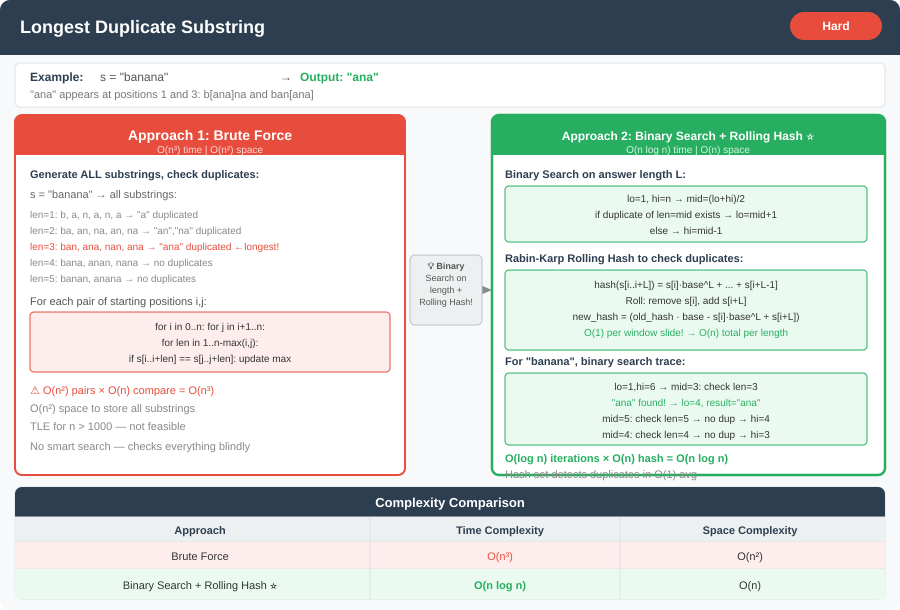

# 🔹 Problem: Longest Duplicate Substring




**Difficulty:** Hard ⚡

---

## 🔹 Problem Statement
Given a string `s`, find the **longest substring that appears at least twice** in `s`.  
You may assume the two occurrences **may overlap**.  
Return any one of the longest duplicate substrings.  
If none exists, return an empty string `""`.

**Example:**  
Input: `s = "banana"`  
Output: `"ana"`

Explanation:
- `"ana"` appears twice: `"b[ana]na"` and `"ban[ana]"`.

---

## 🔹 Intuition
- Brute force all substrings → O(n²) or worse.
- Use **Binary Search on substring length** + **Rabin-Karp rolling hash** to efficiently check duplicates.
- Binary search helps find the **maximum length** of duplicate substring.

---

## 🔹 Approaches

### 1. Brute Force
- Generate all substrings.
- Check which ones appear more than once.
- Keep track of the longest.

**Time Complexity:** O(n³)  
**Space Complexity:** O(n²) for storing substrings

---

### 2. Binary Search + Rolling Hash (Optimal)
- Use binary search for substring length `L`:
    1. Mid = (low + high) / 2 → check if duplicate substring of length `mid` exists using **hashing**.
    2. If exists → try longer length (`low = mid + 1`).
    3. Else → try shorter length (`high = mid - 1`).
- Use **Rabin-Karp rolling hash** to detect duplicates efficiently.

**Time Complexity:** O(n log n)  
**Space Complexity:** O(n) for hash sets

---

## 🔹 Java Code

```java
import java.util.*;

public class LongestDuplicateSubstring {

    public static String longestDupSubstring(String s) {
        int n = s.length();
        int left = 1, right = n;
        String result = "";

        while (left <= right) {
            int mid = left + (right - left) / 2;
            String dup = search(s, mid);
            if (!dup.equals("")) {
                result = dup;
                left = mid + 1;
            } else {
                right = mid - 1;
            }
        }

        return result;
    }

    private static String search(String s, int len) {
        long mod = (1L << 32);
        long hash = 0;
        long base = 256;

        for (int i = 0; i < len; i++) {
            hash = (hash * base + s.charAt(i)) % mod;
        }

        Set<Long> seen = new HashSet<>();
        seen.add(hash);

        long power = 1;
        for (int i = 1; i <= len; i++) power = (power * base) % mod;

        for (int i = 1; i <= s.length() - len; i++) {
            hash = (hash * base - s.charAt(i - 1) * power % mod + mod) % mod;
            hash = (hash + s.charAt(i + len - 1)) % mod;

            if (seen.contains(hash)) {
                return s.substring(i, i + len);
            }
            seen.add(hash);
        }

        return "";
    }

    public static void main(String[] args) {
        String s = "banana";
        System.out.println(longestDupSubstring(s)); // Output: "ana"
    }
}
```

---

## 🔹 Complexity Analysis

| Approach                     | Time Complexity | Space Complexity |
|-------------------------------|----------------|-----------------|
| Brute Force                  | O(n³)          | O(n²)           |
| Binary Search + Rolling Hash | O(n log n)     | O(n)            |

---

## 🔹 Edge Cases
- Empty string → Output `""`
- No duplicate substring → Output `""`
- Entire string repeated → returns substring of length `n-1`
- Multiple duplicates → any one longest substring is valid

---

## 🔹 Follow-Up Questions
1. How would you modify it to **return all longest duplicate substrings**?
2. Can you implement it using a **suffix array** instead of hashing?
3. How would you optimize it for **very large strings**, e.g., length > 10⁶?
