# 🔹 Problem: Longest Substring Without Repeating Characters




**Difficulty:** Medium ⚡

---

## 🔹 Problem Statement
Given a string `s`, find the **length of the longest substring without repeating characters**.

**Example:**  
Input: `s = "abcabcbb"`  
Output: `3`

Explanation:
- The longest substring without repeating characters is `"abc"`, length = 3.

---

## 🔹 Intuition
- Use the **sliding window technique** to maintain a substring with unique characters.
- Expand the window by moving the right pointer.
- If a character repeats, shrink the window from the left until no duplicates remain.
- Keep track of the **maximum window size** during the process.

---

## 🔹 Approaches

### 1. Brute Force
- Check all possible substrings.
- For each substring, check if all characters are unique.
- Keep track of the maximum length.

**Time Complexity:** O(n²)  
**Space Complexity:** O(n) (for checking uniqueness)

---

### 2. Sliding Window + HashSet (Optimal)
- Use a **HashSet** to store characters in the current window.
- Two pointers `left` and `right`:
    1. Move `right` forward and add `s[right]` to the set.
    2. If `s[right]` is already in the set, remove `s[left]` from the set and move `left`.
    3. Update `maxLength` after each step.

**Time Complexity:** O(n)  
**Space Complexity:** O(min(n, charset_size))

---

## 🔹 Java Code

```java
import java.util.*;

public class LongestSubstringWithoutRepeating {

    public static int lengthOfLongestSubstring(String s) {
        Set<Character> set = new HashSet<>();
        int left = 0, maxLength = 0;

        for (int right = 0; right < s.length(); right++) {
            char ch = s.charAt(right);
            while (set.contains(ch)) {
                set.remove(s.charAt(left));
                left++;
            }
            set.add(ch);
            maxLength = Math.max(maxLength, right - left + 1);
        }

        return maxLength;
    }

    public static void main(String[] args) {
        String s = "abcabcbb";
        System.out.println(lengthOfLongestSubstring(s)); // Output: 3
    }
}
```

---

## 🔹 Complexity Analysis

| Approach                   | Time Complexity | Space Complexity |
|----------------------------|----------------|-----------------|
| Brute Force                | O(n²)          | O(n)            |
| Sliding Window + HashSet   | O(n)           | O(min(n, charset_size)) |

---

## 🔹 Edge Cases
- Empty string → Output `0`
- String with all unique characters → Output = string length
- String with all same characters → Output = `1`
- Mixed case characters → Case-sensitive handling

---

## 🔹 Follow-Up Questions
1. Can you return the **substring itself** instead of just its length?
2. How would you optimize it if the input string is **very large**?
3. How would you modify it to handle **Unicode characters** efficiently?
