# 🔹 Problem: Minimum Window Substring




**Difficulty:** Hard ⚡

---

## 🔹 Problem Statement
Given two strings `s` and `t`, find the **minimum window in `s` which contains all the characters of `t`** (including duplicates).  
If no such window exists, return an empty string `""`.

**Example:**  
Input: `s = "ADOBECODEBANC"`, `t = "ABC"`  
Output: `"BANC"`

Explanation:
- The substring `"BANC"` contains all characters `A`, `B`, and `C` and is the smallest such window.

---

## 🔹 Intuition
- **Sliding window** `[left, right]` on `s`: expand `right` until the window **covers** `t` (with multiplicities), then shrink `left` while still valid to minimize length.
- **Fast bookkeeping (ASCII):** Use **`int[128]`** (or `256` if needed) for **`need[c]`** (from `t`) and **`win[c]`** (current window). Avoids `HashMap` boxing and resizing — same **O(|s| + |t|)** time, better constants.
- **`missing` counter:** **`missing`** = how many **instances** from `t` are still **under-covered** in the window (initially **`|t|`**). Before **`win[c]++`**, if **`need[c] > 0`** and **`win[c] < need[c]`**, **`missing--`**. Before **`win[lc]--`**, if **`need[lc] > 0`** and **`win[lc] <= need[lc]`**, **`missing++`**. Valid window ⇔ **`missing == 0`**. Same invariant as **`formed == required`** over distinct chars, but **one int** and **no second map**.
- **Unicode / large alphabet:** Keep **`HashMap<Character, Integer>`** for `need` / `win`.

---

## 🔹 `missing` vs `formed` / `required`

| | **`missing`** | **`formed` / `required`** |
|--|----------------|---------------------------|
| **Counts** | **Occurrences** of `t` still under-covered in the window (starts at **\|t\|**). | **Distinct** letters of `t` that are fully satisfied: **`required`** = number of keys in `t`’s map with positive count; **`formed`** = how many of those keys have `windowCount == need` right now. |
| **Valid window** | **`missing == 0`** | **`formed == required`** |
| **Typical pairing** | **`int[128]`** `need` / `win` (ASCII) | **`HashMap`** counts |
| **When to prefer** | Bounded alphabet, fewer allocations, one extra **`int`** besides arrays. | Large / sparse alphabet, or you already think in “how many distinct constraints are satisfied?” |

Same sliding-window idea and **O(\|s\| + \|t\|)** time; pick one style and stay consistent in the shrink loop.

---

## 🔹 Approaches

### 1. Brute Force
- Check all substrings of `s`.
- For each substring, check if it contains all characters of `t`.
- Track the smallest valid substring.

**Time Complexity:** O(n² * m) → n = length of s, m = length of t  
**Space Complexity:** O(1) for frequency (constant alphabet)

---

### 2. Sliding window + HashMap (`formed` / `required`)
- Count `t` in a map; maintain window counts; **`formed`** = number of distinct keys whose window count **equals** target count.
- Same structure as §3: **outer `for` over `right`**, **inner `while`** to shrink **`left`** while **`formed == required`**.
- **Time:** O(|s| + |t|) · **Space:** O(|Σ|) hash overhead per access.

---

### 3. Sliding window + `int[128]` + `missing` (recommended on ASCII)
- **`need[c]`** from `t`, **`win[c]`** in window, **`missing`** starts at **`|t|`**.
- **Outer `for (right ...)`** expands the window; **inner `while (missing == 0)`** shrinks **`left`** while the window stays valid.
- Single **`char[]`** for `s` avoids repeated **`charAt`** in the hot path (minor).
- **Time:** O(|s| + |t|) · **Space:** O(1) extra if alphabet size is constant (128).

---

## 🔹 Java Code

```java
import java.util.*;

public class MinimumWindowSubstring {

    /** Optimized: ASCII counts + missing counter — fewer allocations, same asymptotics */
    public static String minWindow(String s, String t) {
        if (t.isEmpty() || s.length() < t.length()) return "";

        int[] need = new int[128];
        for (int i = 0; i < t.length(); i++) {
            need[t.charAt(i)]++;
        }

        int missing = t.length();
        int[] win = new int[128];
        char[] arr = s.toCharArray();

        int left = 0;
        int start = 0;
        int minLen = Integer.MAX_VALUE;

        for (int right = 0; right < arr.length; right++) {
            char c = arr[right];
            if (need[c] > 0 && win[c] < need[c]) {
                missing--;
            }
            win[c]++;

            while (missing == 0) {
                if (right - left + 1 < minLen) {
                    minLen = right - left + 1;
                    start = left;
                }
                char lc = arr[left];
                if (need[lc] > 0 && win[lc] <= need[lc]) {
                    missing++;
                }
                win[lc]--;
                left++;
            }
        }

        return minLen == Integer.MAX_VALUE ? "" : s.substring(start, start + minLen);
    }

    /** HashMap variant — use when alphabet is not bounded ASCII */
    public static String minWindowHashMap(String s, String t) {
        if (s == null || t == null || s.length() < t.length()) return "";

        Map<Character, Integer> tCount = new HashMap<>();
        for (char c : t.toCharArray()) {
            tCount.put(c, tCount.getOrDefault(c, 0) + 1);
        }

        Map<Character, Integer> windowCount = new HashMap<>();
        int left = 0;
        int required = tCount.size();
        int formed = 0;
        int minLen = Integer.MAX_VALUE;
        int start = 0;

        for (int right = 0; right < s.length(); right++) {
            char c = s.charAt(right);
            windowCount.put(c, windowCount.getOrDefault(c, 0) + 1);

            if (tCount.containsKey(c) && windowCount.get(c).intValue() == tCount.get(c).intValue()) {
                formed++;
            }

            while (left <= right && formed == required) {
                if (right - left + 1 < minLen) {
                    minLen = right - left + 1;
                    start = left;
                }

                char leftChar = s.charAt(left);
                windowCount.put(leftChar, windowCount.get(leftChar) - 1);
                if (tCount.containsKey(leftChar)
                        && windowCount.get(leftChar).intValue() < tCount.get(leftChar).intValue()) {
                    formed--;
                }
                left++;
            }
        }

        return minLen == Integer.MAX_VALUE ? "" : s.substring(start, start + minLen);
    }

    public static void main(String[] args) {
        String s = "ADOBECODEBANC";
        String t = "ABC";
        System.out.println(minWindow(s, t)); // BANC
    }
}
```

---

## 🔹 Complexity Analysis

| Approach                          | Time Complexity | Space Complexity        |
|-----------------------------------|----------------|-------------------------|
| Brute Force                       | O(n² · m)      | O(1) alphabet           |
| Sliding window + HashMap          | O(n + m)       | O(|Σ|) map buckets      |
| Sliding window + `int[]` + missing | O(n + m)    | O(1) for fixed Σ e.g. 128 |

---

## 🔹 Edge Cases
- `s = ""` or `t = ""` → Output `""`
- `s` shorter than `t` → Output `""`
- No valid window → Output `""`
- `s` and `t` with duplicate characters → handled by frequency map

---

## 🔹 Follow-Up Questions
1. Can you find the **number of minimum windows** containing all characters?
2. How would you modify the solution if `t` is very large compared to `s`?
3. Can this be adapted for **streaming input**, where `s` arrives character by character?
