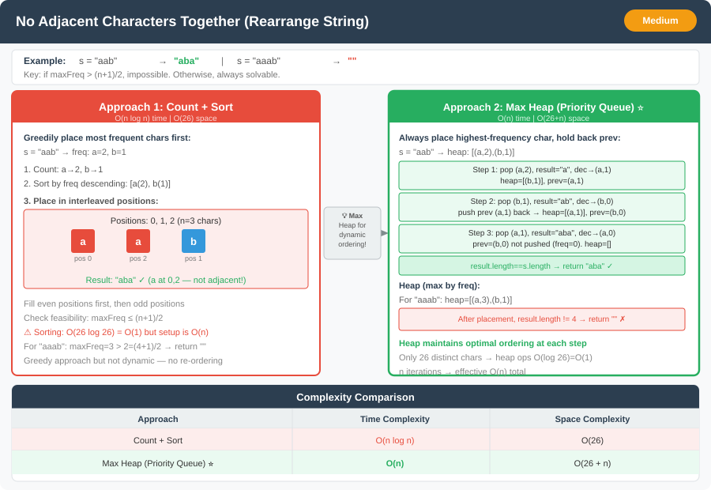

# 🔹 Problem: No Adjacent Characters Together




**Difficulty:** Medium ⚡

---

## 🔹 Problem Statement
Given a string `s` consisting of only lowercase letters, **rearrange the characters** so that **no two adjacent characters are the same**.  
Return **any valid rearranged string**, or an empty string `""` if not possible.

**Example:**  
Input: `s = "aab"`  
Output: `"aba"`

Input: `s = "aaab"`  
Output: `""`

Explanation:
- `"aab"` can be rearranged as `"aba"` where no two same letters are adjacent.
- `"aaab"` cannot be rearranged to satisfy the condition.

---

## 🔹 Intuition
- **Feasibility:** Let **`maxFreq`** be the largest character count. You can avoid adjacent equals **iff** **`maxFreq <= (n + 1) / 2`** — otherwise one letter would need more than half the slots on one “parity” (evens or odds), which is impossible.
- **Max freq first (no heap):** Find the letter with **`maxFreq`**. Fill **every other index** starting at **`0`** (`0, 2, 4, …`) with that letter until it’s exhausted. Then reset **`idx`** to **`1`** if you ran past the end of the array, and place **all remaining letters** by stepping **`idx += 2`** (same parity stride), wrapping **`idx` to `1`** when **`idx >= n`**. Separating the dominant letter onto one parity guarantees it never touches itself.
- **Heap variant:** Repeatedly take the **largest remaining count** that isn’t the previous placed character — same idea, different scheduling.

---

## 🔹 Approaches

### 1. Count + Sorting
- Count frequency of each character.
- Sort characters by frequency.
- Try to place characters alternatively in the string.
- If at any point a character cannot be placed without repeating → impossible.

**Time Complexity:** O(n log n)  
**Space Complexity:** O(26) → for frequency array

---

### 2. Max Heap / Priority Queue (Optimal)
- Count frequency of each character.
- Push all characters into a **max-heap** by frequency.
- Initialize `prevChar` with frequency 0.
- While heap is not empty:
    1. Pop character `curr` from heap.
    2. Append `curr` to result.
    3. Decrease its frequency.
    4. Push `prevChar` back if frequency > 0.
    5. Update `prevChar = curr`.
- If successfully placed all characters → return string; else → `""`.

**Time Complexity:** O(n log 26) → O(n) effectively  
**Space Complexity:** O(26 + n) → heap + result

---

### 3. Max frequency + alternating indices (no heap)
- Scan counts → track **`maxFreq`** and which letter **`letter`** achieves it.
- If **`maxFreq > (n + 1) / 2`** → return **`""`**.
- **`char[] ans = new char[n]`**, **`idx = 0`**: while **`count[letter] > 0`**, set **`ans[idx] = letter`**, **`idx += 2`**, decrement count.
- If **`idx >= n`**, set **`idx = 1`** (switch to odd slots).
- For every other **`i`**, while **`count[i] > 0`**: if **`idx >= n`** then **`idx = 1`**; **`ans[idx] = i`**, **`idx += 2`**, decrement.

**Time Complexity:** O(n)  
**Space Complexity:** O(26) for counts + O(n) for output

---

## 🔹 Java Code

```java
import java.util.*;

public class NoAdjacentCharacters {

    /** Approach 3: max freq + alternating slots — O(n), no heap */
    public static String rearrangeStringMaxFreq(String s) {
        int[] cnt = new int[26];
        int maxFreq = 0;
        int letter = 0;
        for (char c : s.toCharArray()) {
            int i = c - 'a';
            cnt[i]++;
            if (cnt[i] > maxFreq) {
                maxFreq = cnt[i];
                letter = i;
            }
        }
        int n = s.length();
        if (maxFreq > (n + 1) / 2) {
            return "";
        }

        char[] ans = new char[n];
        int idx = 0;
        while (cnt[letter] > 0) {
            ans[idx] = (char) (letter + 'a');
            idx += 2;
            cnt[letter]--;
        }
        if (idx >= n) {
            idx = 1;
        }
        for (int i = 0; i < 26; i++) {
            while (cnt[i] > 0) {
                if (idx >= n) {
                    idx = 1;
                }
                ans[idx] = (char) (i + 'a');
                idx += 2;
                cnt[i]--;
            }
        }
        return new String(ans);
    }

    public static String rearrangeString(String s) {
        int[] freq = new int[26];
        for (char c : s.toCharArray()) freq[c - 'a']++;

        PriorityQueue<int[]> maxHeap = new PriorityQueue<>((a,b) -> b[1] - a[1]);
        for (int i = 0; i < 26; i++) {
            if (freq[i] > 0) maxHeap.offer(new int[]{i, freq[i]});
        }

        StringBuilder result = new StringBuilder();
        int[] prev = {-1, 0}; // {charIndex, remainingCount}

        while (!maxHeap.isEmpty()) {
            int[] curr = maxHeap.poll();
            result.append((char) (curr[0] + 'a'));
            curr[1]--;

            if (prev[1] > 0) {
                maxHeap.offer(prev);
            }

            prev = curr;
        }

        return result.length() == s.length() ? result.toString() : "";
    }

    public static void main(String[] args) {
        String s1 = "aab";
        String s2 = "aaab";

        System.out.println(rearrangeString(s1)); // Output: "aba"
        System.out.println(rearrangeString(s2)); // Output: ""
    }
}
```

---

## 🔹 Complexity Analysis

| Approach                         | Time Complexity | Space Complexity |
|----------------------------------|----------------|------------------|
| Count + Sorting                  | O(n log n)     | O(26)            |
| Max Heap / Priority Queue        | O(n)           | O(26 + n)        |
| Max freq + alternating indices   | O(n)           | O(26 + n)        |

---

## 🔹 Edge Cases
- Single character → always valid
- All characters same → impossible → return `""`
- Already valid string → no rearrangement needed
- Large frequency of one character → check if possible (`maxFreq <= (n+1)/2`)

---

## 🔹 Follow-Up Questions
1. How would you handle **uppercase and lowercase letters together**?
2. Can you **return all possible valid rearrangements**?
3. How would you modify the solution for **streaming input**, where characters arrive one by one?
