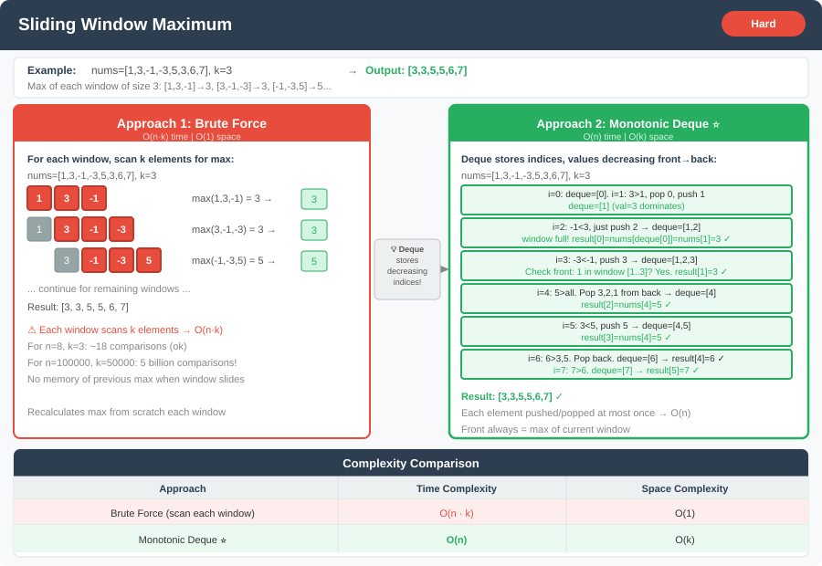

# 🔹 Problem: Sliding Window Maximum




**Difficulty:** Hard ⚡

---

## 🔹 Problem Statement
Given an array of integers `nums` and an integer `k`, find the **maximum value in each sliding window of size k**.

**Example:**  
Input: `nums = [1,3,-1,-3,5,3,6,7]`, `k = 3`  
Output: `[3,3,5,5,6,7]`

Explanation:
- Window `[1,3,-1]` → max is `3`
- Window `[3,-1,-3]` → max is `3`
- Window `[-1,-3,5]` → max is `5`
- Window `[-3,5,3]` → max is `5`
- Window `[5,3,6]` → max is `6`
- Window `[3,6,7]` → max is `7`

---

## 🔹 Intuition
- Naive approach: for each window, traverse all k elements to find max → O(n*k)
- Optimized approach: use a **Deque** to store indices of useful elements:
    - Keep **indices of elements in decreasing order**.
    - Remove indices which are **out of current window**.
    - Front of deque always contains the **max of current window**.

---

## 🔹 Approaches

### 1. Brute Force
- For each window of size k:
    1. Traverse the k elements.
    2. Find the maximum.
- Add it to the result array.

**Time Complexity:** O(n*k)  
**Space Complexity:** O(1) (ignoring output)

---

### 2. Optimized Deque Approach
- Use a **double-ended queue** to store indices in decreasing order of their values.
- For each element:
    1. Remove indices from **back** while current element > nums[back].
    2. Remove index from **front** if it is out of the window.
    3. Add current index to deque.
    4. If window has reached size k, add `nums[deque.front]` to result.

**Time Complexity:** O(n)  
**Space Complexity:** O(k)

---

## 🔹 Java Code

```java
import java.util.*;

public class SlidingWindowMaximum {

    public static int[] maxSlidingWindow(int[] nums, int k) {
        if (nums == null || k <= 0) return new int[0];
        int n = nums.length;
        int[] result = new int[n - k + 1];
        Deque<Integer> deque = new LinkedList<>();

        for (int i = 0; i < n; i++) {
            // Remove indices out of window
            while (!deque.isEmpty() && deque.peekFirst() < i - k + 1) {
                deque.pollFirst();
            }

            // Remove indices whose values are less than current
            while (!deque.isEmpty() && nums[i] > nums[deque.peekLast()]) {
                deque.pollLast();
            }

            deque.offerLast(i);

            // Add current max to result
            if (i >= k - 1) {
                result[i - k + 1] = nums[deque.peekFirst()];
            }
        }

        return result;
    }

    public static void main(String[] args) {
        int[] nums = {1,3,-1,-3,5,3,6,7};
        int k = 3;
        System.out.println(Arrays.toString(maxSlidingWindow(nums, k)));
    }
}
```

---

## 🔹 Complexity Analysis

| Approach        | Time Complexity | Space Complexity |
|-----------------|-----------------|------------------|
| Brute Force     | O(n*k)          | O(1)             |
| Deque Optimized | O(n)            | O(k)             |

---

## 🔹 Edge Cases
- `nums = []` → Output `[]`
- `k = 1` → Output = original array
- `k = nums.length` → Output = single maximum element
- All negative numbers → works the same as positives

---

## 🔹 Follow-Up Questions
1. How would you modify it to find **minimum in each sliding window**?
2. Can you implement it using a **priority queue (heap)**?
3. How would you handle a **streaming input**, where `nums` is coming in real-time?
