# 🔹 Problem: Bottom View of a Binary Tree




**Difficulty:** Medium ⚡

---

## 🔹 Problem Statement
Given the root of a **binary tree**, return the **bottom view** of the tree.

**Bottom View Definition:**
- Nodes visible when the tree is viewed from **below**.
- For each vertical column (horizontal distance, HD), the **last node encountered** from top to bottom is included.

---

## 🔹 Intuition
- Assign **horizontal distance (HD)** to each node:
    - Root → HD = 0
    - Left child → HD = parent HD - 1
    - Right child → HD = parent HD + 1
- Use **level-order traversal (BFS)** to ensure bottom-most node at each HD is captured last.
- Store nodes in a **map** keyed by HD.
- Output values sorted by HD (leftmost to rightmost).

---

## 🔹 Approaches

### 1. BFS with Map
- Use a `TreeMap<Integer, Integer>` or `HashMap<Integer, Integer>` + track min/max HD.
- Two **`Queue`s** in lockstep — **`nodes`** and **`horizontalDist`** — no **`Pair`** or extra class (JDK collections only).
- For each node:
    - Update map with current node value (overwrites previous value at HD).
    - Enqueue children with updated HD.
- Collect map values in HD order for bottom view.

**Time Complexity:** O(n)  
**Space Complexity:** O(n)

---

## 🔹 Java Code (BFS Approach)

```java
import java.util.*;

class TreeNode {
    int val;
    TreeNode left, right;
    TreeNode(int val) { this.val = val; }
}

public class BottomViewBinaryTree {

    public static List<Integer> bottomView(TreeNode root) {
        List<Integer> result = new ArrayList<>();
        if (root == null) return result;

        Map<Integer, Integer> map = new HashMap<>();
        Queue<TreeNode> nodes = new LinkedList<>();
        Queue<Integer> horizontalDist = new LinkedList<>();
        int minHD = 0;
        int maxHD = 0;

        nodes.add(root);
        horizontalDist.add(0);

        while (!nodes.isEmpty()) {
            TreeNode node = nodes.poll();
            int hd = horizontalDist.poll();

            map.put(hd, node.val);

            if (node.left != null) {
                nodes.add(node.left);
                horizontalDist.add(hd - 1);
            }
            if (node.right != null) {
                nodes.add(node.right);
                horizontalDist.add(hd + 1);
            }

            minHD = Math.min(minHD, hd);
            maxHD = Math.max(maxHD, hd);
        }

        for (int i = minHD; i <= maxHD; i++) {
            result.add(map.get(i));
        }
        return result;
    }
}
```

---

## 🔹 Complexity Analysis

| Approach | Time Complexity | Space Complexity | Remarks |
|----------|----------------|-----------------|---------|
| BFS + Map | O(n) | O(n) | Level-order ensures last node at each HD is captured |

---

## 🔹 Edge Cases
- **Empty tree** → return `[]`
- **Single node tree** → return `[root.val]`
- **Left-skewed tree** → last node visible in each column
- **Right-skewed tree** → last node visible in each column
- **Nodes overlapping vertically** → only bottom-most node included

---

## 🔹 Follow-Up Questions
1. How would you implement **top view** instead?
2. Can you optimize using **TreeMap** to avoid min/max tracking?
3. How to modify for **N-ary trees**?
4. Can this be done **recursively**?
5. How to print **both top and bottom view in one traversal**?
