# 🔹 Problem: Time to Burn a Binary Tree




**Difficulty:** Medium ⚡

---

## 🔹 Problem Statement
Given the root of a **binary tree** and a **target node** where a fire starts, find the **minimum time (in minutes)** required to burn the entire tree.  
The fire spreads from a burning node to its **adjacent nodes** (left child, right child, and parent) in **1 minute**.

**Input variants:**
- You may be given the **target node value** (and you need to locate the node), or
- you're given a reference to the **target node** directly.

---

## 🔹 Intuition
- Each node can spread fire to at most three neighbours (left, right, parent).
- Two common ways to think about the problem:
    1. Convert the tree to an **undirected graph** (or store parent pointers) and run a **BFS** from the target — the number of BFS levels needed equals the time.
    2. A single **postorder DFS** can compute the answer by returning distances from nodes to the target and using subtree heights to record how long fire takes to reach distant parts while bubbling up.

The BFS approach is straightforward and easy to implement; the DFS approach is slightly more clever and avoids explicit parent maps but is a bit trickier.

For BFS, treat each wave as **one minute**: after processing the current frontier, set **`burnedThisLevel = true`** if any **new** neighbor was enqueued. **`if (burnedThisLevel) minutes++;`** — only advance time when fire actually spread this round (equivalent to checking the queue non-empty after the wave, but reads as “did we ignite anyone new?”).

---

## 🔹 Approaches

### 1. BFS using Parent Pointers (Recommended)
- First pass: traverse tree and build `parent` map for every node (so we can move to parent in BFS).
- Find the actual `Node` that corresponds to the target value (if only value given).
- Run BFS from target node; each level is 1 minute. After each level, **`if (burnedThisLevel) minutes++`**.

**Time Complexity:** O(n)  
**Space Complexity:** O(n)

---

### 2. Single-pass DFS (Postorder) — no parent map
- Use recursion to:
    - compute subtree heights,
    - return distance from current node to target (or -1 if target absent),
    - when returning a non-negative distance, use the opposite subtree height to update global `maxTime`.
- This propagates "time taken so far" upward, updating the global answer whenever fire can flow into other subtrees.

**Time Complexity:** O(n)  
**Space Complexity:** O(h)

---

## 🔹 Java Code (Both Approaches)

```java
import java.util.*;

class Node {
    int val;
    Node left, right;
    Node(int v) { val = v; }
}

public class BurnBinaryTree {

    // -------------------------
    // 1) BFS with parent pointers
    // -------------------------
    public static int minTimeToBurnBFS(Node root, int targetVal) {
        if (root == null) return 0;

        // 1. Build parent map and find target node
        Map<Node, Node> parent = new HashMap<>();
        Node target = buildParentMap(root, parent, targetVal);

        if (target == null) return -1; // target not found (or handle as needed)

        // 2. BFS from target
        Queue<Node> q = new LinkedList<>();
        Set<Node> visited = new HashSet<>();
        q.add(target);
        visited.add(target);

        int minutes = 0;
        while (!q.isEmpty()) {
            int sz = q.size();
            boolean burnedThisLevel = false;

            for (int i = 0; i < sz; i++) {
                Node cur = q.poll();

                // neighbors: left, right, parent
                if (cur.left != null && !visited.contains(cur.left)) {
                    visited.add(cur.left);
                    q.add(cur.left);
                    burnedThisLevel = true;
                }
                if (cur.right != null && !visited.contains(cur.right)) {
                    visited.add(cur.right);
                    q.add(cur.right);
                    burnedThisLevel = true;
                }
                Node par = parent.get(cur);
                if (par != null && !visited.contains(par)) {
                    visited.add(par);
                    q.add(par);
                    burnedThisLevel = true;
                }
            }

            if (burnedThisLevel) {
                minutes++;
            }
        }

        return minutes;
    }

    // Helper: build parent map and return reference to target Node
    private static Node buildParentMap(Node root, Map<Node, Node> parent, int targetVal) {
        Node target = null;
        Queue<Node> q = new LinkedList<>();
        q.add(root);
        parent.put(root, null);

        while (!q.isEmpty()) {
            Node cur = q.poll();
            if (cur.val == targetVal) target = cur;

            if (cur.left != null) {
                parent.put(cur.left, cur);
                q.add(cur.left);
            }
            if (cur.right != null) {
                parent.put(cur.right, cur);
                q.add(cur.right);
            }
        }
        return target;
    }

    // -------------------------
    // 2) Single-pass DFS (no parent map)
    // -------------------------
    // Global answer holder
    private static int maxTime;

    // Public API: target is value
    public static int minTimeToBurnDFS(Node root, int targetVal) {
        maxTime = 0;
        dfsDistance(root, targetVal);
        return maxTime;
    }

    // Returns:
    // - If node subtree contains target: distance from this node to target (>=0)
    // - If target not in this subtree: -1
    // Also updates maxTime with time to burn nodes reachable via other subtrees
    private static int dfsDistance(Node node, int targetVal) {
        if (node == null) return -1;

        if (node.val == targetVal) {
            // target found at this node
            int height = height(node); // time to burn entire subtree rooted at target
            maxTime = Math.max(maxTime, height - 1); // height-1 edges in subtree
            return 0;
        }

        int leftDist = dfsDistance(node.left, targetVal);
        if (leftDist != -1) {
            // target is in left subtree at distance leftDist from node.left
            // time to reach deepest node in right subtree: (leftDist + 1) + height(right) - 1
            int rightHeight = height(node.right);
            maxTime = Math.max(maxTime, leftDist + 1 + (rightHeight > 0 ? rightHeight - 1 : 0));
            return leftDist + 1;
        }

        int rightDist = dfsDistance(node.right, targetVal);
        if (rightDist != -1) {
            int leftHeight = height(node.left);
            maxTime = Math.max(maxTime, rightDist + 1 + (leftHeight > 0 ? leftHeight - 1 : 0));
            return rightDist + 1;
        }

        return -1; // target not in this subtree
    }

    // Classic height: number of nodes on longest path; returns 0 for null
    private static int height(Node node) {
        if (node == null) return 0;
        return 1 + Math.max(height(node.left), height(node.right));
    }

    // -------------------------
    // Optional: variant when target is given as Node reference
    // -------------------------
    public static int minTimeToBurnBFS_Node(Node root, Node targetNode) {
        if (root == null || targetNode == null) return 0;
        Map<Node, Node> parent = new HashMap<>();
        buildParentMapForNode(root, parent); // fill parent map
        // BFS
        Queue<Node> q = new LinkedList<>();
        Set<Node> visited = new HashSet<>();
        q.add(targetNode);
        visited.add(targetNode);
        int minutes = 0;

        while (!q.isEmpty()) {
            int sz = q.size();
            boolean burnedThisLevel = false;
            for (int i = 0; i < sz; i++) {
                Node cur = q.poll();
                if (cur.left != null && visited.add(cur.left)) {
                    q.add(cur.left);
                    burnedThisLevel = true;
                }
                if (cur.right != null && visited.add(cur.right)) {
                    q.add(cur.right);
                    burnedThisLevel = true;
                }
                Node p = parent.get(cur);
                if (p != null && visited.add(p)) {
                    q.add(p);
                    burnedThisLevel = true;
                }
            }
            if (burnedThisLevel) {
                minutes++;
            }
        }
        return minutes;
    }

    private static void buildParentMapForNode(Node root, Map<Node, Node> parent) {
        Queue<Node> q = new LinkedList<>();
        q.add(root);
        parent.put(root, null);
        while (!q.isEmpty()) {
            Node cur = q.poll();
            if (cur.left != null) {
                parent.put(cur.left, cur);
                q.add(cur.left);
            }
            if (cur.right != null) {
                parent.put(cur.right, cur);
                q.add(cur.right);
            }
        }
    }

    // -------------------------
    // Example usage (not part of function library)
    // -------------------------
    public static void main(String[] args) {
        /*
              1
             / \
            2   3
           / \   \
          4   5   6
        Start fire at node 5 -> expected time = ?
        */
        Node root = new Node(1);
        root.left = new Node(2);
        root.right = new Node(3);
        root.left.left = new Node(4);
        root.left.right = new Node(5);
        root.right.right = new Node(6);

        System.out.println(minTimeToBurnBFS(root, 5));   // BFS approach
        System.out.println(minTimeToBurnDFS(root, 5));   // DFS approach
    }
}
```

---

## 🔹 Complexity Analysis

| Approach                      | Time Complexity | Space Complexity | Remarks |
|-------------------------------|----------------|-----------------|---------|
| BFS with parent map           | O(n)           | O(n)             | Two passes (map build + BFS) |
| Single-pass DFS (no map)      | O(n * h?) ≈ O(n²) worst-case naive height calls | O(h) | If naive `height()` is used repeatedly, worst-case cost can blow up. Use cached heights or compute heights in same traversal to keep it O(n). |

**Note on DFS cost:** the provided DFS version calls `height()` inside recursion which can cause extra work. To make the DFS truly O(n), compute heights in a single post-order traversal that also returns distances — avoid repeated `height()` calls by returning both (distance-to-target, height) in a pair.

---

## 🔹 Edge Cases
- **Empty tree** → `0` (or handle as per spec)
- **Target not present** → return `-1` or handle as per spec
- **Single node tree (target is root)** → `0` minutes to burn (already burning) or `0` if counting edges
- **Skewed tree** → time equals tree height - 1
- **Multiple nodes with same value** → if using value to identify target, ambiguity arises — prefer node reference

---

## 🔹 Follow-Up Questions
1. Modify DFS approach to return both height and distance in one traversal (true O(n)).
2. If multiple fires start simultaneously at different targets, how does the BFS change? (enqueue all start nodes at time 0).
3. Can you return the **order of nodes** burned minute-by-minute?
4. How to adapt for **N-ary trees**?
5. If edges have weights (different spread times), how would you compute total burn time? (use Dijkstra from multiple sources)
