# 🔹 Problem: Check if Root to Leaf Path Sum Exists




**Difficulty:** Easy 🌱

---

## 🔹 Problem Statement
Given the root of a **binary tree** and an integer `targetSum`, determine if the tree has a **root-to-leaf path** such that the sum of the node values along the path equals `targetSum`.

**Notes:**
- A **leaf** is a node with no children.
- Return `true` if such a path exists, otherwise `false`.

---

## 🔹 Intuition
- For each node, maintain the **remaining sum** required.
- Subtract the node's value from the target sum and recur for left and right children.
- If a **leaf node** is reached and remaining sum equals node value → path exists.

---

## 🔹 Approaches

### 1. Recursive DFS
- Base case: if node is `null` → return `false`.
- If leaf node → check if remaining sum equals node value.
- Recur for left and right subtrees with updated sum.

**Time Complexity:** O(n)  
**Space Complexity:** O(h) — recursion stack

### 2. Iterative BFS
- Use a queue storing `(node, remainingSum)` pairs.
- Pop node and check leaf condition.
- Enqueue children with updated remaining sum.

**Time Complexity:** O(n)  
**Space Complexity:** O(w) — queue width

---

## 🔹 Java Code (Recursive Approach)

```java
class Node {
    int val;
    Node left, right;
    Node(int val) { this.val = val; }
}

public class RootToLeafPathSum {

    // 1. Recursive DFS
    public static boolean hasPathSum(Node root, int targetSum) {
        if (root == null) return false;

        // Check if leaf node
        if (root.left == null && root.right == null) {
            return root.val == targetSum;
        }

        int remainingSum = targetSum - root.val;
        return hasPathSum(root.left, remainingSum) || hasPathSum(root.right, remainingSum);
    }

    // 2. Iterative BFS (Optional)
    public static boolean hasPathSumBFS(Node root, int targetSum) {
        if (root == null) return false;

        Queue<Pair<Node, Integer>> queue = new LinkedList<>();
        queue.add(new Pair<>(root, root.val));

        while (!queue.isEmpty()) {
            Pair<Node, Integer> p = queue.poll();
            Node node = p.getKey();
            int sum = p.getValue();

            if (node.left == null && node.right == null) {
                if (sum == targetSum) return true;
            }

            if (node.left != null) queue.add(new Pair<>(node.left, sum + node.left.val));
            if (node.right != null) queue.add(new Pair<>(node.right, sum + node.right.val));
        }

        return false;
    }

    // Simple Pair class
    static class Pair<K,V> {
        private K key; private V value;
        public Pair(K k, V v) { key = k; value = v; }
        public K getKey() { return key; }
        public V getValue() { return value; }
    }
}
```

---

## 🔹 Complexity Analysis

| Approach | Time Complexity | Space Complexity | Remarks |
|----------|----------------|-----------------|---------|
| Recursive DFS | O(n) | O(h) | Recursion stack depends on tree height |
| Iterative BFS | O(n) | O(w) | Queue stores node pairs, w = max width of tree |

---

## 🔹 Edge Cases
- **Empty tree** → return `false`
- **Single node tree** → compare node value with `targetSum`
- **Negative values** → works correctly with subtraction
- **Multiple valid paths** → return `true` on first valid path

---

## 🔹 Follow-Up Questions
1. Can you **return the actual path** that sums to target?
2. How would you modify for **all paths that sum to target**?
3. Can this be adapted for **N-ary trees**?
4. Can you solve it **iteratively using DFS stack**?
5. How to handle **very large trees** without stack overflow?
