# 🔹 Problem: Check if a Binary Tree is Balanced




**Difficulty:** Medium ⚡

---

## 🔹 Problem Statement
Given a **binary tree**, determine whether it is **height-balanced**.

A **balanced binary tree** is defined as a tree in which the **height difference** between the left and right subtrees of **every node** is **not more than 1**.

**Formally:**  
For every node,  

|height(left subtree) - height(right subtree)| ≤ 1


---

## 🔹 Intuition
- For each node, we need to know:
    1. Whether its left and right subtrees are balanced.
    2. The height of those subtrees.

- A naïve solution would compute height repeatedly → **O(n²)**.
- An optimized solution performs a **bottom-up postorder traversal**:
    - Compute height and balance in one go.
    - If any subtree is unbalanced, propagate `-1` or a flag upwards immediately.

This reduces time complexity to **O(n)**.

---

## 🔹 Approaches

### 1. Optimized Recursive (Postorder) Approach
- Recursively compute the height of subtrees.
- If either subtree is unbalanced, stop and return false.
- Otherwise, check if the height difference ≤ 1.

**Time Complexity:** O(n)  
**Space Complexity:** O(h) — recursion stack

---

### 2. Naïve Recursive Approach
- For each node:
    - Compute `height(left)` and `height(right)`.
    - Check balance at the node.
- Calls height multiple times → **O(n²)**.

**Time Complexity:** O(n²)  
**Space Complexity:** O(h)

---

## 🔹 Java Code (All Approaches)

```java
class Node {
    int val;
    Node left, right;
    Node(int val) {
        this.val = val;
    }
}

public class BalancedBinaryTree {

    // 1. Optimized Recursive Approach (O(n))
    public static boolean isBalanced(Node root) {
        return checkHeight(root) != -1;
    }

    private static int checkHeight(Node node) {
        if (node == null) return 0;

        int left = checkHeight(node.left);
        if (left == -1) return -1; // Left subtree not balanced

        int right = checkHeight(node.right);
        if (right == -1) return -1; // Right subtree not balanced

        if (Math.abs(left - right) > 1) return -1; // Current node not balanced

        return Math.max(left, right) + 1; // Return height
    }

    // 2. Naïve Recursive Approach (O(n²))
    public static boolean isBalancedNaive(Node root) {
        if (root == null) return true;

        int leftHeight = height(root.left);
        int rightHeight = height(root.right);

        return Math.abs(leftHeight - rightHeight) <= 1
                && isBalancedNaive(root.left)
                && isBalancedNaive(root.right);
    }

    private static int height(Node node) {
        if (node == null) return 0;
        return 1 + Math.max(height(node.left), height(node.right));
    }
}
```

---

## 🔹 Complexity Analysis

| Approach              | Time Complexity | Space Complexity | Remarks               |
|-----------------------|----------------|------------------|-----------------------|
| Optimized (Postorder) | O(n)           | O(h)             | Efficient & preferred |
| Naïve (Recompute)     | O(n²)          | O(h)             | Repeated height calls |

---

## 🔹 Edge Cases
- **Empty tree** → return `true`
- **Single node** → return `true`
- **Skewed tree** (all nodes to one side) → return `false`
- **Perfect binary tree** → return `true`
- **Large tree** → watch for stack overflow in recursion (consider iterative variant)

---

## 🔹 Follow-Up Questions
1. How can we modify the method to **return both balance status and height** together?
2. Can we implement this **iteratively using a stack** (postorder simulation)?
3. How does the balance property change for an **N-ary tree**?
4. Can we use **Morris traversal** or other O(1)-space traversals here?
5. How could this check be applied during **dynamic tree construction** (insertion phase)?

---

