# 🔹 Problem: Construct Binary Tree from Preorder and Inorder Traversal




**Difficulty:** Medium ⚡

---

## 🔹 Problem Statement
Given two arrays:
1. `preorder` — the preorder traversal of a binary tree
2. `inorder` — the inorder traversal of the same tree

Construct and return the **binary tree**.

**Notes:**
- Preorder: Root → Left → Right
- Inorder: Left → Root → Right

---

## 🔹 Intuition
- The **first element of preorder** is always the **root**.
- Find the root's index in inorder array → splits inorder into left and right subtrees.
- Recur for **left and right subtrees** with appropriate slices of preorder and inorder arrays.

---

## 🔹 Approaches

### 1. Recursive with Index Mapping
- Create a **map of inorder values to indices** for O(1) lookup.
- Maintain a **preorder index** pointer.
- Recur for left and right subtrees using index ranges in inorder.

**Time Complexity:** O(n)  
**Space Complexity:** O(n) — for hashmap + recursion stack

### 2. Iterative (Advanced / Optional)
- Use stack to simulate recursive building.
- Track parent-child relationships using preorder sequence.
- Less common, more complex.

---

## 🔹 Java Code (Recursive Approach)

```java
import java.util.*;

class Node {
    int val;
    Node left, right;
    Node(int val) { this.val = val; }
}

public class BuildTreePreIn {

    private static int preIndex = 0;

    public static Node buildTree(int[] preorder, int[] inorder) {
        preIndex = 0;
        Map<Integer, Integer> inorderMap = new HashMap<>();
        for (int i = 0; i < inorder.length; i++) {
            inorderMap.put(inorder[i], i);
        }
        return build(preorder, inorderMap, 0, inorder.length - 1);
    }

    private static Node build(int[] preorder, Map<Integer, Integer> inorderMap, int inStart, int inEnd) {
        if (inStart > inEnd) return null;

        int rootVal = preorder[preIndex++];
        Node root = new Node(rootVal);

        int inIndex = inorderMap.get(rootVal);

        root.left = build(preorder, inorderMap, inStart, inIndex - 1);
        root.right = build(preorder, inorderMap, inIndex + 1, inEnd);

        return root;
    }
}
```

---

## 🔹 Complexity Analysis

| Approach               | Time Complexity | Space Complexity | Remarks |
|------------------------|----------------|-----------------|---------|
| Recursive with Map      | O(n)           | O(n)             | Map for inorder indices + recursion stack |
| Iterative (Advanced)    | O(n)           | O(n)             | Uses stack |

---

## 🔹 Edge Cases
- **Empty arrays** → return `null`
- **Arrays of length 1** → single node tree
- **Invalid arrays** → not a valid binary tree → may throw exception or return partial tree
- **All nodes in one side (skewed tree)** → recursion still works

---

## 🔹 Follow-Up Questions
1. Can you construct from **inorder and postorder** instead?
2. Can this be implemented **iteratively**?
3. How to handle **duplicate values**?
4. Can you **construct tree with O(1) extra space** if recursion stack allowed?
5. How to **validate preorder and inorder arrays** before construction?
