# 🔹 Problem: Diameter of a Binary Tree




**Difficulty:** Medium ⚡

---

## 🔹 Problem Statement
Given the root of a **binary tree**, return the **diameter** of the tree.

The **diameter** of a binary tree is defined as the **length of the longest path between any two nodes** in the tree.
- The length of a path is measured by the **number of edges** between nodes.

---

## 🔹 Intuition
- For any node, the **longest path that passes through it** is the sum of the **height of its left subtree** and **height of its right subtree**.
- The **diameter** is the **maximum such path** over all nodes.
- Use **postorder traversal** to compute height and update diameter simultaneously.

---

## 🔹 Approaches

### 1. Recursive DFS (Postorder)
- Recursively calculate the **height** of left and right subtrees.
- For each node:
    - `diameter = max(diameter, leftHeight + rightHeight)`
- Return `height = 1 + max(leftHeight, rightHeight)` to parent.

**Time Complexity:** O(n) — visit each node once  
**Space Complexity:** O(h) — recursion stack (h = height)

### 2. BFS + DFS Hybrid (Less common)
- Perform level order traversal and compute the longest path from each node using DFS.
- Not optimal → O(n²)

---

## 🔹 Java Code (Recursive DFS)

```java
class TreeNode {
    int val;
    TreeNode left, right;

    TreeNode(int val) {
        this.val = val;
        left = right = null;
    }
}

public class DiameterBinaryTree {

    private static int maxDiameter = 0;

    public static int diameterOfBinaryTree(TreeNode root) {
        maxDiameter = 0;
        height(root);
        return maxDiameter;
    }

    private static int height(TreeNode node) {
        if (node == null) return 0;

        int leftHeight = height(node.left);
        int rightHeight = height(node.right);

        // Update the diameter at this node
        maxDiameter = Math.max(maxDiameter, leftHeight + rightHeight);

        // Return height of this node
        return 1 + Math.max(leftHeight, rightHeight);
    }
}
```

---

## 🔹 Complexity Analysis

| Approach       | Time Complexity | Space Complexity |
|----------------|----------------|-----------------|
| DFS (Postorder)| O(n)           | O(h)            |

---

## 🔹 Edge Cases
- Empty tree → diameter = 0
- Single node → diameter = 0
- Skewed tree → diameter = number of nodes - 1
- Balanced tree → diameter = sum of heights of left and right subtrees at root

---

## 🔹 Follow-Up Questions
1. How would you find the **diameter in terms of nodes** instead of edges?
2. Can you compute the diameter **iteratively**?
3. How can this algorithm be modified to find **longest path between leaves** specifically?
