# 🔹 Problem: Find the Distance Between Two Nodes in a Binary Tree




**Difficulty:** Medium ⚡

---

## 🔹 Problem Statement
Given a **binary tree** and two nodes `p` and `q`, find the **distance** between them.

**Notes:**
- **Distance** is defined as the number of edges in the **shortest path** connecting the two nodes.
- The path goes through their **lowest common ancestor (LCA)**.

---

## 🔹 Intuition
- First, find the **LCA** of `p` and `q`.
- Compute **distance from LCA to p** and **LCA to q** individually.
- Sum the two distances to get **distance between p and q**.

**Distance Formula:**  

distance(p, q) = distance(LCA, p) + distance(LCA, q)


---

## 🔹 Approaches

### 1. Recursive DFS
- Find LCA using standard recursive method.
- Define a helper to compute **distance from given node to target node**.
- Return sum of distances from LCA.

**Time Complexity:** O(n)  
**Space Complexity:** O(h)

### 2. BFS Level Traversal (Optional)
- Level order traversal to find path from root to `p` and `q`.
- Compare paths to find LCA.
- Compute distance using path lengths.

**Time Complexity:** O(n)  
**Space Complexity:** O(n)

---

## 🔹 Java Code (Recursive DFS)

```java
class Node {
    int val;
    Node left, right;
    Node(int val) { this.val = val; }
}

public class DistanceBetweenNodes {

    // 1. Find distance between p and q
    public static int findDistance(Node root, Node p, Node q) {
        Node lca = lowestCommonAncestor(root, p, q);
        int d1 = distanceFromNode(lca, p, 0);
        int d2 = distanceFromNode(lca, q, 0);
        return d1 + d2;
    }

    // Helper to find distance from node to target
    private static int distanceFromNode(Node node, Node target, int dist) {
        if (node == null) return -1;
        if (node == target) return dist;

        int left = distanceFromNode(node.left, target, dist + 1);
        if (left != -1) return left;

        return distanceFromNode(node.right, target, dist + 1);
    }

    // Standard LCA
    private static Node lowestCommonAncestor(Node root, Node p, Node q) {
        if (root == null || root == p || root == q) return root;

        Node left = lowestCommonAncestor(root.left, p, q);
        Node right = lowestCommonAncestor(root.right, p, q);

        if (left != null && right != null) return root;
        return left != null ? left : right;
    }
}
```
---

## 🔹 Complexity Analysis

| Approach       | Time Complexity | Space Complexity | Remarks |
|----------------|----------------|-----------------|---------|
| Recursive DFS  | O(n)           | O(h)             | h = tree height |
| BFS Path Method | O(n)           | O(n)             | Stores paths from root |

---

## 🔹 Edge Cases
- **Empty tree** → return `-1`
- **Nodes not present** → return `-1`
- **Nodes are same** → distance = `0`
- **One node is ancestor of other** → distance = number of edges between them

---

## 🔹 Follow-Up Questions
1. Can you **find distance without computing LCA separately**?
2. How to adapt for **N-ary trees**?
3. Can you compute distance **iteratively**?
4. How to handle **large trees efficiently**?
5. Can you **find distance for multiple queries** efficiently?
