# 🔹 Problem: Inorder Traversal of a Binary Tree




**Difficulty:** Easy 🌱

---

## 🔹 Problem Statement
Given the root of a **binary tree**, return the **inorder traversal** of its nodes’ values.

In an inorder traversal, you visit:
1. Left subtree
2. Root node
3. Right subtree

---

## 🔹 Intuition
- The inorder traversal ensures that for **Binary Search Trees (BSTs)**, nodes are visited in **sorted order**.
- There are multiple ways to perform inorder traversal:
    1. **Recursive** (simple and intuitive)
    2. **Iterative** using a stack
    3. **Morris Traversal** (O(1) space, no recursion or stack)

---

## 🔹 Approaches

### 1. Recursive Approach
- Traverse the left subtree.
- Visit the root.
- Traverse the right subtree.

**Time Complexity:** O(n)  
**Space Complexity:** O(h) — recursion stack (h = height of the tree)

---

### 2. Iterative Approach (Using Stack)
- Use a stack to simulate recursion.
- Push all left nodes, process top, then go right.

**Time Complexity:** O(n)  
**Space Complexity:** O(h)

---

### 3. Morris Traversal (Without Stack or Recursion)
- Use threaded binary tree technique.
- Temporarily connect a node’s predecessor to itself.
- Restore links while traversing.

**Time Complexity:** O(n)  
**Space Complexity:** O(1)

---

## 🔹 Java Code (All 3 Approaches)

```java
import java.util.*;

class TreeNode {
    int val;
    TreeNode left, right;

    TreeNode(int val) {
        this.val = val;
        left = right = null;
    }
}

public class InorderTraversal {

    // 1. Recursive Approach
    public static List<Integer> inorderRecursive(TreeNode root) {
        List<Integer> result = new ArrayList<>();
        inorderHelper(root, result);
        return result;
    }

    private static void inorderHelper(TreeNode node, List<Integer> result) {
        if (node == null) return;
        inorderHelper(node.left, result);
        result.add(node.val);
        inorderHelper(node.right, result);
    }

    // 2. Iterative Approach (Using Stack)
    public static List<Integer> inorderIterative(TreeNode root) {
        List<Integer> result = new ArrayList<>();
        Stack<TreeNode> stack = new Stack<>();
        TreeNode curr = root;

        while (curr != null || !stack.isEmpty()) {
            while (curr != null) {
                stack.push(curr);
                curr = curr.left;
            }
            curr = stack.pop();
            result.add(curr.val);
            curr = curr.right;
        }

        return result;
    }

    // 3. Morris Traversal (O(1) space)
    public static List<Integer> inorderMorris(TreeNode root) {
        List<Integer> result = new ArrayList<>();
        TreeNode curr = root;

        while (curr != null) {
            if (curr.left == null) {
                result.add(curr.val);
                curr = curr.right;
            } else {
                TreeNode pre = curr.left;
                while (pre.right != null && pre.right != curr) {
                    pre = pre.right;
                }

                if (pre.right == null) {
                    pre.right = curr;
                    curr = curr.left;
                } else {
                    pre.right = null;
                    result.add(curr.val);
                    curr = curr.right;
                }
            }
        }

        return result;
    }
}
```

---

## 🔹 Complexity Analysis

| Approach            | Time Complexity | Space Complexity |
|---------------------|-----------------|------------------|
| Recursive           | O(n)            | O(h)             |
| Iterative (Stack)   | O(n)            | O(h)             |
| Morris Traversal    | O(n)            | O(1)             |

---

## 🔹 Edge Cases
- Empty tree → returns empty list `[]`
- Single node → returns `[root.val]`
- Skewed tree (all left/right) → linear traversal
- Balanced BST → nodes visited in sorted order

---

## 🔹 Follow-Up Questions
1. Can you perform **preorder** and **postorder** traversals iteratively too?
2. Can you use the inorder traversal to **validate a BST**?
3. How can you modify Morris traversal to perform **preorder** instead of inorder?
