# 🔹 Problem: Insert a Node in a Binary Search Tree




**Difficulty:** Medium ⚡

---

## 🔹 Problem Statement
Given the root of a **Binary Search Tree (BST)** and a value `val`, insert a new node with value `val` into the BST.

- Return the root of the **modified BST**.
- A BST must maintain the property:
    - For any node, all nodes in the left subtree are **less** than the node.
    - All nodes in the right subtree are **greater** than the node.
- There may be **no duplicate values**.

---

## 🔹 Intuition
- Start at the root.
- Recursively or iteratively find the correct **position** for the new node:
    - If `val < node.val` → go left.
    - If `val > node.val` → go right.
- Insert the new node where a `null` child exists.
- Recursion naturally returns the updated root for every subtree.

---

## 🔹 Approaches

### 1. Recursive Insertion
- Compare value with current node.
- Recur into left or right subtree.
- Base case: null → create new node.

**Time Complexity:** O(h) — height of BST  
**Space Complexity:** O(h) — recursion stack

### 2. Iterative Insertion
- Traverse down the tree with a parent pointer.
- Insert new node as left/right child of parent.
- Avoid recursion stack.

**Time Complexity:** O(h)  
**Space Complexity:** O(1)

---

## 🔹 Java Code (Recursive & Iterative)

```java
class TreeNode {
    int val;
    TreeNode left, right;
    TreeNode(int val) { this.val = val; }
}

public class InsertBST {

    // 1. Recursive Approach
    public static TreeNode insertRecursive(TreeNode root, int val) {
        if (root == null) return new TreeNode(val);

        if (val < root.val) {
            root.left = insertRecursive(root.left, val);
        } else if (val > root.val) {
            root.right = insertRecursive(root.right, val);
        }
        // if val == root.val, do nothing (no duplicates)

        return root;
    }

    // 2. Iterative Approach
    public static TreeNode insertIterative(TreeNode root, int val) {
        if (root == null) return new TreeNode(val);

        TreeNode parent = null;
        TreeNode curr = root;

        while (curr != null) {
            parent = curr;
            if (val < curr.val) {
                curr = curr.left;
            } else if (val > curr.val) {
                curr = curr.right;
            } else {
                return root; // no duplicates
            }
        }

        if (val < parent.val) parent.left = new TreeNode(val);
        else parent.right = new TreeNode(val);

        return root;
    }
}
```

---

## 🔹 Complexity Analysis

| Approach       | Time Complexity | Space Complexity | Remarks             |
|----------------|----------------|-----------------|-------------------|
| Recursive      | O(h)           | O(h)            | h = height of BST  |
| Iterative      | O(h)           | O(1)            | Preferred for large trees |

---

## 🔹 Edge Cases
- **Empty BST** → new node becomes root
- **Single node BST** → insert left or right based on value
- **Insertion of min/max value** → goes to leftmost or rightmost
- **Already exists value** → BST remains unchanged

---

## 🔹 Follow-Up Questions
1. How would you **balance the BST** after multiple insertions?
2. Can you implement **iterative insertion without parent pointer**?
3. How to handle **duplicates** if allowed in BST?
4. What if the tree is **AVL or Red-Black Tree**?
5. How to **insert recursively and return depth of inserted node**?
