# 🔹 Problem: Least Common Ancestor (LCA) of a Binary Tree




**Difficulty:** Medium ⚡

---

## 🔹 Problem Statement
Given a **binary tree** and two nodes `p` and `q`, find their **lowest common ancestor (LCA)**.

**Definition:**  
The **LCA** of two nodes `p` and `q` is defined as the **lowest node** in the tree that has **both `p` and `q` as descendants** (a node can be a descendant of itself).

---

## 🔹 Intuition
- Use **DFS traversal** from root.
- If root matches `p` or `q`, return root.
- Recur for left and right subtrees.
- If both left and right return non-null → current node is LCA.
- If only one side returns non-null → propagate that node upwards.

---

## 🔹 Approaches

### 1. Recursive DFS
- Base case: if node is `null` → return `null`
- If node == `p` or `q` → return node
- Recur left and right
- If both left and right are non-null → current node is LCA
- Else return non-null child

**Time Complexity:** O(n)  
**Space Complexity:** O(h) — recursion stack

### 2. Parent Map + Ancestor Set (Iterative)
- Traverse tree and store parent references in a map.
- Build a set of ancestors for one node.
- Traverse ancestors of second node to find the first common ancestor.

**Time Complexity:** O(n)  
**Space Complexity:** O(n)

---

## 🔹 Java Code (Recursive DFS)

```java
class Node {
    int val;
    Node left, right;
    Node(int val) { this.val = val; }
}

public class LCA {

    public static Node lowestCommonAncestor(Node root, Node p, Node q) {
        if (root == null || root == p || root == q) return root;

        Node left = lowestCommonAncestor(root.left, p, q);
        Node right = lowestCommonAncestor(root.right, p, q);

        if (left != null && right != null) return root; // both sides found
        return left != null ? left : right;
    }

    // 2. Iterative using Parent Map (Optional)
    public static Node lowestCommonAncestorIterative(Node root, Node p, Node q) {
        if (root == null) return null;

        Map<Node, Node> parentMap = new HashMap<>();
        parentMap.put(root, null);
        Stack<Node> stack = new Stack<>();
        stack.push(root);

        // Build parent map
        while (!parentMap.containsKey(p) || !parentMap.containsKey(q)) {
            Node node = stack.pop();
            if (node.left != null) {
                parentMap.put(node.left, node);
                stack.push(node.left);
            }
            if (node.right != null) {
                parentMap.put(node.right, node);
                stack.push(node.right);
            }
        }

        // Build ancestor set for p
        Set<Node> ancestors = new HashSet<>();
        while (p != null) {
            ancestors.add(p);
            p = parentMap.get(p);
        }

        // Find first ancestor of q in ancestor set
        while (!ancestors.contains(q)) {
            q = parentMap.get(q);
        }

        return q;
    }
}
```
---

## 🔹 Complexity Analysis

| Approach               | Time Complexity | Space Complexity | Remarks |
|------------------------|----------------|-----------------|---------|
| Recursive DFS          | O(n)           | O(h)             | h = height of tree |
| Parent Map + Iterative  | O(n)           | O(n)             | Map stores parent of each node |

---

## 🔹 Edge Cases
- **Empty tree** → return `null`
- **One node is ancestor of other** → LCA is the ancestor node
- **Both nodes same** → LCA is the node itself
- **Nodes not present in tree** → return `null`

---

## 🔹 Follow-Up Questions
1. Can you find LCA in a **Binary Search Tree** more efficiently?
2. Can this be implemented **iteratively without using parent map**?
3. How to handle **N-ary trees**?
4. Can you find LCA **when nodes might not exist in tree**?
5. How to find LCA **for multiple nodes (>2) simultaneously**?
