# 🔹 Problem: Maximum Path Sum from Leaf to Leaf




**Difficulty:** Hard ⚡⚡

---

## 🔹 Problem Statement
Given a **binary tree**, find the **maximum path sum** between **any two leaf nodes**.

**Notes:**
- A **leaf** is a node with no children.
- The path must start and end at **two different leaves**.
- Path **may pass through root or any intermediate nodes**.

---

## 🔹 Intuition
- For each node, compute the **maximum root-to-leaf sum** for left and right subtrees.
- If node has **both left and right child**, update global maximum using:  
  `maxSum = max(maxSum, leftMax + node.val + rightMax)`
- Return **maximum root-to-leaf sum** for parent to continue.
- Use **post-order traversal** to process children first.

---

## 🔹 Approaches

### 1. Recursive Postorder (Optimized)
- Process left and right children first.
- Update global max only at nodes with **both children**.
- Return max root-to-leaf sum to parent.

**Time Complexity:** O(n)  
**Space Complexity:** O(h) — recursion stack

### 2. Recursive with Pair Class (Returning Both Values)
- For each node, return a pair:  
  `(maxLeafToLeafSum, maxRootToLeafSum)`
- Combines calculation in one recursion without using global variable.

**Time Complexity:** O(n)  
**Space Complexity:** O(h)

### 3. Iterative DFS (Optional / Advanced)
- Use stack to simulate post-order traversal.
- Maintain maps for `maxRootToLeaf` and `maxLeafToLeaf` values.
- Update global max during processing of nodes.

**Time Complexity:** O(n)  
**Space Complexity:** O(n)

---

## 🔹 Java Code (All Approaches)

```java
import java.util.*;

class Node {
    int val;
    Node left, right;
    Node(int val) { this.val = val; }
}

public class MaxLeafToLeafPathSum {

    // 1. Recursive Postorder with Global Variable
    private static int maxSum;
    public static int maxPathSum(Node root) {
        maxSum = Integer.MIN_VALUE;
        maxLeafToLeaf(root);
        return maxSum;
    }

    private static int maxLeafToLeaf(Node node) {
        if (node == null) return 0;

        int leftMax = maxLeafToLeaf(node.left);
        int rightMax = maxLeafToLeaf(node.right);

        if (node.left != null && node.right != null) {
            maxSum = Math.max(maxSum, leftMax + node.val + rightMax);
            return Math.max(leftMax, rightMax) + node.val;
        }

        return (node.left != null ? leftMax : rightMax) + node.val;
    }

    // 2. Recursive Using Pair Class
    static class Pair {
        int maxLeafToLeaf;
        int maxRootToLeaf;
        Pair(int leafToLeaf, int rootToLeaf) {
            maxLeafToLeaf = leafToLeaf;
            maxRootToLeaf = rootToLeaf;
        }
    }

    public static int maxPathSumPair(Node root) {
        return helper(root).maxLeafToLeaf;
    }

    private static Pair helper(Node node) {
        if (node == null) return new Pair(Integer.MIN_VALUE, 0);

        Pair left = helper(node.left);
        Pair right = helper(node.right);

        int maxRootToLeaf = Math.max(left.maxRootToLeaf, right.maxRootToLeaf) + node.val;

        int maxLeafToLeaf = Math.max(left.maxLeafToLeaf, right.maxLeafToLeaf);
        if (node.left != null && node.right != null) {
            maxLeafToLeaf = Math.max(maxLeafToLeaf, left.maxRootToLeaf + node.val + right.maxRootToLeaf);
        }

        return new Pair(maxLeafToLeaf, maxRootToLeaf);
    }

    // 3. Iterative DFS Approach (Advanced, optional)
    // Can be implemented using stack + map to simulate postorder
}
```

---

## 🔹 Complexity Analysis

| Approach                       | Time Complexity | Space Complexity | Remarks |
|--------------------------------|----------------|-----------------|---------|
| Recursive Postorder (Global)   | O(n)           | O(h)             | h = tree height |
| Recursive with Pair Class       | O(n)           | O(h)             | Combines all calculations without global var |
| Iterative DFS (Optional)        | O(n)           | O(n)             | Uses stack and maps |

---

## 🔹 Edge Cases
- **Empty tree** → return `Integer.MIN_VALUE` or `0`
- **Single node tree** → no leaf-to-leaf path exists
- **Left-skewed or right-skewed tree** → path may not exist
- **Negative values** → handled correctly
- **Tree with only two leaves** → path sum is sum of leaf → root → leaf

---

## 🔹 Follow-Up Questions
1. Can you **return the actual path nodes** for max leaf-to-leaf sum?
2. How would you modify for **maximum path sum between any two nodes**?
3. Can this be adapted for **N-ary trees**?
4. How to handle **very large trees** iteratively?
5. How does handling **negative values** change the solution logic?
