# 🔹 Problem: Postorder Traversal of a Binary Tree




**Difficulty:** Medium ⚡

---

## 🔹 Problem Statement
Given the root of a **binary tree**, return the **postorder traversal** of its nodes’ values.

In a postorder traversal, you visit:
1. Left subtree
2. Right subtree
3. Root node

---

## 🔹 Intuition
- Postorder is useful for **deleting a tree**, **evaluating expressions**, or any situation where a node must be processed **after its children**.
- You can perform it:
    1. **Recursively** (most intuitive)
    2. **Iteratively** (using one or two stacks)
    3. **Morris Traversal** (O(1) space — less common and tricky)

---

## 🔹 Approaches

### 1. Recursive Approach
- Traverse left subtree.
- Traverse right subtree.
- Visit root.

**Time Complexity:** O(n)  
**Space Complexity:** O(h) — recursion stack (h = height of the tree)

---

### 2. Iterative Approach (Using Two Stacks)
- Use first stack to perform modified preorder traversal (Root → Right → Left).
- Push nodes from first stack to second stack, then pop from second to get postorder (Left → Right → Root).

**Time Complexity:** O(n)  
**Space Complexity:** O(n)

---

### 3. Iterative Approach (Using One Stack)
- Use a single stack to simulate recursion.
- Keep track of the last visited node to determine traversal direction.

**Time Complexity:** O(n)  
**Space Complexity:** O(h)

---

## 🔹 Java Code (All 3 Approaches)

```java
import java.util.*;

class TreeNode {
    int val;
    TreeNode left, right;

    TreeNode(int val) {
        this.val = val;
        left = right = null;
    }
}

public class PostorderTraversal {

    // 1. Recursive Approach
    public static List<Integer> postorderRecursive(TreeNode root) {
        List<Integer> result = new ArrayList<>();
        postorderHelper(root, result);
        return result;
    }

    private static void postorderHelper(TreeNode node, List<Integer> result) {
        if (node == null) return;
        postorderHelper(node.left, result);
        postorderHelper(node.right, result);
        result.add(node.val);
    }

    // 2. Iterative Approach (Using Two Stacks)
    public static List<Integer> postorderTwoStacks(TreeNode root) {
        List<Integer> result = new ArrayList<>();
        if (root == null) return result;

        Stack<TreeNode> stack1 = new Stack<>();
        Stack<TreeNode> stack2 = new Stack<>();
        stack1.push(root);

        while (!stack1.isEmpty()) {
            TreeNode node = stack1.pop();
            stack2.push(node);

            if (node.left != null) stack1.push(node.left);
            if (node.right != null) stack1.push(node.right);
        }

        while (!stack2.isEmpty()) {
            result.add(stack2.pop().val);
        }

        return result;
    }

    // 3. Iterative Approach (Using One Stack)
    public static List<Integer> postorderOneStack(TreeNode root) {
        List<Integer> result = new ArrayList<>();
        Stack<TreeNode> stack = new Stack<>();
        TreeNode curr = root, lastVisited = null;

        while (curr != null || !stack.isEmpty()) {
            if (curr != null) {
                stack.push(curr);
                curr = curr.left;
            } else {
                TreeNode peek = stack.peek();
                if (peek.right != null && lastVisited != peek.right) {
                    curr = peek.right;
                } else {
                    result.add(peek.val);
                    lastVisited = stack.pop();
                }
            }
        }

        return result;
    }
}
```

---

## 🔹 Complexity Analysis

| Approach              | Time Complexity | Space Complexity |
|-----------------------|-----------------|------------------|
| Recursive             | O(n)            | O(h)             |
| Iterative (Two Stack) | O(n)            | O(n)             |
| Iterative (One Stack) | O(n)            | O(h)             |

---

## 🔹 Edge Cases
- Empty tree → returns empty list `[]`
- Single node → returns `[root.val]`
- Skewed tree (all left/right) → linear traversal
- Balanced tree → root visited last

---

## 🔹 Follow-Up Questions
1. How does **postorder** differ from **preorder** and **inorder** traversal?
2. Can you write a **postorder traversal** using **Morris Traversal** (O(1) space)?
3. How would you use postorder traversal to **delete all nodes** of a binary tree?
