# 🔹 Problem: Serialize and Deserialize Binary Tree




**Difficulty:** Hard ⚡⚡

---

## 🔹 Problem Statement
Design an algorithm to **serialize** a binary tree into a string and **deserialize** the string back into the original tree.

**Notes:**
- Serialization converts the tree to a string so that it can be stored or transmitted.
- Deserialization reconstructs the tree from the string.
- Must handle **null nodes** to preserve tree structure.

---

## 🔹 Intuition
- Use **preorder traversal** (or any traversal) with markers for `null`.
- For serialization:
    - Traverse tree, append node values to string separated by a delimiter.
    - Use a special symbol (e.g., `#`) for `null`.
- For deserialization:
    - Read values sequentially.
    - Recur to rebuild the tree structure using preorder logic.

---

## 🔹 Approaches

### 1. Recursive Preorder Serialization
- Preorder traversal: Root → Left → Right
- Use `#` for nulls
- Join values with a delimiter (e.g., `,`)
- During deserialization, split string and recursively rebuild tree.

**Time Complexity:** O(n)  
**Space Complexity:** O(n) — for string + recursion stack

### 2. BFS Level-Order Serialization (Optional)
- Use queue to serialize level by level.
- Append nulls explicitly.
- Deserialize using queue to reconstruct tree level by level.

---

## 🔹 Java Code (Preorder Recursive)

```java
import java.util.*;

class Node {
    int val;
    Node left, right;
    Node(int val) { this.val = val; }
}

public class CodecBinaryTree {

    private static final String NULL_SYMBOL = "#";
    private static final String DELIMITER = ",";

    // Serialize
    public String serialize(Node root) {
        StringBuilder sb = new StringBuilder();
        serializeHelper(root, sb);
        return sb.toString();
    }

    private void serializeHelper(Node node, StringBuilder sb) {
        if (node == null) {
            sb.append(NULL_SYMBOL).append(DELIMITER);
            return;
        }
        sb.append(node.val).append(DELIMITER);
        serializeHelper(node.left, sb);
        serializeHelper(node.right, sb);
    }

    // Deserialize
    public Node deserialize(String data) {
        if (data == null || data.isEmpty()) return null;
        Queue<String> nodes = new LinkedList<>(Arrays.asList(data.split(DELIMITER)));
        return deserializeHelper(nodes);
    }

    private Node deserializeHelper(Queue<String> nodes) {
        String val = nodes.poll();
        if (val.equals(NULL_SYMBOL)) return null;

        Node node = new Node(Integer.parseInt(val));
        node.left = deserializeHelper(nodes);
        node.right = deserializeHelper(nodes);
        return node;
    }
}
```

---

## 🔹 Complexity Analysis

| Approach                | Time Complexity | Space Complexity | Remarks |
|-------------------------|----------------|-----------------|---------|
| Recursive Preorder       | O(n)           | O(n)             | String + recursion stack |
| BFS Level-Order (Optional)| O(n)           | O(n)             | Queue used during serialization/deserialization |

---

## 🔹 Edge Cases
- **Empty tree** → serialized string = `#`
- **Single node tree** → serialized string = `val,#,#`
- **Skewed tree** → serialization preserves nulls
- **Negative or zero values** → handled correctly

---

## 🔹 Follow-Up Questions
1. Can you implement **iterative BFS serialization/deserialization**?
2. How to **optimize the string length**?
3. How to handle **duplicate node values**?
4. Can this be adapted for **N-ary trees**?
5. How to serialize/deserialize for **distributed systems** efficiently?
