# 🔹 Problem: Vertical Order Traversal of a Binary Tree




**Difficulty:** Medium ⚡

---

## 🔹 Problem Statement
Given the root of a **binary tree**, return the **vertical order traversal** of its nodes' values.

**Rules:**
1. Nodes are grouped by **vertical columns** (x-coordinate).
2. Columns are ordered from **leftmost to rightmost**.
3. Within a column, nodes are ordered from **top to bottom**.
4. If two nodes share the same row and column, order them by **node value**.

---

## 🔹 Intuition
- Assign **horizontal distance (HD)** to each node:
    - Root → HD = 0
    - Left child → HD = parent HD - 1
    - Right child → HD = parent HD + 1
- Use **level-order traversal (BFS)** to maintain top-to-bottom order.
- Group nodes by HD in a **`HashMap`**, and track **`minHd` / `maxHd`** while traversing so you can emit columns from left to right.

---

## 🔹 Approaches

### 1. BFS with Map
- Use a `HashMap<Integer, List<Integer>>` to store nodes by HD.
- Two **`Queue`s** — **`nodes`** and **`horizontalDist`** — polled/pushed together (**no `Pair`**).
- While dequeuing, update **`minHd`** and **`maxHd`** from each column index.
- Add each visited node’s value to the list for its HD.
- Walk **`c` from `minHd` to `maxHd`** and append `map.get(c)` when present (skips empty columns if any).

**Time Complexity:** O(n)
- n = number of nodes (BFS plus a linear pass over the column range)

**Space Complexity:** O(n)

---

### 2. DFS with Map
- Perform **preorder traversal**.
- Pass **HD** and **level** in recursion.
- Use `TreeMap<HD, List<Pair<level, value>>>` to store nodes.
- Sort nodes in each column by level (and value if tie).

**Time Complexity:** O(n log n)  
**Space Complexity:** O(n)

---

## 🔹 Java Code (BFS Approach)

```java
import java.util.*;

class TreeNode {
    int val;
    TreeNode left, right;
    TreeNode(int val) { this.val = val; }
}

public class VerticalOrderTraversal {

    public static List<List<Integer>> verticalOrder(TreeNode root) {
        List<List<Integer>> result = new ArrayList<>();
        if (root == null) return result;

        Map<Integer, List<Integer>> map = new HashMap<>();
        Queue<TreeNode> nodes = new LinkedList<>();
        Queue<Integer> horizontalDist = new LinkedList<>();

        nodes.add(root);
        horizontalDist.add(0);

        int minHd = 0;
        int maxHd = 0;

        while (!nodes.isEmpty()) {
            TreeNode node = nodes.poll();
            int hd = horizontalDist.poll();

            minHd = Math.min(minHd, hd);
            maxHd = Math.max(maxHd, hd);

            map.computeIfAbsent(hd, k -> new ArrayList<>()).add(node.val);

            if (node.left != null) {
                nodes.add(node.left);
                horizontalDist.add(hd - 1);
            }
            if (node.right != null) {
                nodes.add(node.right);
                horizontalDist.add(hd + 1);
            }
        }

        for (int c = minHd; c <= maxHd; c++) {
            List<Integer> col = map.get(c);
            if (col != null) {
                result.add(col);
            }
        }
        return result;
    }
}
```

---

## 🔹 Complexity Analysis

| Approach | Time Complexity | Space Complexity | Remarks |
|----------|----------------|-----------------|---------|
| BFS + HashMap | O(n) | O(n) | Track `minHd`/`maxHd`, then scan columns in order |
| DFS + TreeMap | O(n log n) | O(n) | Sort nodes by level and value in each column |

---

## 🔹 Edge Cases
- **Empty tree** → return `[]`
- **Single node tree** → return `[[root.val]]`
- **Left-skewed tree** → single node per column
- **Right-skewed tree** → single node per column
- **Multiple nodes in same position** → sort by value if using DFS approach

---

## 🔹 Follow-Up Questions
1. Can you **print bottom-up vertical order**?
2. How would you modify for **top view or bottom view** of a tree?
3. Can you use **`List<List<Integer>>` indexed by `hd - minHd`** instead of a map?
4. How would you handle **N-ary trees**?
5. Can this be optimized to **O(n)** time using BFS only?
